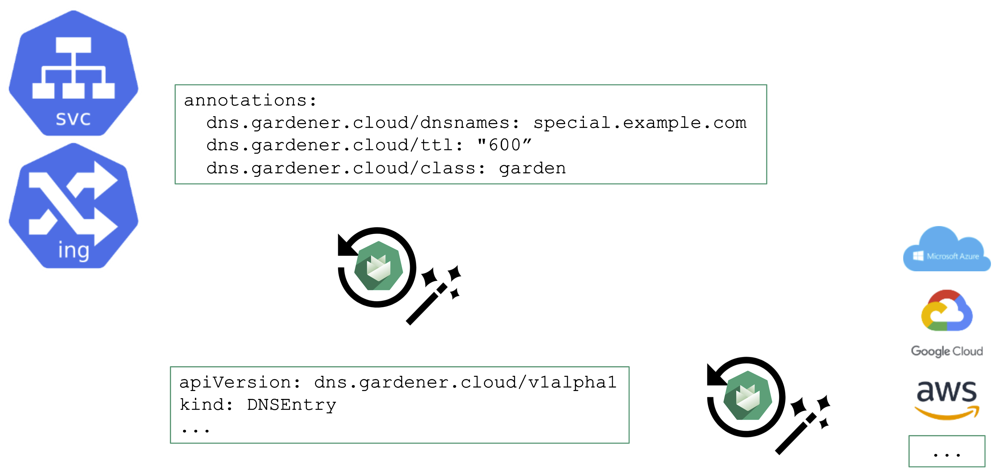
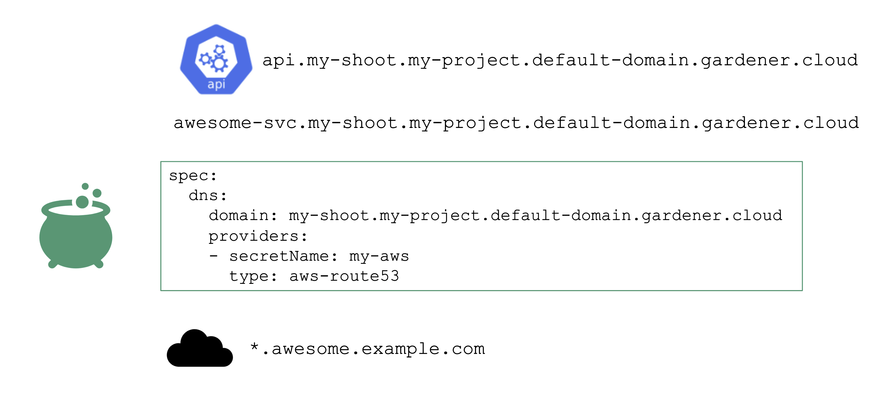

## External DNS Management

When you deploy to Kubernetes, there is no native management of DNS. Instead, you get IPv4 addresses via cloud-controller-manager requested for every Service of type LoadBalancer. Of course, the Ingress resource helps here, but how is the DNS zone for the ingress controller managed?

Essentially, some sort of automation for DNS management is missing.

## Automating DNS Management

From a user's perspective, it is desirable to work with already known resources and concepts. Hence, the DNS management offered by Gardener plugs seamlessly into Kubernetes resources and a user does not need to "leave" the context of the shoot cluster.

To request a DNS record creation / update, a Service or Ingress resource is annotated accordingly. The shoot-dns-service extension will (if configured) will pick up the request and create a DNSEntry resource + reconcile it to have an actual DNS record created at a configured DNS provider. Gardener supports the following providers:
- aws-route53
- azure-dns
- azure-private-dns
- google-clouddns
- openstack-designate
- alicloud-dns
- cloudflare-dns

For more information, see [DNS Names](https://github.com/gardener/gardener-extension-shoot-dns-service/blob/master/docs/usage/dns_names.md).

## DNS Provider

For the above to work, we need some ingredients. Primarily, this is implemented via a so-called DNSProvider. Every shoot has a default provider that is used to set up the API server's public DNS record. It can be used to request sub-domains as well. 

In addition, a shoot can reference credentials to a DNS provider. Those can be used to manage custom domains.

Please have a look at the [documentation](https://gardener.cloud/docs/guides/networking/dns-extension/) for further details. 