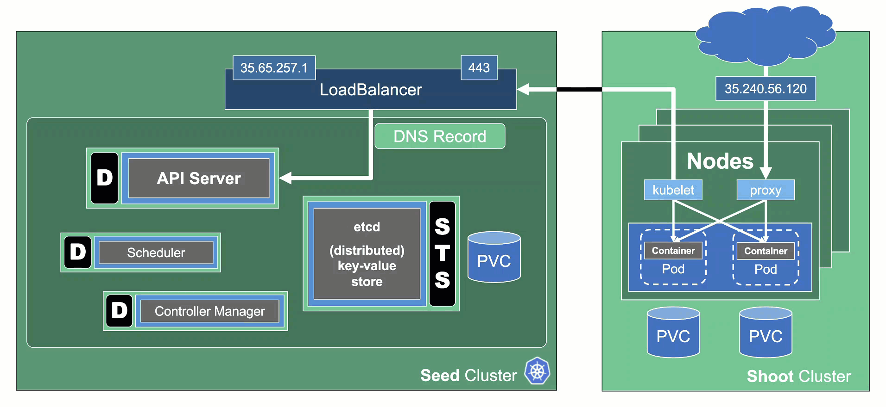
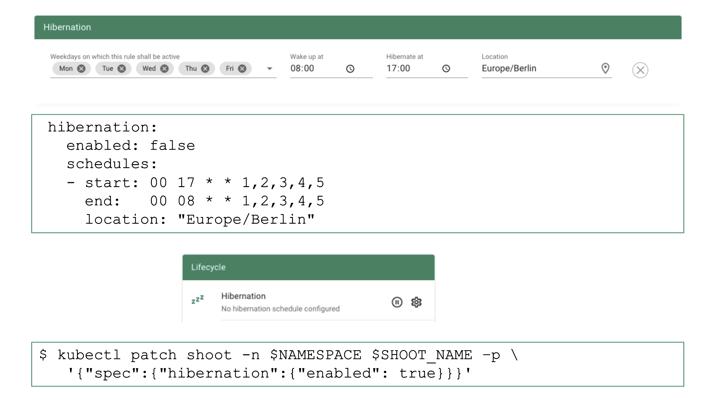

## Hibernation

Some clusters need to be up all the time - typically, they would be hosting some kind of production workload. Others might be used for development purposes or testing during business hours only. Keeping them up and running all the time is a waste of money. Gardener can help you here with its "hibernation" feature. Essentially, hibernation means to shut down all components of a cluster.

## How Hibernation Works

The hibernation flow for a shoot attempts to reduce the resources consumed as much as possible. Hence everything not state-related is being decommissioned.

### Data Plane

All nodes will be drained and the VMs will be deleted. As a result, all pods will be "stuck" in a `Pending` state since no new nodes are added. Of course, PVC / PV holding data is not deleted.

Services of type `LoadBalancer` will keep their external IP addresses.

### Control Plane

All components will be scaled down and no pods will remain running. ETCD data is kept safe on the disk. 

The DNS records routing traffic for the API server are also destroyed. Trying to connect to a hibernated cluster via kubectl will result in a DNS lookup failure / no-such-host message.

When waking up a cluster, all control plane components will be scaled up again and the DNS records will be re-created. Nodes will be created again and pods scheduled to run on them.

## How to Configure / Trigger Hibernation

The easiest way to configure hibernation schedules is via the dashboard. Of course, this is reflected in the shoot's spec and can also be maintained there. Before a cluster is hibernated, constraints in the shoot's status will be evaluated. There might be conditions (mostly revolving around mutating / validating webhooks) that would block a successful wake-up. In such a case, the constraint will block hibernation in the first place.

To wake-up or hibernate a shoot immediately, the dashboard can be used or a patch to the shoot's spec can be applied directly.