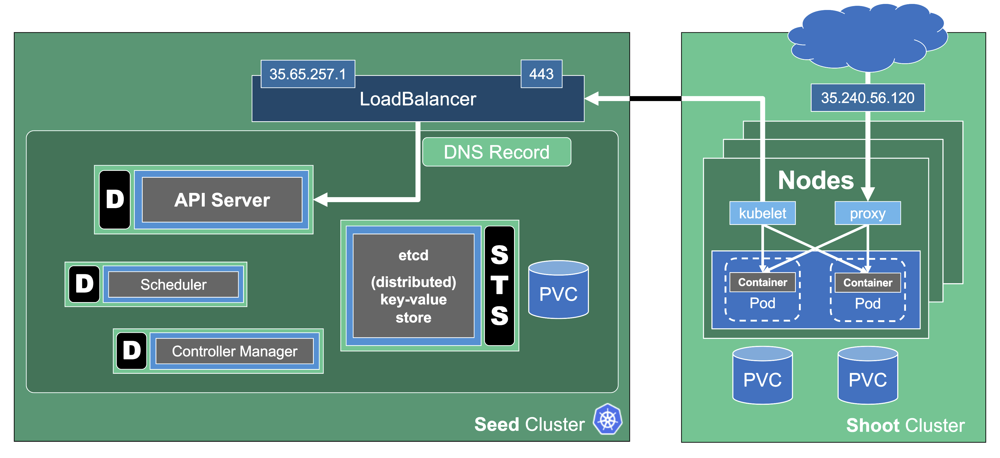

## Controlplane as a Service

Sometimes, there may be use cases for Kubernetes clusters that don't require Pods but only features of the control plane. Gardener can create the so-called "workerless" Shoots, which are exactly that. A Kubernetes cluster without Nodes (and without any controller related to them).

In a scenario where you already have multiple clusters, you can use it for orchestration (leases) or factor out components that require many CRDs.

As part of the control plane, the following components are deployed in the seed cluster for workerless Shoot:
- etcds
- kube-apiserver
- kube-controller-manager
- gardener-resource-manager
- logging and monitoring components
- extension components (to find out if they support workerless Shoots, see the [Extensions](https://github.com/gardener/gardener/blob/master/docs/extensions/extension.md#what-is-required-to-register-and-support-an-extension-type) topic)