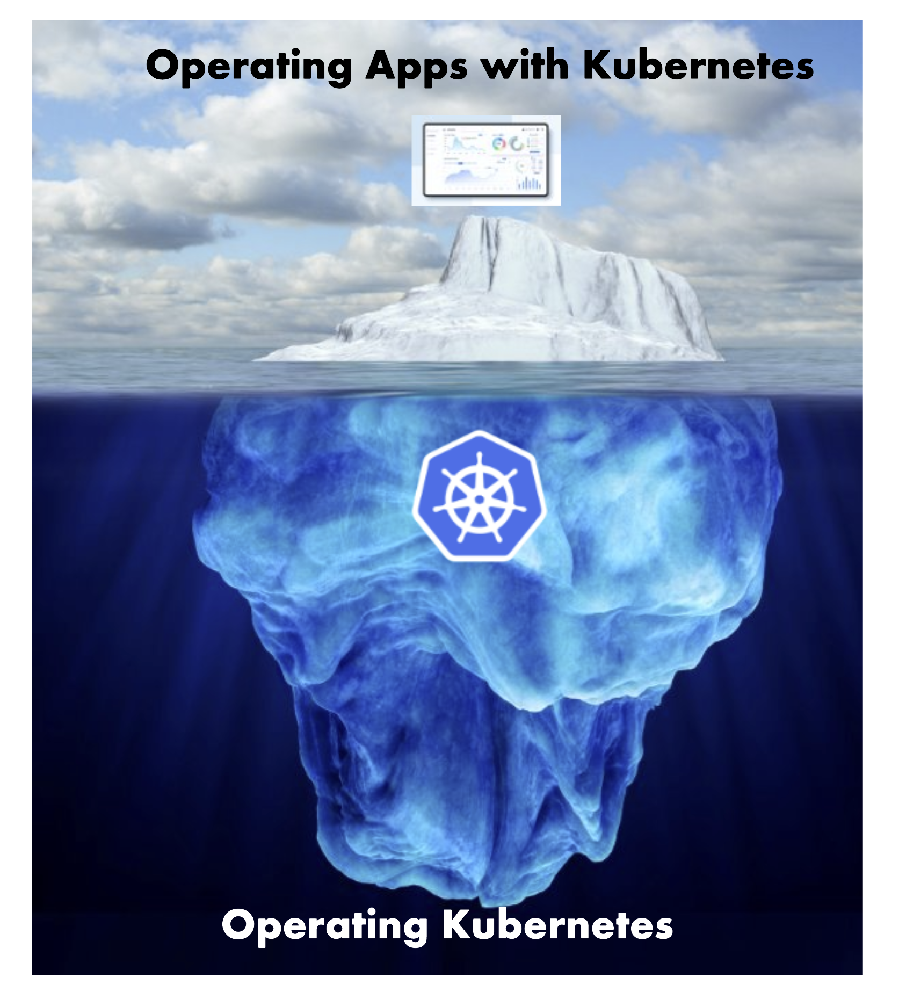
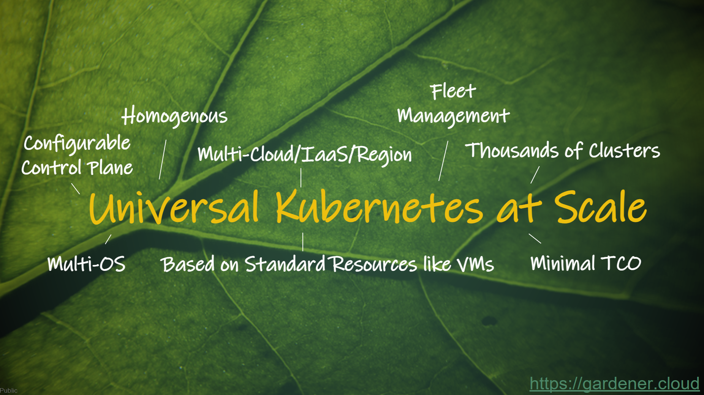
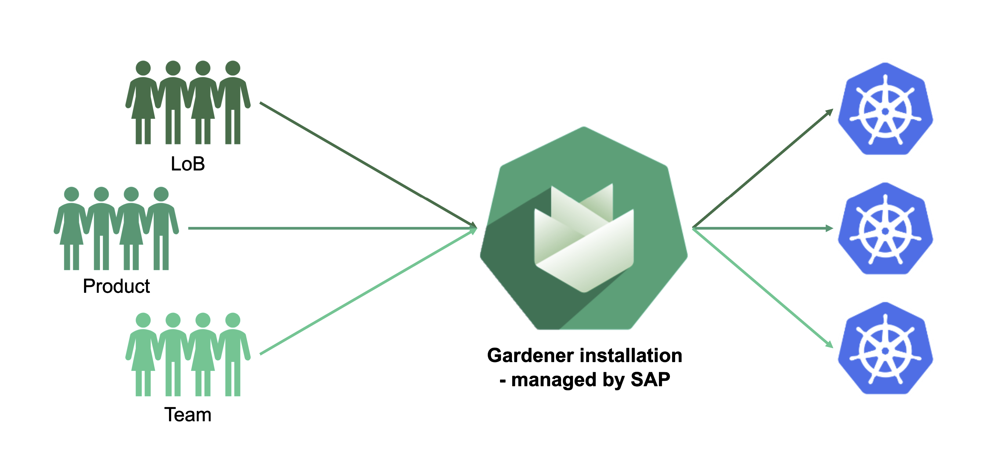
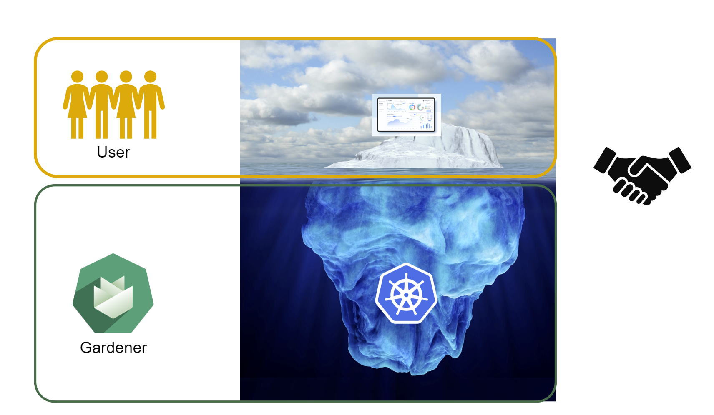
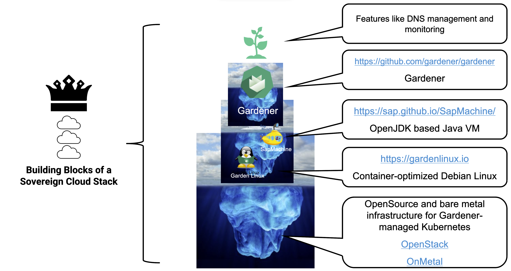

## Problem Space

Let's discuss the problem space first. Why do we need something like Gardener?

### What do we do?

The starting point is this rather simple questions: what does SAP do?

Well, SAP is a vendor of business software and makes a decent amount of profit. But of course, selling is only the start. A customer should also use the software.

Which brings us to the way this software is consumed.

Traditionally, software has been shipped on physical / digital media to the customer. There, someone had to install, configure, and operate it. This is the so-called "on-premise" software.

In recent times, the pattern has shifted. Modern solutions are operated by us and sold as a service. The end-user then consumes the service.

But still, someone needs to install, configure and maintain it - regardless of where it is installed.

### Running Business Software

Whether a local admin installs software on-site or we operate it, some hardware has to run the "business software". And of course, it will run forever once started.

For on-premise deliveries, a hosting partner or the local IT would then take care of updates and maintenance for the newly installed software. Most importantly though, only a limited amount of instances would need their attention.

But when we host services for our customers, there is no way someone can do all this manually at acceptable costs. And once everything is working, nothing should be changed - never touch a running system.

So we need some vehicle to easily spin up new instances, do lifecycle operations, get some basic failure resilency, and more. How can we achieve that?

## Solution Space 1 - Kubernetes

Let's start solving some of the problems described earlier with Container technology and Kubernetes.

### Self-Contained Containers

Container technology enables us to solve these problems to a certain degree. As self-contained containers contain themselves, the container forms a vehicle that is shippable and self-contained.

However, it does not help with resiliency and configuration. Therefore, we need another system for orchestration.

### Orchestration

"Classical" orchestration that just follows the notes and moves from `state A` to `state B` doesn't solve all of our problems. We need something else.

"Desired State" is the next big thing. With it, you write a construction plan, then have controllers cycle through "observe -> analyze -> act" and transition the actual to the desired state.

### Summary

<!-- Needs rechecking -->

Containers (famously brought to the mainstream as "Docker") and Kubernetes are the ingredients of a fundamental shift in IT, where the Operating System layer enables the decoupling of software and hardware, and container-related technologies form the next-generation layer of abstraction.

## Solution Space 2 - Gardener

So, K8s solves a lot of problems. But how do you get a K8s cluster?

Either:
- Buy a cluster as a service from an external vendor
- Gardener yourself a cluster with our tooling

Essentially, it is a "make or buy" decision from SAP's perspective.

### The Reason Why We "Make" It

The reason why SAP decides to invest into creating Gardener is to gather in-house knowledge and experience to share and benefit from.

It certainly helps when you can influence backlogs and discuss priorities within the same company.

Gardener allows to run K8s clusters on various hyperscalers. It offers the same set of basic configuration options independent of the choosen infrastructure. This kind of harmonization supports the n+1 strategy while reducing adoption costs for the individual LoB. Just imagine having to deal with multiple vendors all offering vastly differently hosted K8s clusters.

The beauty here is the ease of adopting new infrastructures. We recently added support for vSphere and the next provider will certainly follow in due time. But a user can still define the same parameters for a cluster.

## What exactly is Gardener?

Gardener is a system to manage Kubernetes clusters. It is driven by the same "desired state" pattern as Kubernetes itself. In fact, it is using Kubernetes to run Kubernetes.

A user may "desire" clusters on infrastructures such as GCP, AWS, Azure, Alicloud, Openstack, vsphere, ...

If you take this rather simplistic principle of reconciliation and add the feature-richness of Gardener to it, you end up with universal K8s at scale.

Whether you need fleet management at minimal TCO or to look for a highly customizable control plane - we have it all.

On top of that, Gardener-managed K8s clusters fulfill the conformance standard set out by the CNCF and we submit our test results for certification.

Gardener is also open-source (99%). We have an organization on [github.com](https://github.com/gardener) and you are welcome to contribute (by opening issues, feature requests or submitting code). The org features the core functionalities, as well as common extensions.

Last time we counted, there were already 131 projects. That's actually more projects than members of the organization.

Gardener is mainly developed by SAP employees and SAP is an "adopter" as well, among StackIT, Telekom, Finanz Informatik Technologie Services GmbH and others. For a full list of adopters, see the [Adopters page](https://github.com/gardener/documentation/blob/master/website/adopter/_index.md).

### Gardener Service at SAP

Internally, anyone can consume the Gardener service. As already explained, Gardener needs access to the respective infrastructure account and can go to work. Whether it's an individual team or product, or even an entire LoB in need of one or several clusters, everyone can use Gardener instead of creating their own custom clusters.

The Gardener service itself is a Gardener installation managed internally at SAP by the Gardener team. Please note, it is only an internal service at the moment. It is not directly sold to customers but can be a component of an SAP product (e.g., Kyma).

### Shared Responsibility Model

We follow a model of shared responsibility. Gardener manages the K8s cluster but has no knowledge of the application domain operated by the user. It is solely the user's responsibility to manage it. Of course, certain things require the involvement of both teams. Let's collaborate!

## Gardener Service

The Gardener service manages the entire lifecycle of quite a number of clusters already. Those clusters utilize almost 43 000 nodes, most of them running GardenLinux.

Even though Gardener consumption has constantly grown over the years, our team remains rather small. Overall, around 70 people develop and operate Gardener at SAP.

## Building Blocks of a Sovereign Cloud Stack

The idea behind "sovereign cloud" is basically the need of an independent technology stack that is neither controlled by foreign companies or legislations. In the end, the EU wants to have a standardized, open source stack that everyone can build upon. With Gardener, SAP is already positioned to contribute to this goal. More projects initiated in our domain will further strengthen our standing.