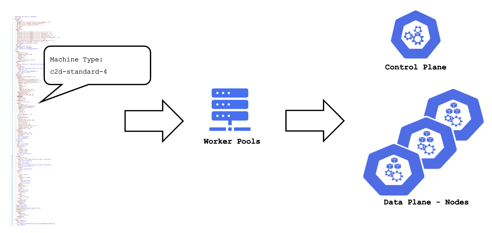
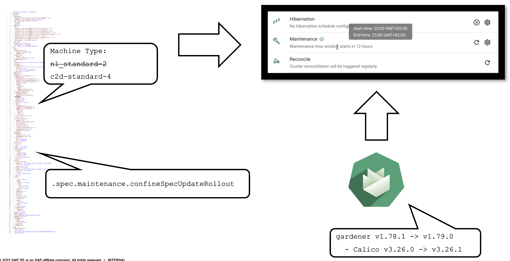
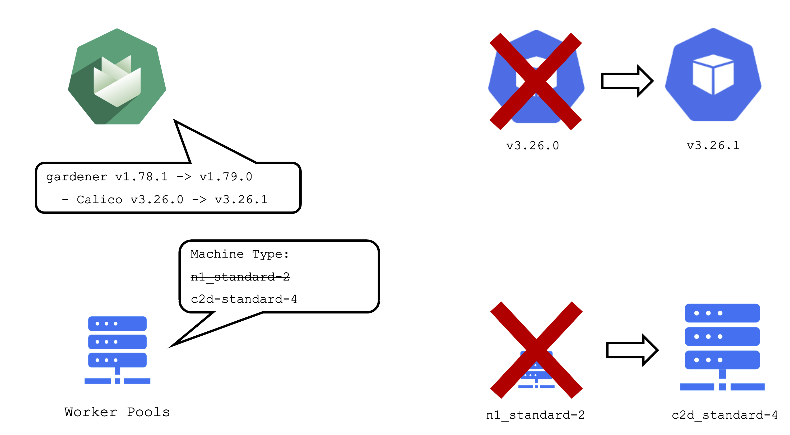
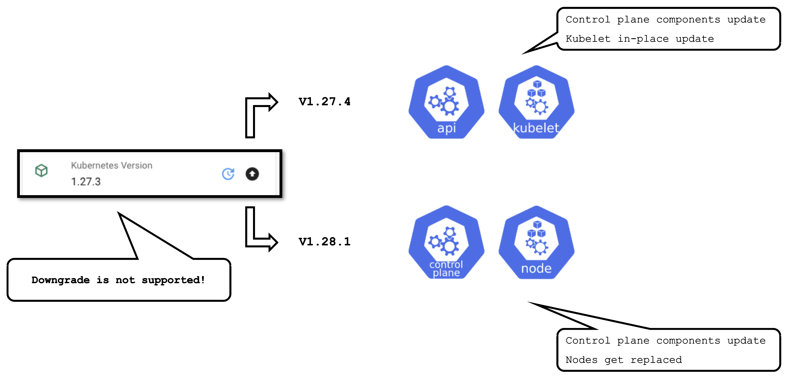
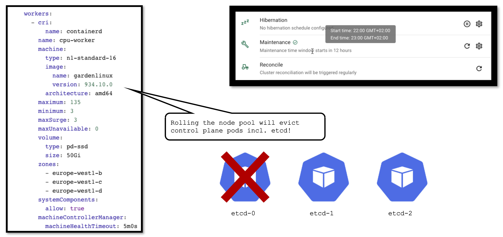

## Reconciliation in K8s

The starting point of all reconciliation cycles is the constant observation of both the desired and actual state. A component would analyze any differences between the two states and try to converge the actual towards the desired state using appropriate actions. Typically, a component is responsible for a single resource type but it also watches others that have an implication on it.

As an example, the K8s controller for ReplicaSets will watch Pods belonging to it in order to ensure that the specified replica count is fulfilled. If one Pod gets deleted, the controller will create a new pod to enforce the desired over the actual state.

This is all standard behaviour, as Gardener is following the native K8s approach. All elements of a shoot cluster have a representation in K8s resources and controllers are watching / acting upon them.

If we pick up the example of the ReplicaSet - a user typically creates a Deployment resource and the ReplicaSet is implicitly generated on the way to create the Pods. Similarly, Gardener takes the user's intent (shoot) and creates lots of domain specific resources on the way. They all reconcile and make sure their actual and desired states match.

## Updating the Desired State of a Shoot

Based on the shoot's specifications, Gardener will create network resources on a hyperscaler, backup resources for the ETCD, credentials, and other resources, but also representations of the worker pools. Eventually, this process will result in a fully functional K8s cluster. 

If a user changes the desired state, Gardener will reconcile the shoot and run through the same cycle to ensure the actual state matches the desired state.

## Maintenance Window and Daily Reconciliation

EVERY shoot cluster reconciles once per day during the so-called "maintenance window". A user can confine the rollout of spec changes to this window.

Additionally, the daily reconciliation will help pick up all kind of version changes. When a new Gardener version was rolled out to the landscape, shoot clusters will pick up any changes during their next reconciliation. For example, if a new Calico version is introduced to fix some bug, it will automatically reach all shoots.

## Impact of a Change

It is important to be aware of the impacts that a change can have on a cluster and the workloads within it.

Updating the calico image will cause all calico pods to be re-created. Another example would be the rollout of a new etcd backup-restore image. This would cause etcd pods to be re-created, rendering a non-HA control plane unavailable until etcd is up and running again.

When a user changes the shoot spec, it can also have significant impact on the cluster. Imagine that a user changes the machine type of a worker pool. This will cause new machines to be created and old machines to be deleted. Or in other words: all nodes will be drained, the pods will be evicted and then re-created on newly created nodes.

## K8s Version Update (Minor + Patch)

Some operations are rather common and have to be performed on a regular basis. Updating the K8s version is one them. Patch updates cause relatively little disruption, as only the control-plane pods will be re-created with new images and the kubelets on all nodes will restart.

A minor version update is more impactful - it will cause all nodes to be recreated and rolls components of the control plane.

## OS Version Update

The OS version is defined for each worker pool and can be changed per worker pool. Contrary to K8s versioning, no semantics apply to OS versions. You can freely switch back and forth. However, as there is no in-place update, each change will cause the entire worker pool to roll and nodes will be replaced.

## Version Classifications

Gardener has the following classifications for K8s and OS image versions:

- `preview`: still in testing phase (several versions can be in preview at the same time)

- `supported`: recommended version

- `deprecated`: a new version has been set to "supported", updating is recommended (might have an expiration date)

- `expired`: cannot be used anymore, clusters using this version will be force-upgraded

Version information is maintained in the relevant cloud profile resource. There might be circumstances where a version will never become `supported` but instead move to `deprecated` directly. Similarly, a version might be directly introduced as `supported`.

## AutoUpdate / Forced Updates

AutoUpdate for a machine image version will update all node pools to the latest supported version. Whenever a new version is set to `supported`, the cluster will pick it up during its next maintenance window.

For K8s versions the mechanism is the same, it is just not applied to minor updates. This means that the cluster will be kept on the latest supported patch version of a specific minor version.

In case a version used in a cluster expires, there is a force update during the next maintenance window. In a worst case scenario, 2 minor versions expire simultaneously. Then there will be two consecutive minor updates enforced.

For more information, see [Shoot Kubernetes and Operating System Versioning in Gardener](https://github.com/gardener/gardener/blob/master/docs/usage/shoot_versions.md).

## Applying Changes to a Seed

It is important to keep in mind that a seed is just another shoot cluster. As such, it has its own lifecycle (daily reconciliation, maintenance, etc.) and is also a subject to change.

From time to time changes need to be applied to the seed as well. Some (like updating the OS version) cause the node pool to roll. In turn, this will cause the eviction of ALL pods running on the affected node. If your etcd is evicted and you don't have a highly available control plane, it will cause downtime for your cluster. Your workloads will continue to run ,of course, but your cluster's API server will not function until the etcd is up and running again.