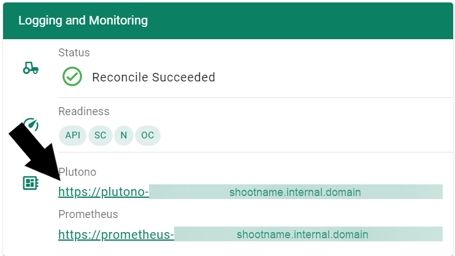
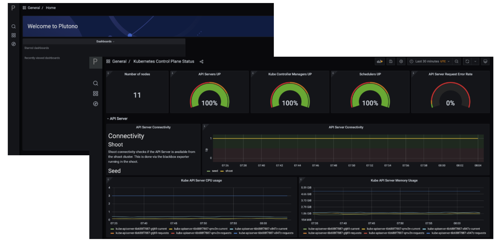
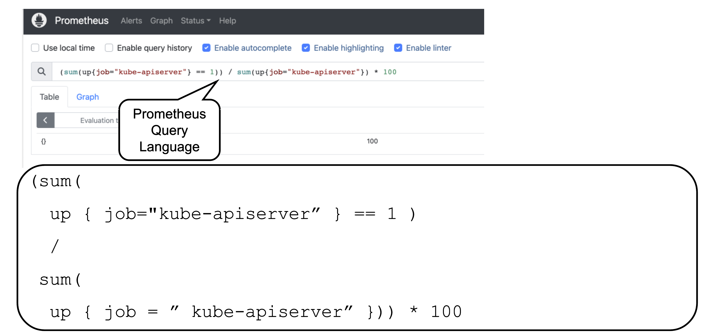
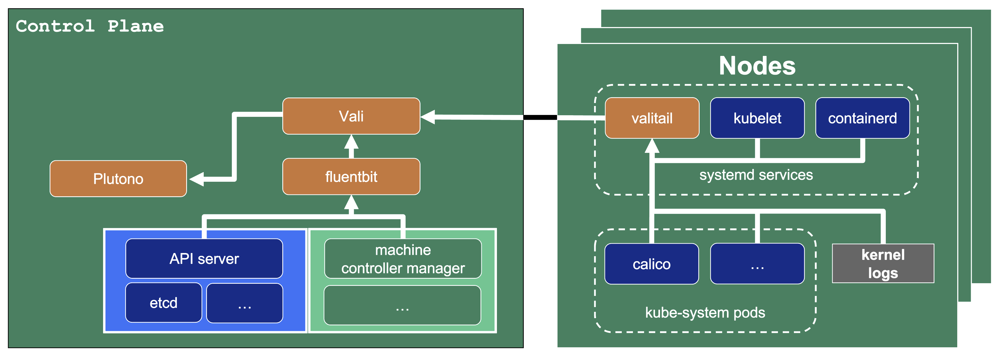
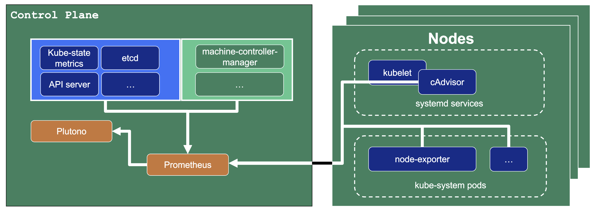
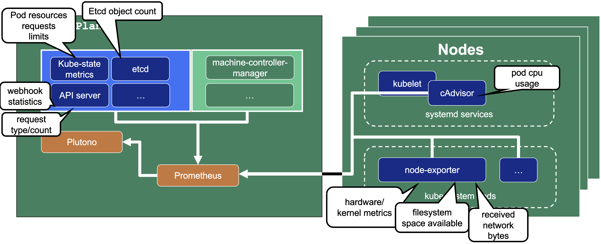
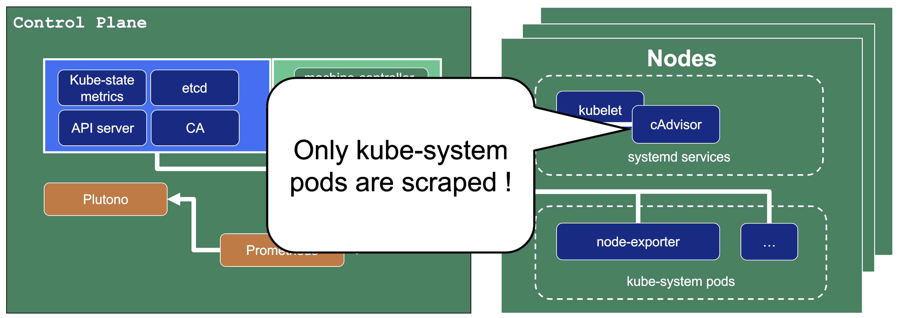

## Overview

Gardener offers out-of-the-box observability for system-components, the control plane, and the nodes of a cluster.

Having your workload survive on day 2 can be a challenge. The goal of this topic is to give you the tools with which to observe, analyze, and alert when the control plane or system components of your workload become unhealthy. This will let you guide your containers through the storm of operating in a production environment.

## Observability - Core Components

The core Observabiltiy components which Gardener offers out-of-the-box are:
- Prometheus - for Metrics and Alerting
- Vali - a Loki fork for Logging
- Plutono - a Grafana fork for Dashboard visualization

Both forks are done from the last version with an Apache license.

### Control Plane Components on the Seed

Prometheus, Plutono, and Vali are all located in the Seed cluster. They run next to the ControlPlane of your cluster.

The next sections will explore those components in detail.
{}
Plutono, Vali, and Prometheus offered by Gardener do not provide monitoring for end-user workloads. If you need this, then you need to deploy your own monitoring stack into your Shoot cluster.
{}

### Accessing the Plutono Dashboards

Let us start by giving some visual hints on how to access Plutono. [Plutono](https://github.com/credativ/plutono#plutono) (formerly known as Grafana) is the monitoring solution shipped ready-to-use with a Gardener Shoot cluster.

In order to access the Gardener provided dashboards, open the `Plutono` link provided in the Gardener dashboard.

The password you can use to log into them is provided below.

Completing this, you will see similar screens.

### Prometheus

[Prometheus](https://prometheus.io/) is a monitoring system and a time series database. It can be queried using PromQL, the so called Prometheus Querying Langauge. 

This example query describes the current uptime status of the kube apiserver.

#### Prometheus and Plutono

Time series data from Prometheus can be made visible with Plutono. Here we see how the query above which describes the uptime of a Kubernetes Cluster is visualized with a Plutono dashboard.

### Vali Logs via Plutono

Vali is our logging solution. Here we see how Logs gathered with Vali are visualized in Plutono. Therefore, we can correlate Logs and metrics in the same tool.

## Observability - Detailed View

### Data Flow

Our monitoring and logging solutions Vali and Prometheus both run next to the control plane of the Shoot Cluster.

Data from both is visualized in the Plutono dashboards.

#### Data Flow - Logging

Plutono displays the logging data from Vali. 

The following diagram allows a more detailed look at Vali and the data flow.

In this example, two different components are scraping logs and sending them to Vali, which in turn stores the logs.

**Valitail**

Valitail is a systemd service that runs on each node. It scrapes kubelet, containerd, kernel logs, and the logs of the pods in the kube-system namespace.

**Fluentbit**

Fluentbit runs as a daemonset on each Seed node. It scrapes logs of the kubernetes control plane components, like apiserver or etcd. 

It also gets logs of the Gardener deployed components like machine-controller-manager or the cluster autoscaler, which is useful when finding out why nodes got created or have been replaced.

#### Data Flow - Monitoring

Looking at Prometheus, our monitoring solution, in more detail:

An instance of Prometheus runs in the Seed cluster next to the Shoots controlplane.

Prometheus is a monitoring solution, which includes alerting and uses a time-series database as its data store. 

In our setup, Prometheus scrapes different pods or system processes in order to gather metrics and preserve them.

This diagram shows the data flow where Prometheus scrapes different targets. After that it persists the data, which can then be visualized via queries in the Plutono dashboards.

Let us have a look what metrics we scrape for debugging purposes:

**Container performance metrics**

cAdvisor is an open-source agent integrated into the kubelet binary that monitors resource usage and analyzes the performance of containers. It collects statistics about the CPU, memory, file, and network usage for all containers running on a given node. We use it to scrape data for all pods running in the kube-system namespace in the shoot cluster.

**Hardware and kernel-related metrics**

The [Prometheus Node Exporter](https://prometheus.io/docs/guides/node-exporter/) runs as a daemonset in the kube-system namespace of your Shoot cluster. It exposes a wide variety of hardware and kernel-related metrics. Some of the metrics we scrape are, for example, the current usage of the filesystem (`node_filesystem_free_bytes`) or current CPU usage (`node_cpu_seconds_total`). Both can help you identify if nodes are running out of hardware resources, which could lead to your workload experiencing downtimes.

**Controlplane component specific metrics**

The different control plane pods (for example, etcd, API server, and kube-controller-manager) emit metrics over the `/metrics` endpoint. This includes metrics like how long webhooks take, the request count of the apiserver and storage information, like how many and what kind of objects are stored in etcd.

**Metrics about the state of Kubernetes objects**

[kube-state-metrics](https://github.com/kubernetes/kube-state-metrics) is a simple service that listens to the Kubernetes API server and generates metrics about the state of the objects. It is not focused on the health of the individual Kubernetes components, but rather on the health of the various objects inside, such as deployments, nodes, and pods.

It exposes metrics calculated from the status of Kubernetes objects (for example, resource requests of pods).

To get a real-world feeling, here are a few example metrics exposed by the components:

For logs and for metrics we only expose those for the Kubernetes Control Plane or for Gardener managed system components like pods in kube-system of the Shoot cluster.

This means that for any workload you deploy into your Shoot cluster, you need to deploy monitoring and logging yourself.

Logs or metrics are kept max 14 days or when a configured space limit is reached.

