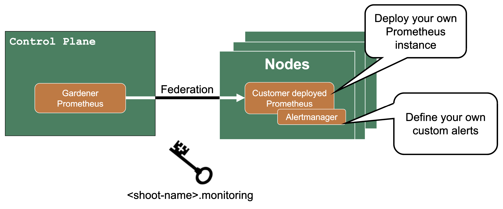

## Overview

There are two types of alerts for control plane and Gardener managed system-components:
- Predefined Gardener alerts 
- Customizable custom alerts

### Predefined Control Plane Alerts

In the shoot spec it is possible to configure `emailReceivers`. On this email address you will automatically receive email notifications for 16 predefined alerts of your control plane.

For more information, see [Alerting](https://github.com/gardener/gardener/blob/master/docs/monitoring/alerting.md).

### Custom Alerts - Federation

If you need more customization for alerts for control plane metrics, you have the option to deploy your own Prometheus into your shoot control plane.

Then you can use federation to forward the metrics from the Gardener managed Prometheus to your custom deployed Prometheus. Since as a shoot owner you do not have access to the control plane pods, this is the only way to get those metrics.

The credentials and endpoint for the Gardener managed Prometheus are exposed over the Gardener dashboard or programmatically in the garden project as a secret (`<shoot-name>.monitoring`).

