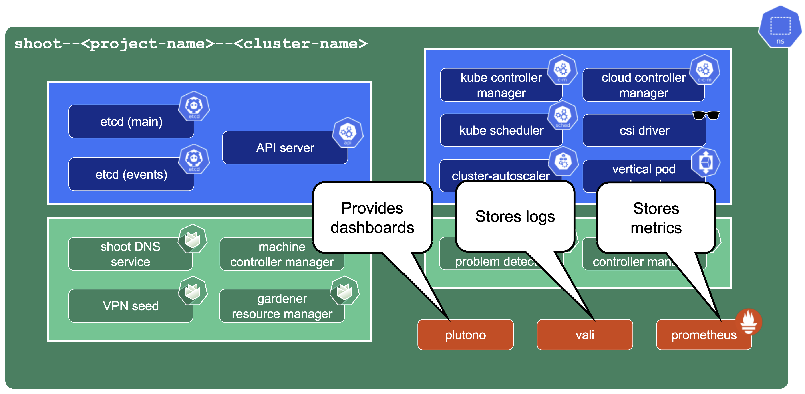

## Core Components

The core Observability components which Gardener offers out-of-the-box are:

- Prometheus - for Metrics and Alerting
- Vali - a Loki fork for Logging
- Plutono - a Grafana fork for Dashboard visualization

Both forks are done from the last version with an Apache license.

### Control Plane Components on the Seed

Prometheus, Plutono, and Vali are all located in the seed cluster. They run next to the control plane of your cluster.

The next sections will explore those components in detail.

{}
Gardener only provides monitoring for Gardener-deployed components. If you need logging or monitoring for your workload, then you need to deploy your own monitoring stack into your shoot cluster.
{}

{}
Gardener only provides a monitoring stack if the cluster is not of `purpose: testing`. For more information, see [Shoot Cluster Purpose](https://gardener.cloud/docs/gardener/shoot_purposes/).
{}

### Logging into Plutono

Let us start by giving some visual hints on how to access Plutono. [Plutono](https://github.com/credativ/plutono#plutono) allows us to query logs and metrics and visualize those in form of dashboards. Plutono is shipped ready-to-use with a Gardener shoot cluster.

In order to access the Gardener provided dashboards, open the `Plutono` link provided in the Gardener dashboard. You will be automatically logged in through OIDC based authentication:

Access is still possible via the non-OIDC ingress using the credentials from the `<clustername>.monitoring` secret. It contains the HTTP basic auth credentials in base64-encoded form, as well as the Plutono ingress URL. The Prometheus URL can be derived from the Plutono URL by replacing the `gu` prefix with `p`.

{}
While still available, basic authentication via username and password has been deprecated. you are advised to use OIDC based authentication.
{}

### Accessing the Dashboards

After logging in, you will be greeted with a Plutono welcome screen. Navigate to `General/Home`, as depicted with the red arrow in the next picture:

Then you will be able to select the dashboards. Some interesting ones to look at are:

- The `Kubernetes Control Plane Status` dashboard allows you to check control plane availability during a certain time frame.
- The `API Server` dashboard gives you an overview on which requests are done towards your apiserver and how long they take.
- With the `Node Details` dashboard you can analyze CPU/Network pressure or memory usage for nodes.
- The `Network Problem Detector` dashboard illustrates the results of periodic networking checks between nodes and to the APIServer.

Here is a picture with the `Kubernetes Control Plane Status` dashboard.

### Prometheus

[Prometheus](https://prometheus.io/) is a monitoring system and a time series database. It can be queried using PromQL, the so called Prometheus Querying Language.

This example query describes the current uptime status of the kube apiserver.

#### Prometheus and Plutono

Time series data from Prometheus can be made visible with Plutono. Here we see how the query above which describes the uptime of a Kubernetes cluster is visualized with a Plutono dashboard.

### Vali Logs via Plutono

Vali is our logging solution. In order to access the logs provided by Vali, you need to:

1. [Log into Plutono](#logging-into-plutono).

1. Choose `Explore`, which is depicted as the little compass symbol:

 

1. Select `Vali` at the top left, as shown here:

There you can browse logs or events of the control plane components.

Here are some examples of helpful queries:

- `{container_name="cluster-autoscaler" }` to get cluster-autoscaler logs and see why certain node groups were scaled up.
- `{container_name="kube-apiserver"} |~ "error"` to get the logs of the kube-apiserver container and filter for errors.
- `{unit="kubelet.service", nodename="ip-123"}` to get the kubelet logs of a specific node.
- `{unit="containerd.service", nodename="ip-123"}` to retrieve the containerd logs for a specific node.

 Choose `Help >` in order to see what options exist to filter the results.

 For more information on how to retrieve K8s events from the past, see [How to Access Logs](https://github.com/gardener/gardener/blob/master/docs/usage/logging.md#how-to-access-the-logs).

## Detailed View

### Data Flow

Our monitoring and logging solutions Vali and Prometheus both run next to the control plane of the shoot cluster.

#### Data Flow - Logging

The following diagram allows a more detailed look at Vali and the data flow.

On the very left, we see Plutono as it displays the logs. Vali is aggregating the logs from different sources.

Valitail and Fluentbit send the logs to Vali, which in turn stores them.

*Valitail*

Valitail is a systemd service that runs on each node. It scrapes kubelet, containerd, kernel logs, and the logs of the pods in the kube-system namespace.

*Fluentbit*

Fluentbit runs as a daemonset on each seed node. It scrapes logs of the kubernetes control plane components, like apiserver or etcd.

It also scrapes logs of the Gardener deployed components which run next to the control plane of the cluster, like the machine-controller-manager or the cluster autoscaler. Debugging those components, for example, would be helpful when finding out why certain worker groups got scaled up or why nodes were replaced.

#### Data Flow - Monitoring

Next to each shoot's control plane, we deploy an instance of Prometheus in the seed.

Gardener uses [Prometheus](https://prometheus.io/) for storing and accessing shoot-related metrics and alerting.

The diagram below shows the data flow of metrics.
Plutono uses PromQL queries to query data from Prometheus. It then visualises those metrics in dashboards.
Prometheus itself scrapes various targets for metrics, as seen in the diagram below by the arrows pointing to the Prometheus instance.

Let us have a look what metrics we scrape for debugging purposes:

**Container performance metrics**

cAdvisor is an open-source agent integrated into the kubelet binary that monitors resource usage and analyzes the performance of containers. It collects statistics about the CPU, memory, file, and network usage for all containers running on a given node. We use it to scrape data for all pods running in the kube-system namespace in the shoot cluster.

**Hardware and kernel-related metrics**

The [Prometheus Node Exporter](https://prometheus.io/docs/guides/node-exporter/) runs as a daemonset in the kube-system namespace of your shoot cluster. It exposes a wide variety of hardware and kernel-related metrics. Some of the metrics we scrape are, for example, the current usage of the filesystem (`node_filesystem_free_bytes`) or current CPU usage (`node_cpu_seconds_total`). Both can help you identify if nodes are running out of hardware resources, which could lead to your workload experiencing downtimes.

**Control plane component specific metrics**

The different control plane pods (for example, etcd, API server, and kube-controller-manager) emit metrics over the `/metrics` endpoint. This includes metrics like how long webhooks take, the request count of the apiserver and storage information, like how many and what kind of objects are stored in etcd.

**Metrics about the state of Kubernetes objects**

[kube-state-metrics](https://github.com/kubernetes/kube-state-metrics) is a simple service that listens to the Kubernetes API server and generates metrics about the state of the objects. It is not concerned with metrics about the Kubernetes components, but rather it exposes metrics calculated from the status of Kubernetes objects (for example, resource requests or health of pods).

In the following image a few example metrics, which are exposed by the various components, are listed:

We only store metrics for Gardener deployed components. Those include the Kubernetes control plane, Gardener managed system components (e.g., pods) in the kube-system namespace of the shoot cluster or systemd units on the nodes. We do not gather metrics for workload deployed in the shoot cluster. This is also shown in the picture below.

This means that for any workload you deploy into your shoot cluster, you need to deploy monitoring and logging yourself.

Logs or metrics are kept up to 14 days or when a configured space limit is reached.

