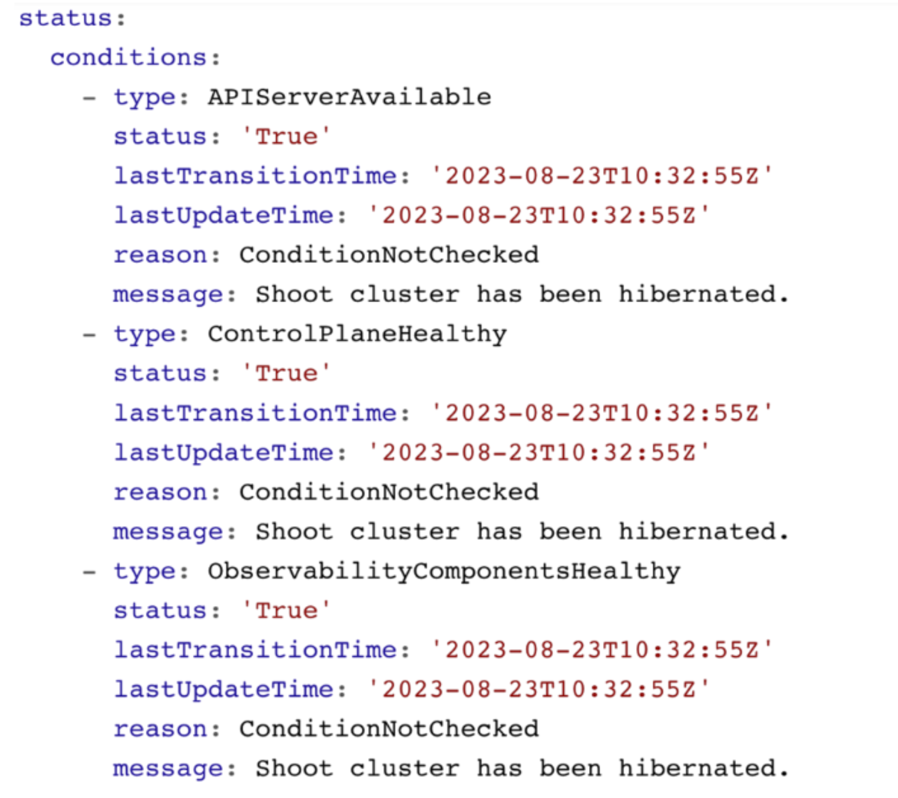
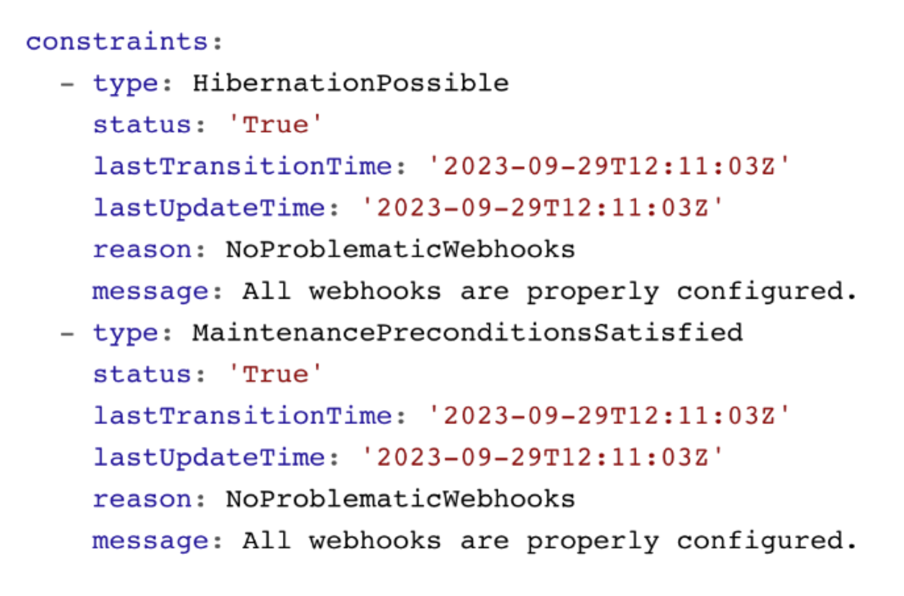
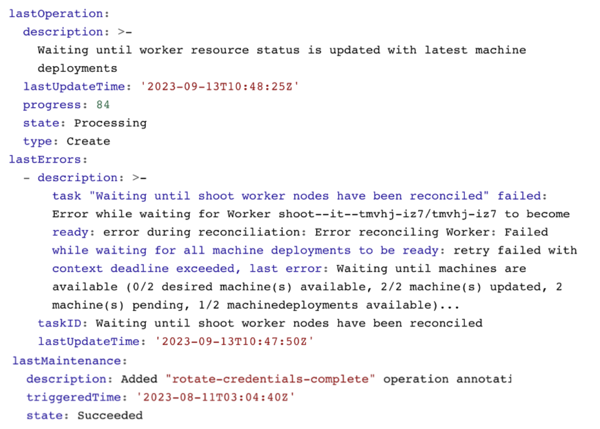
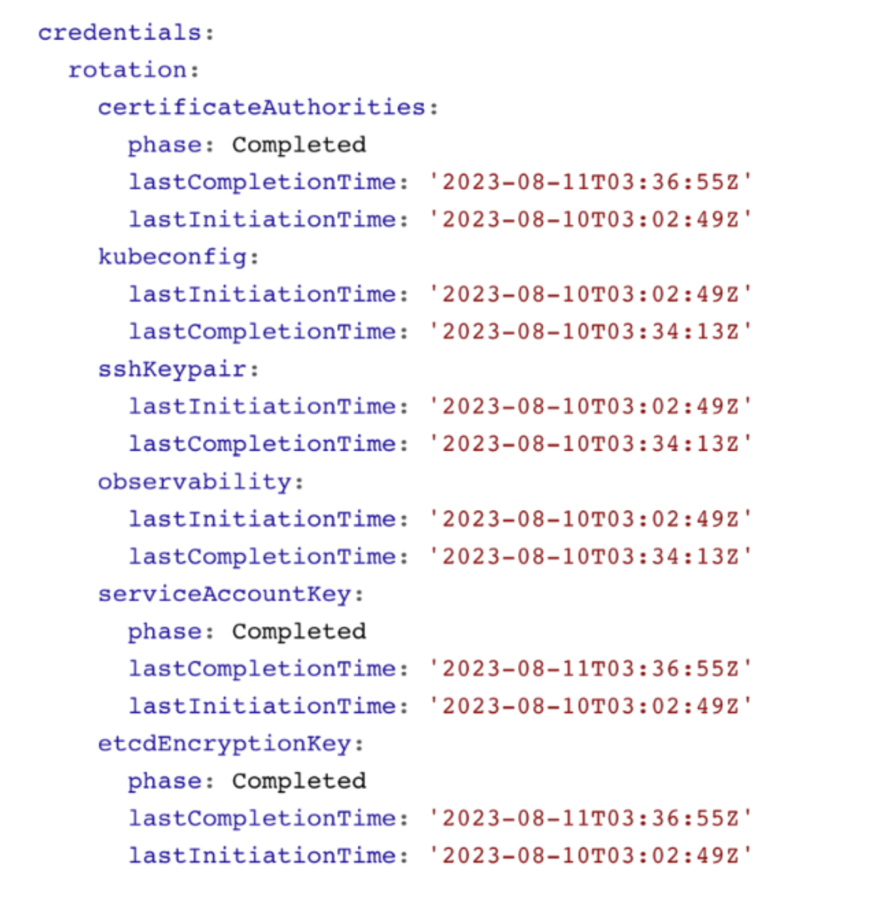

## Overview

In this topic you can see various shoot statuses and how you can use them to monitor your shoot cluster.

## Shoot Status - Conditions

You can retrieve the shoot status by using `kubectl get shoot -oyaml`

It contains conditions, which give you information about the healthiness of your cluster. Those conditions are also forwarded to the Gardener dashboard and show your cluster as healthy or unhealthy.

## Shoot Status - Constraints

The shoot status also contains constraints. If these constraints are met, your cluster operations are impaired and the cluster is likely to fail at some point. Please watch them and act accordingly.

## Shoot Status - Last Operation

The `lastOperation`, `lastErrors`, and `lastMaintenance` give you information on what was last happening in your clusters. This is especially useful when you are facing an error.

In this example, nodes are being recreated and not all machines have reached the desired state yet.

## Shoot Status - Credentials Rotation

You can also see the status of the last credentials rotation. Here you can also programmatically derive when the last rotation was down in order to trigger the next rotation.

