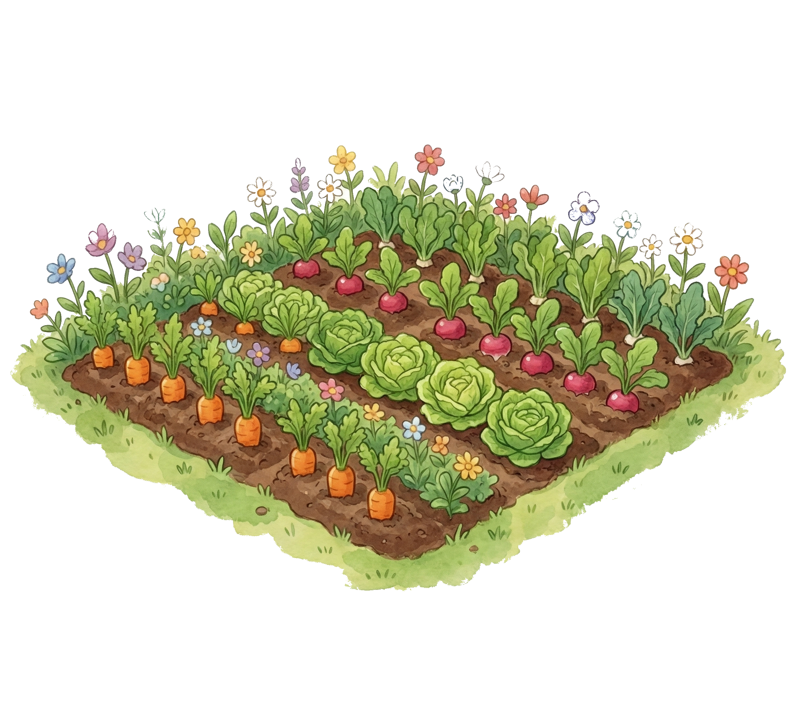
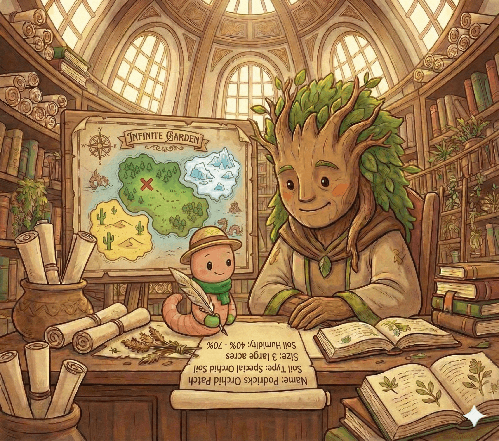
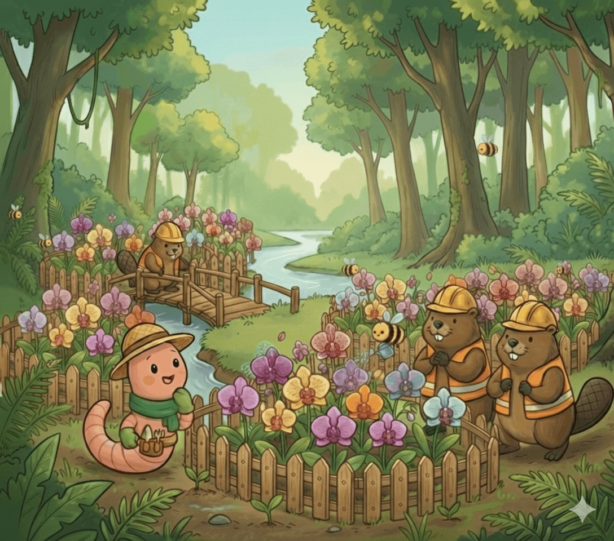

# Podrick and the Infinite Garden

**An Illustrated Guide to Gardener for Readers of All Ages**


* **Written by:** _The Gardener authors_  
* **Inspiration:** [_The Illustrated Children's Guide to Kubernetes_](https://www.cncf.io/phippy/the-childrens-illustrated-guide-to-kubernetes/)  
* **Illustrations:** _generated with [Gemini Nano Banana Pro](https://gemini.google/overview/image-generation/)_

## Meet Podrick

Podrick was a simple earthworm with a complex dream.
While most worms were content tunneling through a single patch of dirt, Podrick had ambition.
He had collected thousands of rare and delicate plants.
Among them were orchids that needed humidity, cacti that craved dry heat, and ferns that demanded shade.

To keep them alive, he needed plots (_Kubernetes clusters_).
Many plots in different environments but all with a similar set of features to ease maintenance efforts.


## _Explanation: Kubernetes Clusters_

* Host containerized workloads.
* Can be configured in many ways.
* Need to be scaled, updated and maintained regularly.



---

At first, Podrick had asked his racoon friends for help.

The raccoons were enthusiastic builders, but they were chaotic.
"Hey Podrick!" a raccoon shouted, straining to shove a green hose into a square pipe.
"I've built the perfect intake system!"
"That's great," Podrick sighed, "but how do I connect your intake system to the other plots?"

He turned to the second raccoon, who was cluelessly trying to drill holes into a puddle of water.
"I have the most advanced tools," the raccoon insisted, "but for some reason, I don't seem to make any progress!"

Meanwhile, the third raccoon ignored them both, meticulously sorting and stacking smooth pebbles.
It was a beautiful way of organizing, but it didn't help Podrick on the quest for the perfect plot.

Each built their own way, using their own tools, speaking their own languages.
If a plot broke, Podrick had to find the builder and understand their logic.
Podrick was tired.


## _Explanation: Providers_

* There are many ways to get and maintain a Kubernetes cluster.
* Different offerings provide different features and configuration options.
* Each provider has their own release/adoption cycle for new Kubernetes version and features.


---

One day, seeking a break from the chaos, Podrick tunneled further than ever before.
He popped his head out of the soil and gasped.

Before him lay a magnificent, standardized plot.
It was lush, perfectly irrigated, and teeming with activity.
But there were no raccoons here.
Instead, there were friendly, yellow-and-black striped bees.

The bees moved with a hive mind, checking the plants, pruning leaves, and watering roots with mathematical precision.

"Excuse me," Podrick chirped. "Who built this?"

A worker bee buzzed down.
"We maintain the plot, little worm. But we did not design it. We follow the orders of the hive."

"Can I get a plot like this?" Podrick asked. "I have so many plants."

"We are but workers," the bee hummed. "If you desire a plot, you must go to the center of the world. You must visit the Great Library of Plants and speak to the Botanist."


---

Podrick traveled until he reached the Great Library of Plants (_The Garden cluster_).
It was a place of immense order.
The walls were lined with books and thousands of rolled-up parchments.

At the center sat the Botanist (_The Gardener API Server_).
She was a wise, towering figure who seemed to know the location of every seed in the world.

"Welcome, Podrick," she said, her voice like rustling leaves. "The bees told me you seek order."

"I need plots," Podrick said. "But not like the raccoons build. I need them to be the same, no matter where they are."


## _Explanation: Garden_

* A dedicated Kubernetes cluster hosting the definition of other Kubernetes clusters.
* The management plane of a Gardener installation.
* Central entry point to manage the lifecycle of a Kubernetes cluster.


---

The Botanist nodded and handed him a blank piece of parchment.
"In the Great Library of Plants, we do not build with hammers and nails. We build with intent. This is a Scroll of Desire."

"I just... write what I want?"

"Exactly," the Botanist smiled.
"Do not tell us how to build the fence. Just write that you want a fence. Do not tell us how to make the soil wet. Just write that you need humidity. This is the declarative way."

Podrick took a quill. He wrote:

```yaml
Name: Podrick's Orchid Patch
Soil Type: Special Orchid Soil
Size: 3 large acres
Soil Humidity: 40% - 70%
```

He handed it back.
The Botanist read the scroll and asked back: "And where shall we build this patch?"

"There is a beautiful and well-suited area in the rainy forest.", Podrick answered and pointed to a spot on a map.

"Very well", said the Botanist.
She took a seal and stamped it.
"It is accepted. Now, meet your guide."



## _Explanation: Shoot_

* A resource served by the Garden cluster.
* Represents a Kubernetes cluster and the desired state of its configuration.
* Every user brings their own infrastructure accounts and grants Gardener access to manage Kubernetes cluster in there.


---

A mechanical whirring filled the air.
Descending from the library's dome was a gleaming, mechanical hummingbird with lenses for eyes.

"This is Gilly," the Botanist introduced her.
"Gilly is one of many Gardenlets. She does not live here in the library. She lives in her own nursery (_The Seed Cluster_), but she watches my library constantly. The moment I stamped that scroll, she saw it."

Gilly hovered in front of Podrick.
"Target acquired: Podrick's Orchid Patch. Destination: The nursery. Hop on, little worm."

Podrick crawled onto Gilly’s metallic back, and they zipped away, leaving the Great Library of Plants behind.


## _Explanation: Gardenlet_

* A controller like the Kubelet.
* Turns a given Kubernetes cluster into a Seed cluster.
* Manages all Shoots (Kubernetes clusters) scheduled there.


---

They arrived at the nursery (_The Seed Cluster_).
It was a massive, protected greenhouse.
Inside, Podrick saw something strange.
There were hundreds of beehives (_Control Planes_), all buzzing safely inside the glass walls.

"Look," Gilly pointed with her beak.
"That is where the maintainers of the plots live."

"The maintainers?"

"The beehives," Gilly explained.
"Each hive is responsible for a different plot. We keep them here, in the nursery, safe and warm. We do not leave the queens out in the cold rain of the actual plots."

Gilly flew to an empty spot in the nursery.
She began moving quicker than Podrick's eyes could follow and soon a new beehive labeled Podrick’s Orchid Patch started to grow.

"The beehive is ready," Gilly chirped.
"But before the bees can settle in, we need the beavers."


## _Explanation: Seed Cluster_

* A Kubernetes cluster hosting Shoot control planes as its workload.
* Is managed by a Gardenlet.
* Each Shoot control plane runs separately in a dedicated namespace.
* Only the Kubernetes API server is exposed to the user.


---

Gilly whistled, and a door at the back of the nursery opened.
Out waddled a team of sturdy beavers wearing hardhats.

One of them operated heavy machinery; a wooden excavator.
The others brought tools and material for construction.

"The scroll of desire says you want 'Special Orchid Soil'," Gilly read from her memory banks.
"And it should be in the rainy forest."
She showed the beavers the spot on the map.
It was the same one Podrick had pointed out to the Botanist back at the library.

Podrick watched in awe as the beavers marched out of the nursery and into the wild lands.
Because the beavers were experts, they didn't care if the ground was sandy, rocky, or clay.
They had different attachments for their wooden excavator for each terrain.

Podrick watched them work.
The beavers cleared the land and built the infrastructure which quickly became a plot.


## _Explanation: Infrastructure Extensions_

* Gardener defines interfaces for creating infrastructure such as a Virtual Private Cloud (VPC).
* Extensions implement the interfaces.
* Extensions are deployed to the Seed cluster and create actual resources on the infrastructure provider.


---

The beavers finished their tasks in no time.

Podrick stood on his new plot.
It was perfect.
The friendly bees (from the hive in the nursery) had flown out to the plot to tend his plants.

The beavers were close by, ready to repair the plot if it broke.


## _Explanation: Machine Controller Manager_

* Runs on the Seed cluster.
* Has domain specific implementations on board to manage actual machines on a given infrastructure.
* Machines become the Nodes of the cluster.


---

Together with Gilly Podrick went back to the Great Library of Plants.

"Gilly," Podrick asked, "Is this the only nursery? What if I want to plant my ice-ferns in the frozen north?"

Before Gilly could answer, the soft voice of the Botanist echoed through the Great Library halls.
"The garden world is much larger than one greenhouse, little worm."

The Botanist led Gilly and Podrick to a balcony overseeing vastly different lands.

"We have nurseries everywhere," the Botanist explained, gesturing to the horizon.
"From the frozen north to the tropical south and from the coasts to the mountains. In every single one of them, there lives a Gardenlet, just like Gilly."

Gilly chirped in agreement.
"My siblings. We all watch the library. We all wait for the scrolls."

Podrick’s mind raced.
"So... if I write a scroll for the frozen north, I don't need to travel there? I don't need to find new racoons or learn how to build on ice?"

"Correct," the Botanist smiled.
"You simply write a scroll of desire specifying 'Ice Soil' and the region 'North'. The Gardenlet in that distant nursery will see it, send out the local beavers, and build your plot exactly as you requested."


## _Explanation: Scaling_

* Many Seeds can be registered with a single Garden cluster.
* Seeds can be on different infrastructures and regions.
* In heavy-use regions, multiple Seeds can be created.


---

Back at the Botanist's desk in the Great Library halls, Podrick looked at his single scroll.
He realized he didn't just have a plot; he had a system. He could manage a thousand plots, all with different needs, on all imaginable landscapes.

"I can have all my plants," Podrick whispered, "In all the perfect places. And I just have to describe what I need to grow them."

"That is the power of the system I created," the Botanist said, resting in her chair.
"You define the What. We handle the How. I like to simply call it the way of the Gardener."


---

Just as Podrick felt a wave of relief, a sudden realization struck him, causing him to freeze.
"Wait! I forgot something terrible!"

Gilly tilted her metallic head.
"What is it?"

"My orchids," Podrick stammered.
"They grow. Fast. I only asked for 3 acres of soil. When they get too big, they'll be crushed!"

The Botanist let out a sound that resembled a chuckle.
"Podrick, do you think the scroll is carved in stone?"

"It's... parchment?"

"It is a living manifesto," the Botanist explained.
"If your plants grow, you do not need to build a new plot. You simply update the scroll. You can change the line 'Size: 3 acres' to 'Size: Auto-manage up to 10 acres'. When the beavers see the plot getting crowded, they will automatically clear more land and expand the fences. This is autoscaling."



## _Explanation: Day-2 Operations_

* Updates like changing the Node pool size or Kubernetes version is done via the Shoot resource.
* Shoot clusters are reconciled regularly and pick up upstream changes automatically.
* Cluster operations like scaling or replacing a broken node happen automatically.
* ETCD backups protect against infrastructure failures.


---

Relieved that his plants are well maintained by Gilly, the beavers and bees, Podrick traveled home.

As he met his racoon friends, he invited them over to have a cup of tea.
The racoons did not have to worry about plots anymore.
Instead, they listened to Podrick as he told the story of his journey and the encounter with the Botanist.

The End.


## Glossary

| Illustration                                                                                                                                                 | Term                                                                                                       | Definition                                                                                                                                         |
|--------------------------------------------------------------------------------------------------------------------------------------------------------------|------------------------------------------------------------------------------------------------------------|----------------------------------------------------------------------------------------------------------------------------------------------------|
|                 | Kubernetes Cluster                                                                                         | Orchestrator of containerized workloads.                                                                                                           |
|                                              | Providers                                                                                                  | Offerings or tools to manage a Kubernetes cluster.                                                                                                 |
|                     | [Garden](https://github.com/gardener/gardener/blob/master/docs/concepts/operator.md#garden-resources)      | Management plane of the system where a user defines how their Kubernetes clusters should look like.                                                |
|                                                | [Shoot](https://github.com/gardener/gardener/blob/master/docs/concepts/apiserver.md#shoots)                | Resource describing the desired and actual state of a Kubernetes cluster.                                                                          |
|                         | [Seed](https://github.com/gardener/gardener/blob/master/docs/concepts/gardenlet.md#seed-controller)        | A Kubernetes cluster hosting other Kubernetes cluster's control planes as workloads.                                                               |
|            | [Gardenlet](https://github.com/gardener/gardener/blob/master/docs/concepts/gardenlet.md)                   | Just like a Kubelet for Nodes, a Gardenlet turns a Kubernetes cluster into a Seed. The Gardenlet has the core logic to manage Kubernetes clusters. |
|  | [Infrastructure Extensions](https://github.com/gardener/gardener/blob/master/extensions/README.md)         | With knowledge about the actual infrastructure, they manage resources such as Virtual Private Clouds (VPCs).                                       |
|         | [Machine Controller Manager](https://github.com/gardener/machine-controller-manager/blob/master/README.md) | Responsible for the lifecycle of a Machine, which represents a Kubernetes cluster's Node.                                                          |
