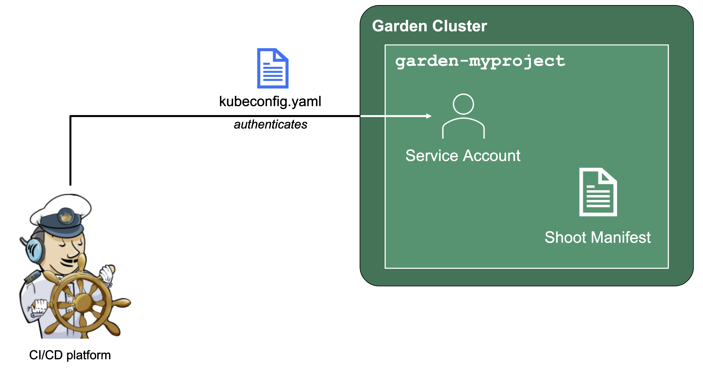
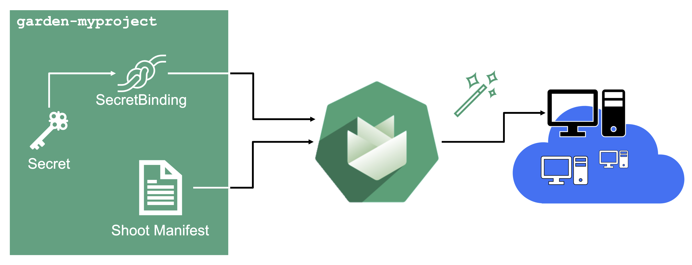

## Overview

Gardener is all about Kubernetes clusters, which we call Shoots. However, Gardener also does user management, delicate permission management and offers technical accounts to integrate its services into other infrastructure. It allows you to create several quotas and it needs credentials to connect to cloud providers. All of these are arranged in multiple fully contained projects, each of which belongs to a dedicated user and/or group.

{}
Since all Gardener resources are custom Kubernetes resources, the usual and well established concept of `resourceQuotas` in Kubernetes can also be applied to Gardener resources. With a `resourceQuota` that sets a hard limit on, e.g. `count/shoots.core.gardener.cloud`, you can restrict the number of Shoot clusters that can be created in a Project.
{}

## Projects on YAML Level

Projects are just another Kubernetes resource which can be expressed by YAML. The resource specification can be found in the [API reference documentation](https://gardener.cloud/docs/gardener/api-reference/core/#core.gardener.cloud/v1beta1.Project).

In essence, a project's specification defines a name, a description (which is a free-text field), a purpose (again, a free-text field), an owner, and members. In Gardener, user management is done on a project level. Therefore, projects can have different members with certain roles. 

For example, a member with the `viewer` role can see and list all clusters but cannot create, delete or modify an existing cluster. For that, a member would need at least an `editor` role. Another important role would be the `uam` role - members with that role are allowed to manage members and technical users for a project. The `owner` of a project is allowed to do all of that, regardless of what roles might be assigned to him.

As with every Kubernetes object, projects can have annotations and there is one annotation that is very important within SAP - the `billing.gardener.cloud/costObject` annotation. Since Gardener is hosting the control plane of all Shoot clusters, it incurs a small fee to its users - with this annotation, it knows which cost-center needs to be billed.

Projects are getting reconciled by Gardener's project-controller, a component of Gardener's controller-manager. The status of the last reconcilation, along with any potential failures, will be recorded in the project's `status` field.

In case you are interested, you can also view the source code for:
- [The structure of a project API object](https://github.com/gardener/gardener/blob/master/pkg/apis/core/types_project.go) 
- [Reconciling a project](https://github.com/gardener/gardener/blob/master/pkg/controllermanager/controller/project/project/reconciler.go)

## Gardener Projects and Kubernetes Namespaces

{}
Each Gardener Project corresponds to a Kubernetes Namespace and all project specific resources are placed into it.
{}

Even though Projects are a dedicated Kubernetes resource, every project also corresponds to a dedicated namespace in the Garden cluster. All project resources - including Shoots - are placed into this namespace. 

You can ask Gardener to use a specific namespace name in the project manifest but usually, this field should be left empty. The namespace then gets created automatically by Gardener's project-controller and its name will then be generated from the project's name, prefixed by "garden-".

ResourceQuotas - if any - will be enforced on the project namespace.

## Service Accounts

Since Gardener is 100% Kubernetes, it can be easily used in a programmatic way - by just sending the resource manifest of a Gardener resource to its API server. To do so, a kubeconfig file and a (technical) user that the kubeconfig maps to are required.

Next to project members, a project can have several Service Accounts - simple Kubernetes Service Accounts that are created in a project's namespace. Consequently, every Service Account will also have its own, dedicated kubeconfig and they can be granted different roles through RoleBindings.

To integrate Gardener with other infrastructure or CI/CD platforms, one can create a Service Account, obtain its kubeconfig and then automatically send Shoot manifests to the Gardener API server. With that, Kubernetes clusters can be created, modified or deleted on the fly whenever they are needed.

## Infrastructure Secrets

For Gardener to create all relevant infrastructure that a Shoot cluster needs inside a cloud provider, it needs to know how to authenticate to the cloud provider's API. This is done through regular secrets.

Through the Gardener Dashboard, secrets can be created for each supported cloud provider (using the Dashboard is the preferred way, as it provides interactive help on what information needs to be placed into the secret and how the corresponding user account on the cloud provider should be configured). All of that is stored in a standard, opaque Kubernetes Secret.

Inside of a Shoot manifest, a reference to that secret is given so that Gardener knows which secret to use for a given Shoot. Consequently, different Shoots, even though they are in the same project, can be created on multiple different cloud provider accounts. However, instead of referring to the Secret directly, Gardener introduces another layer of indirection called a SecretBinding. 

In the Shoot manifest, we refer to a SecretBinding and the SecretBinding in turn refers to the actual Secret.