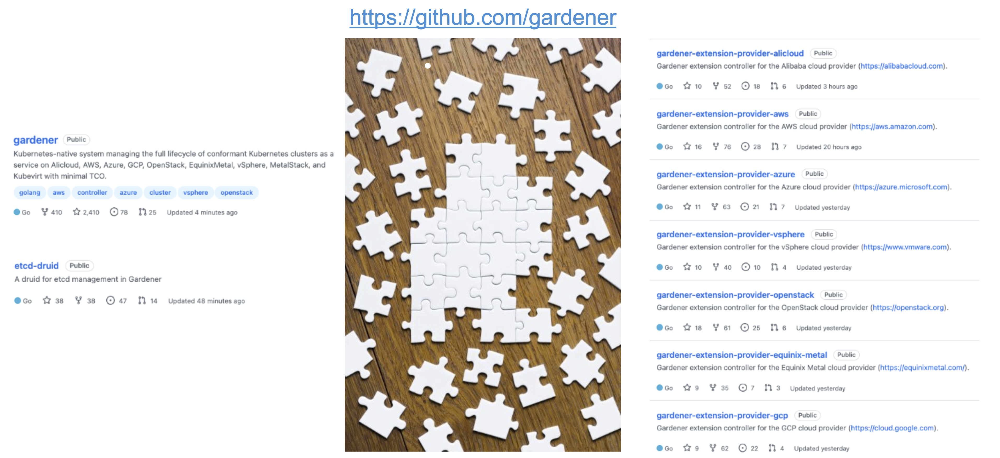
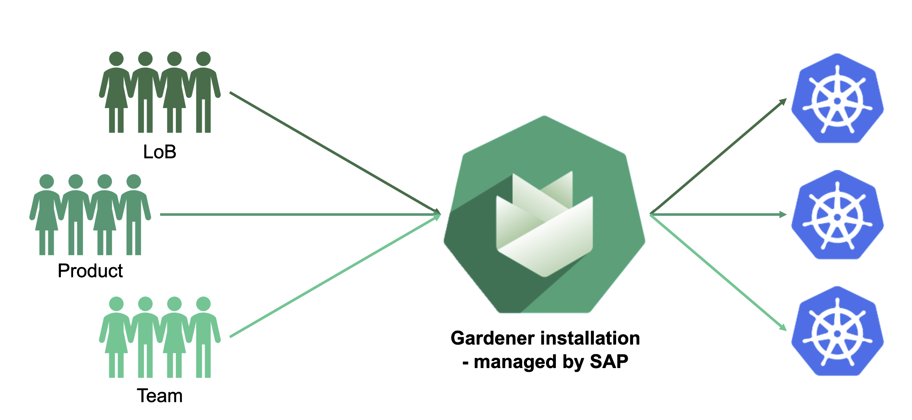
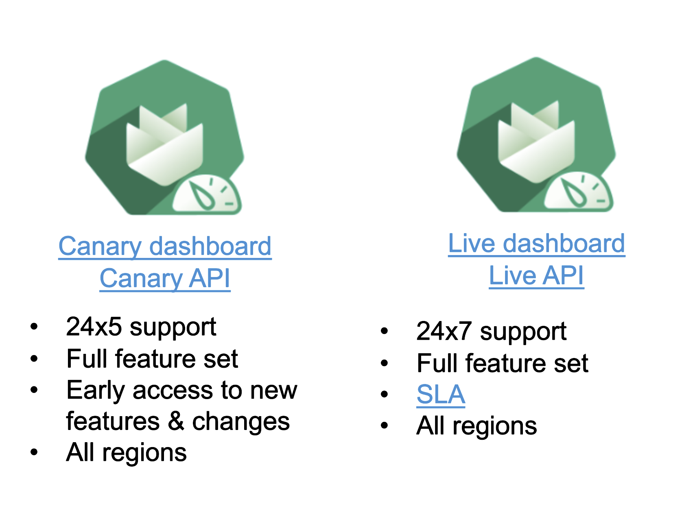
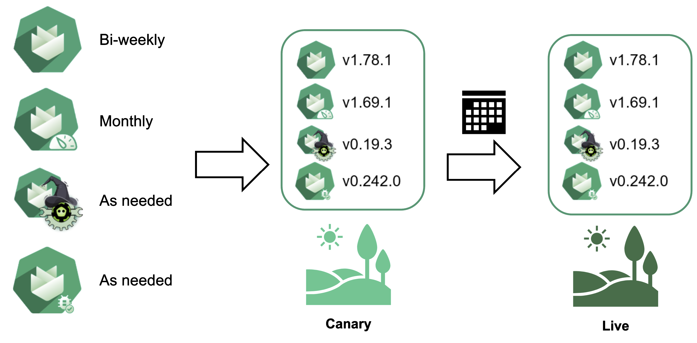
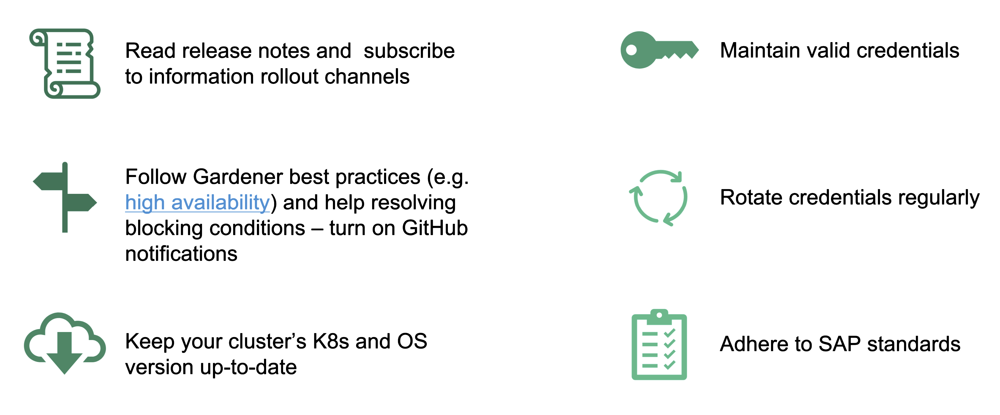
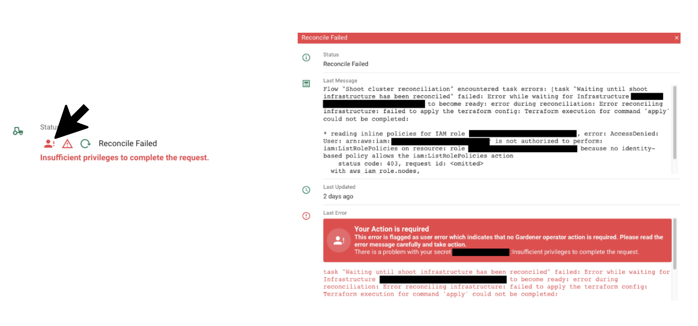
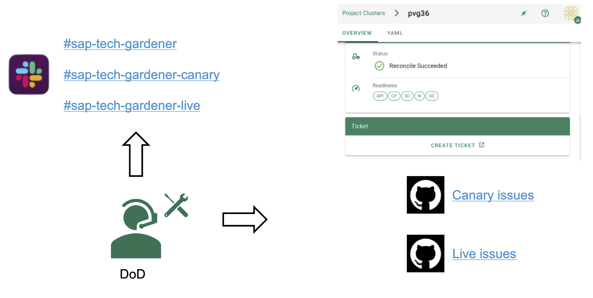

## Gardener - Open Source

Most of Gardener's components are actually open source. The code can be found on github.com within the Gardener organization. The Gardener team at SAP are currently the primary contributors. 

The same team is also responsible for hosting the Gardener service at SAP.

## Gardener Service

Internally, anyone can consume the Gardener service. As already explained, Gardener needs access to the respective infrastructure account and can go to work. Whether it's an individual team or product, or even an entire LoB in need of one or several clusters, everyone can use Gardener instead of creating their own custom clusters.

The Gardener service itself is a Gardener installation managed internally at SAP by the Gardener team. Please note that it is only an internal service at the moment. It is not directly sold to customers but can be a component of an SAP product (e.g., Kyma)

## Landscapes

Gardener has only 2 landscapes open for end-user consumption:
- Canary
- Live

A single landscape supports creating clusters in various regions and on different infrastructures.

Canary should be the starting point for everyone to test their ideas. We offer 24x5 support for the landscape and stakeholder have access to the full set of features.

On the other side, the live landscape is supposed to host production-grade workloads. It offers more support with quicker reaction times and 24x7 coverage. In addition, Gardener aims at SLAs of:
- 99.9% monthly uptime for the Gardener API
- 99.9% monthly uptime for the API server of Shoot

Worker components like VMs are based on the respective infrastructure provider SLAs.

It is a very good practice to mirror the live setup and replicate it in similar fashion on Canary to be able to test Gardener changes before they hit your production clusters.

## Release Cycle

Gardener consists of a variety of components. Each comes with an individual release cycle. In order to be able to handle it, we bundle a distinct combination of versions + glue code into a so-called landscape release. These in turn are transported through our internal qualification and if no errors appear, reach the Canary landscape for stakeholder testing.

Every 2 weeks on Wednesday, the Live landscape is updated. To allow stakeholders to test the changes (again distinct combination of versions) that will reach Live, we "freeze" the Canary landscape the Thursday before the Live update. Only bug fixes or configurational changes will be deployed during the freeze period. 

The timetable / sprint planning can be found here: https://wiki.one.int.sap/wiki/pages/viewpage.action?pageId=1945186691

## Release Information

Getting release information can be hard, but it is absolutely necessary to review it for stakeholders. Here is how you can access them / where to find them:

- Slack: This is Gardener primary communication channel for all sorts of announcements. Stakeholders ideally join all the relevant Gardener channels.
    - [#sap-tech-gardener-canary](https://sap-ti.slack.com/archives/CBV3JS9S4)
    - [#sap-tech-gardener-live](https://sap-ti.slack.com/archives/CBVQLMS6N)

- [Mailing list](https://listserv.sap.corp/mailman/listinfo/kubernetes-users): Subscribe to this list to receive the most important information (like deprecation announcements). Release notes are not posted there.

- [Documentation pages](https://github.tools.sap/kubernetes/documentation/blob/master/website/documentation/landscapes/_index.md): Gardener's internal documentation pages feature landscape information incl. release notes.

## Shoot Owner Responsibilities

Please make sure to read the landscape-specific release notes published to the respective Slack channels carefully (esp. changes labeled as BREAKING for users). While the release notes can be accessed via the [internal documentation](https://github.tools.sap/kubernetes/documentation/blob/master/website/documentation/landscapes/_index.md), if you don't have access to Slack, you are likely to miss out on important information.

- Subscribe to the [mailing list](https://listserv.sap.corp/mailman/listinfo/kubernetes-users) and take action if you are affected by an upcoming change
- Keep your cluster up-to-date with K8s and OS versions to avoid unplanned force-updates on expiration and consume the latest security fixes
- Maintain valid (infrastructure, auditlog, DNS, ...) credentials
- Follow Gardener best practises and help to resolve blocking conditions
- Adhere to SAP standards and regulations
- Trigger credentials rotation regularly

## Interpreting Errors

Please read the error message carefully. When using the dashboard, errors have a classification and the text indicates if this is an error where no Gardener operator is needed.

When accessing the errors via the Shoot's status, the classification is missing. But you are still encouraged to read the error message and check if it is something that can be solved without involving a Gardener operator.

## Support

Gardener has two major support channels:
- Slack
- GitHub Issues

On Slack, stakeholders can ask questions or search for similar questions. The DoD is watching the channels and will try to answer as soon as possible. However help requests via Slack have a low priority.

If a cluster has problems, please open a GitHub issue and describe the observed behavior. Ideally, the ticket should be opened via the "Create Ticket" button from the Gardener dashboard. Depending on the landscape a Shoot is part of, the ticket will be opened in a different repository.

{}
Opening tickets with a certain priority will page the DoD even on a weekend. Please be mindful with a DoD's time.

We are happy to help with issues, consulting or answering questions in general. But sometime, we also need to prioritize. This is were your help is crucial.
{}

### Rating the Issue Severity

Some issues are critical, for example, if you system is experiencing a downtime.

On the other hand, if something is not working as expected or you need a helping hand in increasing quotas, there is no such urgency. Please set the severity of issues appropriately.

## Documentation Links

- [Public Gardener Documentation](https://gardener.cloud/)
- [Gardener Guides](https://gardener.cloud/docs/guides/)
- [Internal Gardener Documentation incl. Internal Guides](https://gardener.cloud.sap/)
- [gardener/gardener GitHub Repo](https://github.com/gardener/gardener) - check the examples folder for inspiration
- [Gardener Support Documentation](https://wiki.one.int.sap/wiki/display/Kubernetes/Gardener+Support)