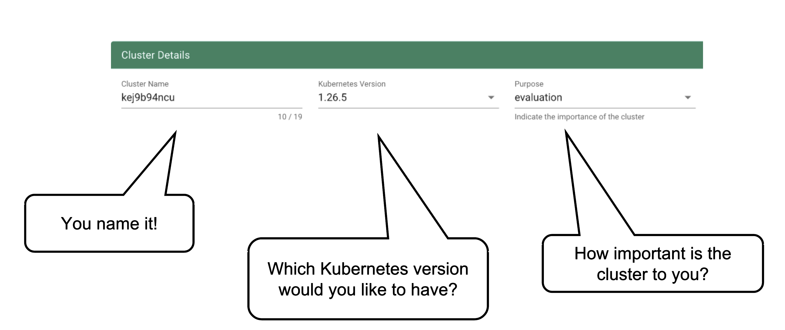
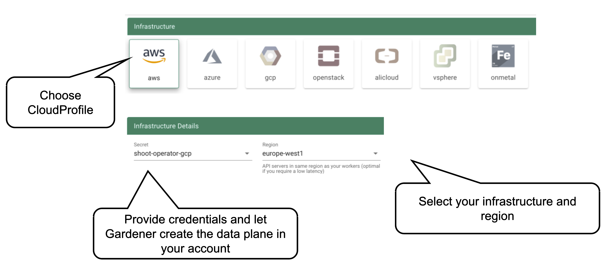
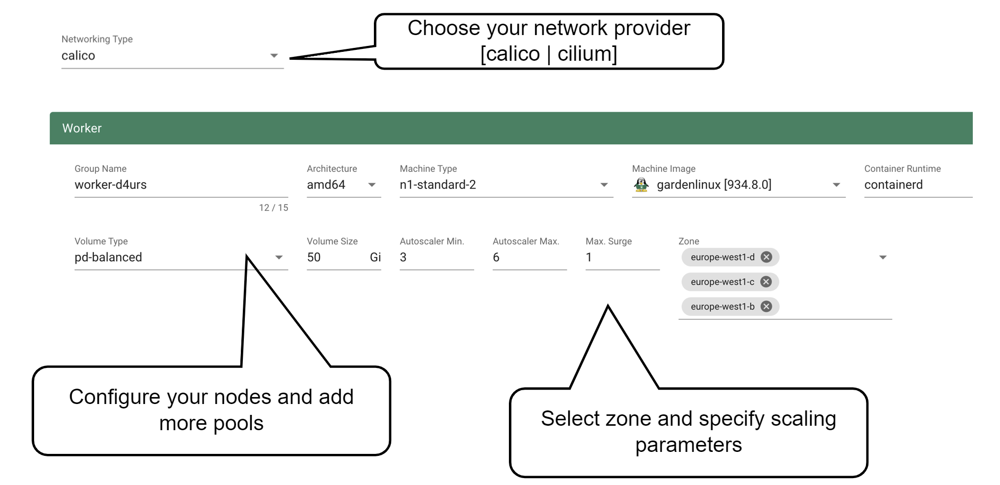
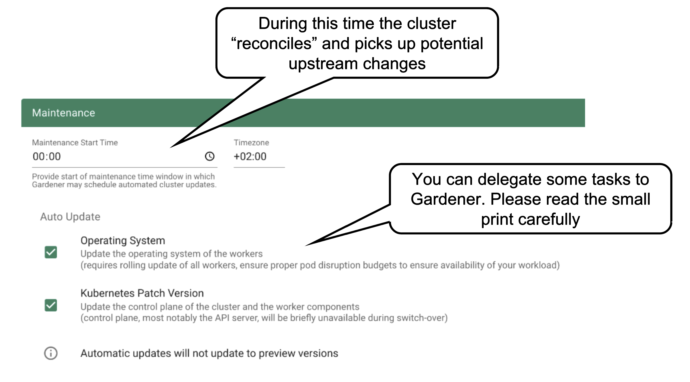
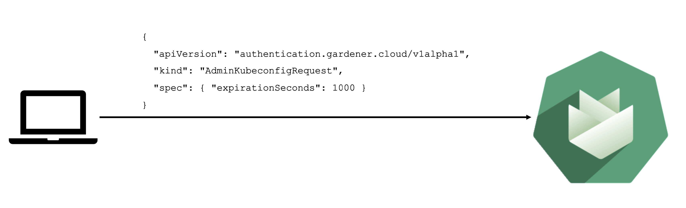
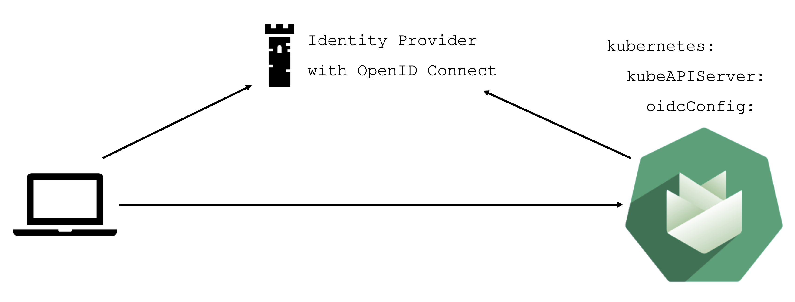
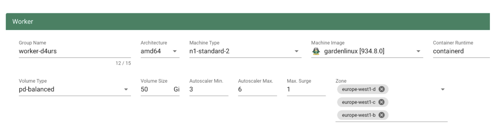
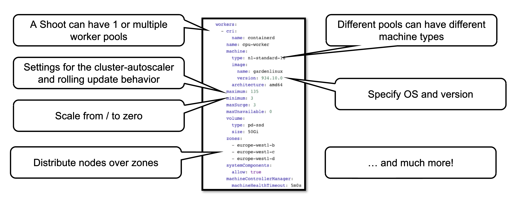
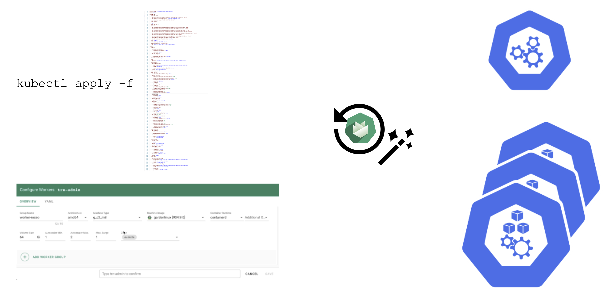
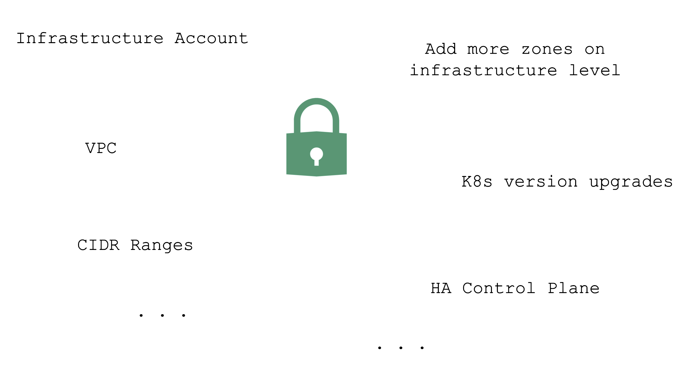

## Overview

A Kubernetes cluster consists of a control plane and a data plane. The data plane runs the actual containers on nodes (which translate to physical or virtual machines). For the control and data plane to work together properly, lots of components need matching configuration.

Some configurations are standardized but some are also very specific to the needs of a cluster's user / workload. Ideally, you want a properly configured cluster with the possibility to fine-tune some settings.

## Concept of a "Shoot"

A shoot is just another Kubernetes resource. Gardener components watch it and act upon changes (e.g., creation). It comes with reasonable default settings but also allows fine-tuned configuration. And on top of it, you get a status providing health information, information about ongoing operations, and so on.

Luckily there is a dashboard to get started.

## Basic Configuration Options

Every cluster needs a name - after all, it is a Kubernetes resource and therefore unique within a namespace.

The Kubernetes version will be used as a starting point. Once a newer version is available, you can update (but not downgrade, not supported by Kubernetes in general).

The "purpose" defines some configuration (like a monitoring stack or alerting rules) and generally indicates the importance of a cluster.

Start by selecting the infrastructure you want to use. The choice will be mapped to a "cloudprofile" that contains provider specific information like the available (actual) OS images, zones and regions or machine types.

Each data plane runs in an infrastructure account owned by the end-user. By selecting the infrastructure secret, the user grants Gardener access to the respective account to create / manage resources.

{}
Changing the account after the creation of a cluster is not possible. The credentials can be updated with a new key or even user but have to stay within the same account. 

Currently, there is no way to move a single cluster to a different account. A user would rather have to re-create a cluster and migrate workloads by different means.
{}

As part of the infrastructure choice, the region for data plane has to be chosen as well. The Gardener scheduler will try to place the control-plane on a seed cluster based on a minimal distance strategy. See [Gardener Scheduler](https://github.com/gardener/gardener/blob/master/docs/concepts/scheduler.md) for more details.

Up next, the networking provider for the cluster has to be selected (CNI). At the point of writing it is possible to choose between Calico and Cilium. If not specified in the shoot's manifest, default CIDR ranges for nodes, services, and pods will be used.

In order to run any workloads in your cluster, you need nodes. The worker section lets you specify the most important configuration options. For beginners, the machine type is probably the most relevant field, together with the machine image (operating system). 

The machine type is provider-specific and configured in the cloudprofile. Check your respective cloudprofile if you're missing a machine type. Maybe it is available but not in this region.

The operating system your machines will run is the next thing to choose. [GardenLinux](https://github.com/gardenlinux/gardenlinux) is the best choice for most use cases, as it is Debian based and maintained by SAP.

Other specifications for the workers include the volume type and size. These settings affect the root disk of each node. Therefore we would always recommend to use an SSD-based type to avoid i/o issues.

The autoscaler parameter defines the initial elasticity / scalability of your cluster. The cluster-autoscaler will add more nodes up to the maximum defined here when your workload grows and remove nodes in case your workload shrinks. The minimum number of nodes should be equal to or higher than the number of zones. You can distribute the nodes of a worker pool among all zones available to your cluster. It is the first step in running HA workloads.

Once per day, all clusters reconcile. This means all controllers will check if there are any updates they have to apply (i.e. new image version for ETCD). The maintenance window defines when this daily operation will be triggered. It is important to understand that there is no opt-out for reconciliation.

It is also possible to confine updates to the shoot spec to be applied only during this time. This can come in handy when you want to bundle changes or prevent changes to be applied outside a well-known time window.

You can allow Gardener to automatically update your cluster's Kubernetes patch version and/or OS version (of the nodes). Take this decision consciously! Whenever a new Kubernetes patch version or OS version is set to "supported" in the respective cloudprofile, auto update will upgrade your cluster during the next maintenance window. If you fail to (manually) upgrade the Kubernetes or OS version before they expire, force-upgrades will take place during the maintenance window.

### Result

The result of user configuration and defaulting is a shoot resource that, once applied, will be acted upon by various Gardener components. The status section represents the intermediate steps / results of these operations. A typical shoot creation flow would look like this:

1. Assign control plane to a seed.
1. Create infrastructure resources in the data plane account (e.g., VPC, gateways, ...)
1. Deploy control plane incl. DNS records.
1. Create nodes (VMs) and bootstrap kubelets.
1. Deploy kube-system components to nodes.

## How to Access a Shoot

Static credentials for Shoots are discontinued with Kubernetes v1.27 in Gardener. Use short lived credentials instead. You can create/request tokens directly via Gardener or delegate authentication to an identity provider.

A short-lived admin kubeconfig can be requested by using kubectl. If this is something you do frequently, consider switching to gardentctl (v2), which helps with it.

An alternative is to use an identity provider and issue oidc tokens.

## What can you configure?

With the basic configuration options known, it is time to discuss more possibilities. Gardener offers a variety of options to tweak the control plane's behavior - like defining an event TTL (default 1h), adding an OIDC configuration or activating some feature gate. You can alter the scheduling profile and define an audit logging policy. In addition, the control-plane can be configured to run in HA mode (applied on a node or zone level), but note that it cannot be changed.

In case you have specific requirements for the cluster internal DNS, Gardener offers a plugin mechanism for custom core DNS rules or optimization with node-local DNS ([Custom DNS Configuration](https://github.com/gardener/gardener/blob/master/docs/usage/custom-dns-config.md), [NodeLocalDNS Configuration](https://github.com/gardener/gardener/blob/master/docs/usage/node-local-dns.md)).

Another category of configuration options is dedicated to the nodes and the infrastructure they are running within. Every provider has their own perks and some of them are exposed. Check the detailed documentation of the relevant infrastructure provider extension. 

You can fine-tune the cluster-autoscaler or help the kubelet to cope better with your workload.

## Worker Pools

There are a couple of ways to configure a worker pool. One of them is to set everything in the Gardener dashboard. However, only a subset of options is presented there.

A slightly more complex way is to set the configuration through the yaml file itself.

You can configure much more, for example, the health timeout after which a machine is getting replaced. For more options, see the [Worker](https://github.com/gardener/gardener/blob/master/docs/api-reference/core.md#worker) API reference.

## How to Change Things

Since a shoot is just another Kubernetes resource, changes can be applied via kubectl. For convenience, the basic settings are configurable via the dashboard's UI. It also has a "yaml" tab where you can alter all of the shoot's specification. Once applied, the cluster will reconcile eventually and your changes become active (or cause an error).

## Immutability in a Shoot

However, not everything can be changed after the creation of the shoot. For example, it is not possible to move a shoot to a different infrastructure account. This is mainly rooted in the fact that discs and network resources are bound to your account. 

Once created, most of the network aspects of a cluster become immutable. On an infrastructure level the VPC cannot be changed and on a cluster level things like the pod / service cidr ranges, together with the nodeCIDRmask, are set for the lifetime of the cluster.

Some other things can be changed, but not reverted. While it is possible to add more zones to a cluster on an infrastructure level (assuming that an appropriate CIDR range is available), removing zones is not supported. Similarly, upgrading Kubernetes versions is comparable to a one-way ticket. As of now, Kubernetes does not support downgrading. Lastly, the HA setting of the control plane is immutable once specified.