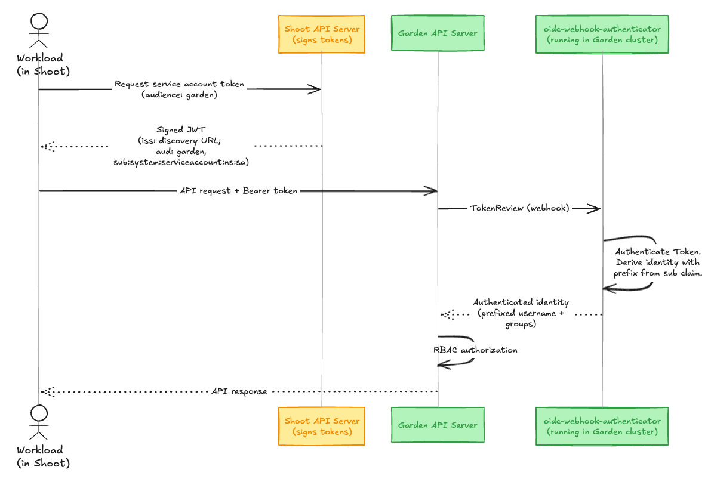

## Overview

This guide explains how to enable trust between the garden cluster and a shoot cluster so that workloads running in the shoot can authenticate directly with the Gardener API server using Kubernetes service account tokens (JWTs), removing the need for static credentials.
Example use cases include:
- A shoot cluster that manages Gardener resources for a specific organization
- CI/CD pipelines running in a shoot that interact with the Gardener API

## How It Works
### Setup - TL;DR

The minimal shoot configuration requires two annotations:

```yaml
annotations:
    authentication.gardener.cloud/issuer: managed
    authentication.gardener.cloud/trusted: 'true'
```

Additionally, authorization in the garden cluster should be configured to grant permissions to the shoot's service account identity which will perform requests to the garden cluster.

> [!IMPORTANT]
> Enabling the managed issuer is irreversible. Switching from:
>
> - default issuer: all previously issued tokens remain valid.
> - custom/external issuer: you must add the custom issuer to `.spec.kubernetes.kubeAPIServer.serviceAccountConfig.acceptedIssuers` before switching, otherwise previously-issued tokens will be invalidated and the control plane, system components, and workload pods may fail. Find more details on [Managed Service Account Issuer documentation](https://github.com/gardener/gardener/blob/master/docs/usage/security/shoot_serviceaccounts.md#managed-service-account-issuer).
> 
### Authentication 
When a request is made, the authentication flow is:


The following components help to enable this feature in the garden cluster:

- **[Managed Service Account Issuer](https://github.com/gardener/gardener/blob/master/docs/usage/security/shoot_serviceaccounts.md#managed-service-account-issuer)**: Configures the shoot API server to sign service account tokens with a Gardener-managed key pair. The corresponding OIDC discovery documents and JWKS are served publicly by the Gardener Discovery Server.
- **[oidc-webhook-authenticator (OWA)](https://github.com/gardener/oidc-webhook-authenticator)**: A webhook token authenticator deployed in the garden cluster that validates OIDC tokens from trusted issuers.
- **[garden-shoot-trust-configurator](https://github.com/gardener/garden-shoot-trust-configurator)**: A controller that watches for shoots annotated as trusted and automatically creates the corresponding OIDC resources consumed by OWA.

## How to establish trust?

The following example uses a health-reporter workload in the shoot. It monitors the health status of all shoots in a Gardener project by querying the Garden API.

```bash
# Target shoot cluster
$ kubectl create namespace health-reporter
$ kubectl create serviceaccount health-reporter -n health-reporter
```

### Step 1: Enable Managed Issuer

By enabling a managed service account issuer, Gardener manages the service account issuer of the shoot and configures the kube-apiserver accordingly. The Gardener Discovery Server then serves the corresponding OIDC discovery documents and JWKS at a publicly accessible URL, enabling the garden cluster to verify the token signatures.

Add the annotation to your shoot:

```yaml
annotations:
    authentication.gardener.cloud/issuer: managed
```

> [!NOTE]
> Once enabled, this feature cannot be disabled.
> After annotating the shoot with `authentication.gardener.cloud/issuer=managed` the reconciliation will not be triggered immediately.
> You can wait for the shoot maintenance window or trigger reconciliation by annotating the shoot with `gardener.cloud/operation=reconcile`.

#### Verification
Verify in the shoot's status that the `service-account-issuer` contains the managed issuer URL ([Service Account Issuer format](https://github.com/gardener/gardener/blob/master/docs/concepts/operator.md#main-reconciler)).

```yaml
status:
  advertisedAddresses:
    - name: service-account-issuer
      url: >-
        https://<discovery-server-host>/projects/<project-name>/shoots/<shoot-uid>/issuer
```

You can find the publicly available discovery documents via the OIDC endpoint `{issuer-url}/.well-known/openid-configuration`:

```bash
$ curl https://<discovery-server-host>/projects/<project-name>/shoots/<shoot-uid>/issuer/.well-known/openid-configuration | jq .

{
  "issuer": "https://<discovery-server-host>/projects/<project-name>/shoots/<shoot-uid>/issuer",
  "jwks_uri": "https://<discovery-server-host>/projects/<project-name>/shoots/<shoot-uid>/issuer/jwks",
  "response_types_supported": [
    "id_token"
  ],
  "subject_types_supported": [
    "public"
  ],
  "id_token_signing_alg_values_supported": [
    "RS256"
  ]
}
```

The service account tokens issued by the shoot's kube-API server will contain an `"iss"` claim that points to the configured issuer.

You can request a token with the `garden` audience (this must match the audience configured in the OIDC resource that the `garden-shoot-trust-configurator` creates).

```bash
kubectl create token health-reporter -n health-reporter --audience garden
```

Decode the JWT to verify its claims:

```json
{
  "aud": [
    "garden"
  ],
  "iss": "https://<discovery-server-host>/projects/<project-name>/shoots/<shoot-uid>/issuer",
  "kubernetes.io": {
    "namespace": "health-reporter",
    "serviceaccount": {
      "name": "health-reporter",
      "uid": "<sa-uid>"
    }
  },
  "sub": "system:serviceaccount:health-reporter:health-reporter"
}
```

### Step 2: Annotate Shoot as Trusted

To have the garden cluster trust the shoot's issuer, add the annotation:

```yaml
annotations:
    authentication.gardener.cloud/trusted: 'true'
```

The [`garden-shoot-trust-configurator`](https://github.com/gardener/garden-shoot-trust-configurator) watches for shoots with this annotation and automatically creates OIDC custom resources. These resources are consumed by the [`oidc-webhook-authenticator`](https://github.com/gardener/oidc-webhook-authenticator), which validates tokens presented to the Gardener API server.

In essence, this will create the following OIDC resource in the garden cluster:
```yaml
apiVersion: authentication.gardener.cloud/v1alpha1
kind: OpenIDConnect
metadata:
  labels:
    app.kubernetes.io/managed-by: garden-shoot-trust-configurator
  name: <project-ns>--<shoot-name>--<shoot-uid>
spec:
  audiences:
  - garden
  groupsClaim: groups
  groupsPrefix: 'ns:<project-ns>:shoot:<shoot-name>:<shoot-uid>:'
  issuerURL: "https://<discovery-server-host>/projects/<project-name>/shoots/<shoot-uid>/issuer"
  jwks:
    distributedClaims: true
  maxTokenExpirationSeconds: 7200
  supportedSigningAlgs:
  - RS256
  usernameClaim: sub
  usernamePrefix: 'ns:<project-ns>:shoot:<shoot-name>:<shoot-uid>:'
```

### Step 3: Configure RBAC

Authentication (token verification) is now handled automatically, but the authenticated identity has very restricted permissions by default, i.e. those available via the `system:authenticated` group. You must create RBAC rules, or configure any other authorizer that is in place, in the garden cluster to authorize the requested actions.

Create a `Role` that grants read access to `Shoot` resources and a `RoleBinding` that binds it to the shoot's ServiceAccount identity:

```bash
# Target project namespace (garden cluster)
$ kubectl apply -f - <<EOF
apiVersion: rbac.authorization.k8s.io/v1
kind: Role
metadata:
  name: shoot-health-reader
  namespace: garden-my-project
rules:
- apiGroups: ["core.gardener.cloud"]
  resources: ["shoots"]
  verbs: ["get", "list"]
---
apiVersion: rbac.authorization.k8s.io/v1
kind: RoleBinding
metadata:
  name: health-reporter-binding
  namespace: garden-my-project
roleRef:
  apiGroup: rbac.authorization.k8s.io
  kind: Role
  name: shoot-health-reader
subjects:
- kind: User
  name: "ns:<project-namespace>:shoot:<shoot-name>:<shoot-uid>:system:serviceaccount:health-reporter:health-reporter"
  apiGroup: rbac.authorization.k8s.io
EOF
```

> [!NOTE]
> The `garden-shoot-trust-configurator` configures a prefix to the token's `sub` and `groups` claim when deriving the name. The format for both is:
> ```javascript
> `ns:<project-ns>:shoot:<shoot-name>:<shoot-uid>:`
> ```
> This ensures identities from different shoots are always unique, even if they share the same ServiceAccount name. The resulting username has the form:
>
> ```javascript
> `ns:<project-ns>:shoot:<shoot-name>:<shoot-uid>:${claims.sub}`
> ```

### Step 4: Verification

Test that you are authenticated and authorized by requesting a token from the shoot and making a request to the Gardener API server:

```bash
# Target shoot cluster
$ TOKEN=$(kubectl create token health-reporter -n health-reporter --audience garden)

$ curl -H "Authorization: Bearer $TOKEN" \
  https://<gardener-api-server>/apis/core.gardener.cloud/v1beta1/namespaces/garden-my-project/shoots | jq .

# Expected output
{
  "kind": "ShootList",
  "apiVersion": "core.gardener.cloud/v1beta1",
  "metadata": {
    "resourceVersion": "123"
  },
  "items": [
    ...
  ]
}
```

## Related Links

- [Managed Service Account Issuer documentation](https://github.com/gardener/gardener/blob/master/docs/usage/security/shoot_serviceaccounts.md#managed-service-account-issuer)
- [garden-shoot-trust-configurator](https://github.com/gardener/garden-shoot-trust-configurator)
- [oidc-webhook-authenticator](https://github.com/gardener/oidc-webhook-authenticator)
- [GEP-0024: Shoot OIDC Issuer](https://github.com/gardener/enhancements/tree/main/geps/0024-shoot-oidc-issuer)
