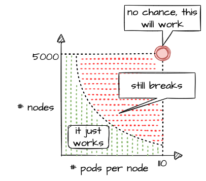

Have you ever wondered how much more your Kubernetes cluster can scale before it breaks down?

Of course, the answer is heavily dependent on your workloads. But be assured, any cluster will break eventually. Therefore, the best mitigation is to plan for sharding early and run multiple clusters instead of trying to optimize everything hoping to survive with a single cluster.
Still, it is helpful to know when the time has come to scale out. This document aims at giving you the basic knowledge to keep a Gardener-managed Kubernetes cluster up and running while it scales according to your needs.

## Welcome to Planet Scale, Please Mind the Gap!

For a complex, distributed system like Kubernetes it is impossible to give absolute thresholds for its scalability. Instead, the limit of a cluster's scalability is a combination of various, interconnected dimensions.

Let's take a rather simple example of two dimensions - the number of `Pods` per `Node` and number of `Nodes` in a cluster. According to the [scalability thresholds documentation](https://github.com/kubernetes/community/blob/master/sig-scalability/configs-and-limits/thresholds.md), Kubernetes can scale up to 5000 `Nodes` and with default settings accommodate a maximum of 110 `Pods` on a single `Node`. Pushing only a single dimension towards its limit will likely harm the cluster. But if both are pushed simultaneously, any cluster will break way before reaching one dimension's limit.



What sounds rather straightforward in theory can be a bit trickier in reality. While 110 `Pods` is the default limit, we successfully pushed beyond that and in certain cases run up to 200 `Pods` per `Node` without breaking the cluster. This is possible in an environment where one knows and controls all workloads and cluster configurations. It still requires careful testing, though, and comes at the cost of limiting the scalability of other dimensions, like the number of `Nodes`.

Of course, a Kubernetes cluster has a plethora of dimensions. Thus, when looking at a simple questions like *"How many resources can I store in ETCD?"*, the only meaningful answer must be: *"it depends"*

The following sections will help you to identify relevant dimensions and how they affect a Gardener-managed Kubernetes cluster's scalability.

## "Official" Kubernetes Thresholds and Scalability Considerations

To get started with the topic, please check the basic guidance provided by the Kubernetes community (specifically SIG Scalability):
- [How we define scalability?](https://github.com/kubernetes/community/blob/master/sig-scalability/slos/slos.md#how-we-define-scalability)
- [Kubernetes Scalability Thresholds](https://github.com/kubernetes/community/blob/master/sig-scalability/configs-and-limits/thresholds.md)

Furthermore, the problem space has been discussed in a [KubeCon talk](https://www.youtube.com/watch?v=t_Ww6ELKl4Q), the slides for which can be found [here](https://docs.google.com/presentation/d/1aWjxpY4YJ4KJQUTqaVHdR4sbhwqDiW30EF4_hGCc-gI). You should at least read the slides before continuing.

Essentially, it comes down to this:

>If you promise to:
> - correctly configure your cluster
> - use extensibility features "reasonably"
> - keep the load in the cluster within recommended limits
>
>Then we promise that your cluster will function properly.

With that knowledge in mind, let's look at Gardener and eventually pick up the question about the number of objects in ETCD raised above.

## Gardener-Specific Considerations

The following considerations are based on experience with various large clusters that scaled in different dimensions. Just as explained above, pushing beyond even one of the limits is likely to cause issues at some point in time (but not guaranteed). Depending on the setup of your workloads however, it might work unexpectedly well. Nevertheless, we urge you take conscious decisions and rather think about sharding your workloads. Please keep in mind - your workload affects the overall stability and scalability of a cluster significantly.

### ETCD

**The following section is based on a setup where ETCD `Pods` run on a dedicated `Node` pool and each `Node` has 8 vCPU and 32GB memory at least.**

ETCD has a practical space limit of 8 GB. It caps the number of objects one can technically have in a Kubernetes cluster.

Of course, the number is heavily influenced by each object's size, especially when considering that secrets and configmaps may store up to 1MB of data. Another dimension is a cluster's churn rate. Since ETCD stores a history of the keyspace, a higher churn rate reduces the number of objects. Gardener runs [compaction](https://etcd.io/docs/v3.4/op-guide/maintenance/#history-compaction) every 30min and [defragmentation](https://etcd.io/docs/v3.4/op-guide/maintenance/#defragmentation) once per day during a cluster's maintenance window to ensure proper ETCD operations. However, it is still possible to overload ETCD. If the space limit is reached, ETCD will only accept `READ` or `DELETE` requests and manual interaction by a Gardener operator is needed to disarm the alarm, once you got below the threshold.

To avoid such a situation, you can monitor the current ETCD usage via the "ETCD" dashboard of the monitoring stack. It gives you the current DB size, as well as historical data for the past 2 weeks. While there are improvements planned to trigger compaction and defragmentation based on DB size, an ETCD should not grow up to this threshold. A typical, healthy DB size is less than 3 GB.

Furthermore, the dashboard has a panel called "Memory", which indicates the memory usage of the etcd pod(s). Using more than 16GB memory is a clear red flag, and you should reduce the load on ETCD.

Another dimension you should be aware of is the object count in ETCD. You can check it via the "API Server" dashboard, which features a "ETCD Object Counts By Resource" panel. The overall number of objects (excluding `events`, as they are stored in a different etcd instance) should not exceed 100k for most use cases.

### Kube API Server

**The following section is based on a setup where `kube-apiserver` run as `Pods` and are scheduled to `Nodes` with at least 8 vCPU and 32GB memory.**

Gardener can scale the `Deployment` of a `kube-apiserver` horizontally and vertically. Horizontal scaling is limited to a certain number of replicas and should not concern a stakeholder much. However, the CPU / memory consumption of an individual `kube-apiserver` pod poses a potential threat to the overall availability of your cluster. The vertical scaling of any `kube-apiserver` is limited by the amount of resources available on a single `Node`. Outgrowing the resources of a `Node` will cause a downtime and render the cluster unavailable.

In general, continuous CPU usage of up to 3 cores and 16 GB memory per `kube-apiserver` pod is considered to be safe. This gives some room to absorb spikes, for example when the caches are initialized. You can check the resource consumption by selecting `kube-apiserver` `Pods` in the "Kubernetes `Pods`" dashboard. If these boundaries are exceeded constantly, you need to investigate and derive measures to lower the load.

Further information is also recorded and made available through the monitoring stack. The dashboard "API Server Request Duration and Response Size" provides insights into the request processing time of `kube-apiserver` `Pods`. Related information like request rates, dropped requests or termination codes (e.g., `429` for too many requests) can be obtained from the dashboards "API Server" and "Kubernetes API Server Details". They provide a good indicator for how well the system is dealing with its current load.

Reducing the load on the API servers can become a challenge. To get started, you may try to:
- Use immutable [secrets](https://kubernetes.io/docs/concepts/configuration/secret/#secret-immutable) and [configmaps](https://kubernetes.io/docs/concepts/configuration/configmap/#configmap-immutable) where possible to save watches. This pays off, especially when you have a high number of `Nodes` or just lots of secrets in general.
- Applications interacting with the K8s API: If you know an object by its name, use it. Using label selector queries is expensive, as the filtering happens only within the `kube-apiserver` and not `etcd`, hence all resources must first pass completely from `etcd` to `kube-apiserver`.
- Use (single object) caches within your controllers. Check the ["Use cache for ShootStates in Gardenlet" issue](https://github.com/gardener/gardener/issues/7593) for an example.

### `Nodes`

When talking about the scalability of a Kubernetes cluster, `Nodes` are probably mentioned in the first place... well, obviously not in this guide. While vanilla Kubernetes lists 5000 `Nodes` as its upper limit, pushing that dimension is not feasible. Most clusters should run with fewer than 300 `Nodes`. If you scale beyond that, be extra careful and closely monitor ETCD and `kube-apiserver`.

The scalability of `Nodes` is subject to a range of limiting factors. Some of them can only be defined upon cluster creation and remain immutable during a cluster lifetime. So let's discuss the most important dimensions.

**CIDR**: 

Upon cluster creation, you have to specify or use the default values for several network segments. There are dedicated CIDRs for services, `Pods`, and `Nodes`. Each defines a range of IP addresses available for the individual resource type. Obviously, the maximum of possible `Nodes` is capped by the CIDR for `Nodes`. 
However, there is a second limiting factor, which is the pod CIDR combined with the `nodeCIDRMaskSize`. This mask is used to divide the pod CIDR into smaller subnets, where each blocks gets assigned to a node. With a `/16` pod network and a `/24` nodeCIDRMaskSize, a cluster can scale up to 256 `Nodes`. Please check [Shoot Networking](https://github.com/gardener/gardener/blob/master/docs/usage/shoot_networking.md) for details.

Even though a `/24` nodeCIDRMaskSize translates to a theoretical 256 pod IP addresses per `Node`, the `maxPods` setting should be less than 1/2 of this value. This gives the system some breathing room for churn and minimizes the risk for strange effects like mis-routed packages caused by immediate re-use of IPs.

**Cloud provider capacity**:

Most of the time, `Nodes` in Kubernetes translate to virtual machines on a hyperscaler. An attempt to add more `Nodes` to a cluster might fail due to capacity issues resulting in an error message like this:

```
Cloud provider message - machine codes error: code = [Internal] message = [InsufficientInstanceCapacity: We currently do not have sufficient <instance type> capacity in the Availability Zone you requested. Our system will be working on provisioning additional capacity. 
```

In heavily utilized regions, individual clusters are competing for scarce resources. So before choosing a region / zone, try to ensure that the hyperscaler supports your anticipated growth. This might be done through quota requests or by contacting the respective support teams.
To mitigate such a situation, you may configure a worker pool with a different `Node` type and a corresponding [priority expander](https://github.com/gardener/autoscaler/blob/machine-controller-manager-provider/cluster-autoscaler/expander/priority/readme.md) as part of a [shoot's autoscaler section](https://github.com/gardener/gardener/blob/master/docs/api-reference/core.md#clusterautoscaler). Please consult the [Autoscaler FAQ](https://github.com/gardener/autoscaler/blob/machine-controller-manager-provider/cluster-autoscaler/FAQ.md#what-are-expanders) for more details.

**Rolling of `Node` pools**:

The overall number of `Nodes` is affecting the duration of a cluster's maintenance. When upgrading a `Node` pool to a new OS image or Kubernetes version, all machines will be drained and deleted, and replaced with new ones. The more `Nodes` a cluster has, the longer this process will take, given that workloads are typically protected by `PodDisruptionBudgets`. Check [Shoot Updates and Upgrades](https://github.com/gardener/gardener/blob/master/docs/usage/shoot_updates.md) for details. Be sure to take this into consideration when planning maintenance.

**Root disk**:

You should be aware that the `Node` configuration impacts your workload's performance too. Take the root disk of a `Node`, for example. While most hyperscalers offer the usage of HDD and SSD disks, it is strongly recommended to use SSD volumes as root disks. When there are lots of `Pods` on a `Node` or workloads making extensive use of `emptyDir` volumes, disk throttling becomes an issue. When a disk hits its IOPS limits, processes are stuck in IO-wait and slow down significantly. This can lead to a slow-down in the kubelet's heartbeat mechanism and result in `Nodes` being replaced automatically, as they appear to be unhealthy. To analyze such a situation, you might have to run tools like `iostat`, `sar` or `top` directly on a `Node`. 

Switching to an I/O optimized instance type (if offered for your infrastructure) can help to resolve issue. Please keep in mind that disks used via `PersistentVolumeClaims` have I/O limits as well. Sometimes these limits are related to the size and/or can be increased for individual disks.  

### Cloud Provider (Infrastructure) Limits
In addition to the already mentioned capacity restrictions, a cloud provider may impose other limitations to a Kubernetes cluster's scalability. One category is the account quota defining the number of resources allowed globally or per region. Make sure to request appropriate values that suit your needs and contain a buffer, for example for having more `Nodes` during a rolling update.

Another dimension is the network throughput per VM or network interface. While you may be able to choose a network-optimized `Node` type for your workload to mitigate issues, you cannot influence the available bandwidth for control plane components. Therefore, please ensure that the traffic on the ETCD does not exceed 100MB/s. The ETCD dashboard provides data for monitoring this metric.

In some environments the upstream DNS might become an issue too and make your workloads subject to rate limiting. Given the heterogeneity of cloud providers incl. private data centers, it is not possible to give any thresholds. Still, the "CoreDNS" and "NodeLocalDNS" dashboards can help to derive a workload's usage pattern. Check the [DNS autoscaling](https://github.com/gardener/gardener/blob/master/docs/usage/dns-autoscaling.md) and [NodeLocalDNS](https://github.com/gardener/gardener/blob/master/docs/usage/node-local-dns.md) documentations for available configuration options.

### Webhooks
While webhooks provide powerful means to manage a cluster, they are equally powerful in breaking a cluster upon a malfunction or unavailability. Imagine using a policy enforcing system like [Kyverno](https://kyverno.io/docs/) or [Open Policy Agent Gatekeeper](https://open-policy-agent.github.io/gatekeeper/website/docs/). As part of the stack, both will deploy webhooks which are invoked for almost everything that happens in a cluster. Now, if this webhook gets either overloaded or is simply not available, the cluster will stop functioning properly. 

Hence, you have to ensure proper sizing, quick processing time, and availability of the webhook serving `Pods` when deploying webhooks. Please consult Dynamic Admission Control ([Availability](https://kubernetes.io/docs/reference/access-authn-authz/extensible-admission-controllers/#availability) and [Timeouts](https://kubernetes.io/docs/reference/access-authn-authz/extensible-admission-controllers/#timeouts) sections) for details. You should also be aware of the time added to any request that has to go through a webhook, as the `kube-apiserver` sends the request for mutation / validation to another pod and waits for the response. The more resources being subject to an external webhook, the more likely this will become a bottleneck when having a high churn rate on resources. Within the Gardener monitoring stack, you can check the extra time per webhook via the "API Server (Admission Details)" dashboard, which has a panel for "Duration per Webhook".

In Gardener, any webhook timeout should be less than 15 seconds. Due to the separation of Kubernetes data-plane (shoot) and control-plane (seed) in Gardener, the extra hop from `kube-apiserver` (control-plane) to webhook (data-plane) is more expensive. Please check [Shoot Status](https://github.com/gardener/gardener/blob/master/docs/usage/shoot_status.md) for more details.

### Custom Resource Definitions
Using Custom Resource Definitions (CRD) to extend a cluster's API is a common Kubernetes pattern and so is writing an operator to act upon custom resources. Writing an efficient controller reduces the load on the `kube-apiserver` and allows for better scaling. As a starting point, you might want to read Gardener's [Kubernetes Clients Guide](https://github.com/gardener/gardener/blob/master/docs/development/kubernetes-clients.md).

Another problematic dimension is the usage of [conversion webhooks](https://kubernetes.io/docs/tasks/extend-kubernetes/custom-resources/custom-resource-definition-versioning/#webhook-conversion) when having resources stored in different versions. Not only do they add latency (see [Webhooks](#webhooks)) but can also block the kube-controllermanager's garbage collection. If a conversion webhook is unavailable, the garbage collector fails to list all resources and does not perform any cleanup. In order to avoid such a situation, it is highly recommended to use conversion webhooks only when necessary and complete the migration to a new version as soon as possible.

## Conclusion

As outlined by SIG Scalability, it is quite impossible to give limits or even recommendations fitting every individual use case. Instead, this guide outlines relevant dimensions and gives rather conservative recommendations based on usage patterns observed. By combining this information, it is possible to operate and scale a cluster in stable manner.

While going beyond is certainly possible for some dimensions, it significantly increases the risk of instability. Typically, limits on the control-plane are introduced by the availability of resources like CPU or memory on a single machine and can hardly be influenced by any user. Therefore, utilizing the existing resources efficiently is key. Other parameters are controlled by a user. In these cases, careful testing may reveal actual limits for a specific use case.

Please keep in mind that all aspects of a workload greatly influence the stability and scalability of a Kubernetes cluster.