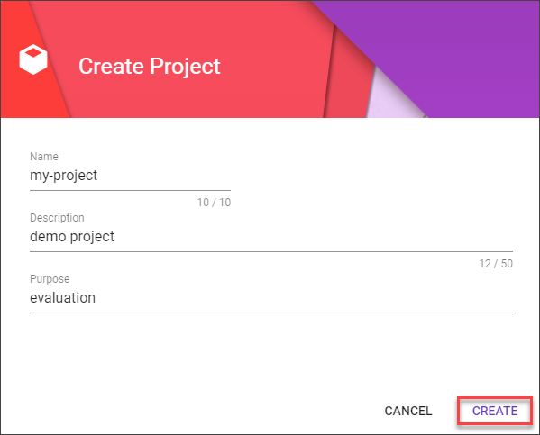
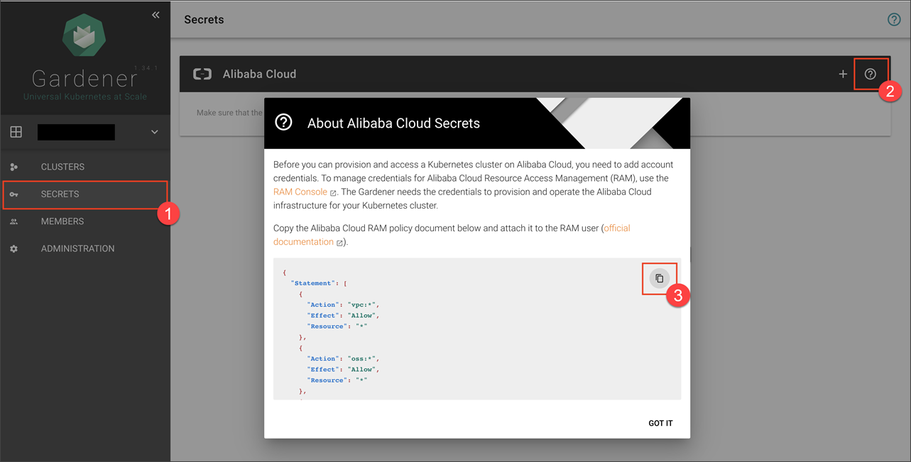
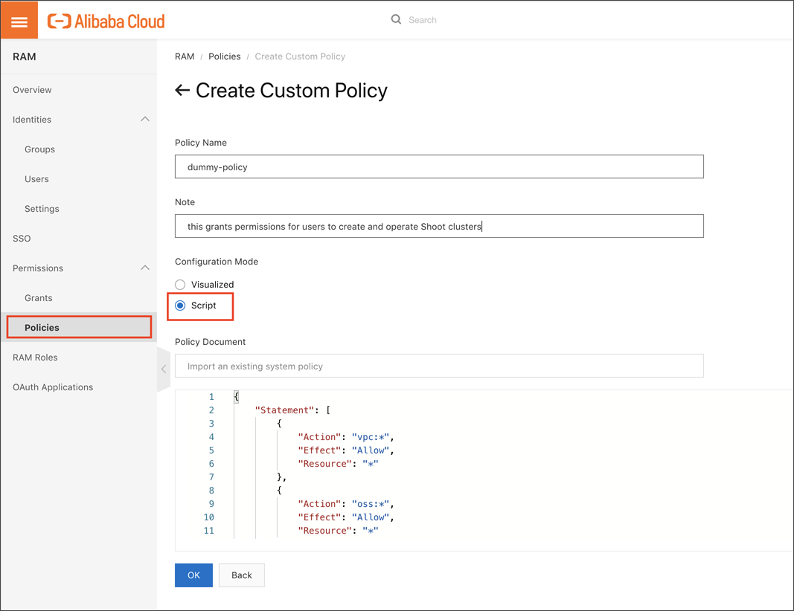
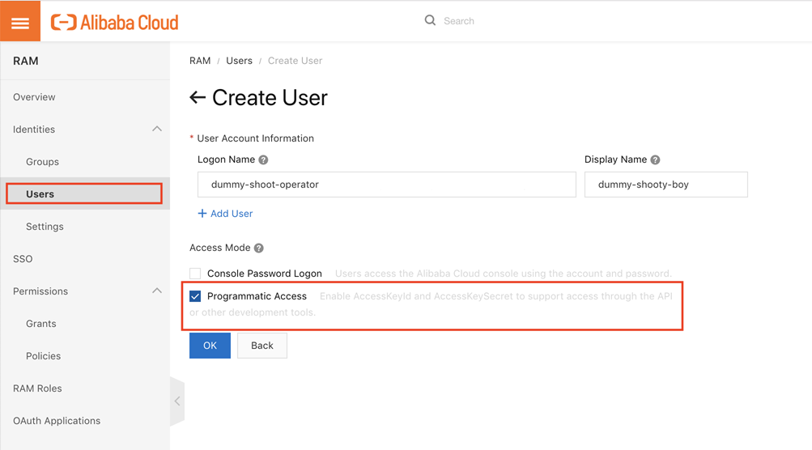
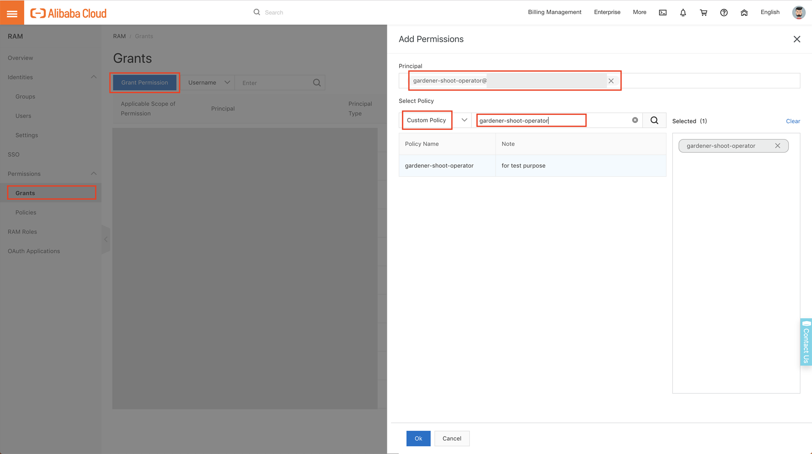
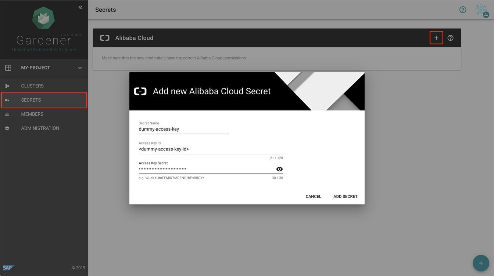
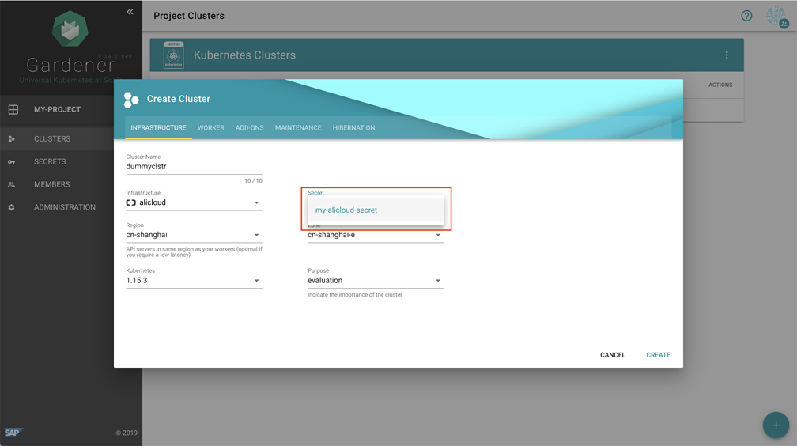

# Create Shoot Clusters in Alibaba Cloud

## Prerequisites

-   You need an Alibaba Cloud account.
-   You have access to the Gardener dashboard and have permissions to create projects.

## Procedure

1.  Go to the Gardener dashboard and create a project.

      

    > To be able to add shoot clusters to this project, you must first create a technical user on Alibaba cloud with sufficient permissions.

2.  To copy the policy for Alibaba Cloud from the Gardener dashboard, choose *Secrets*, click on the help button \(  \) for Alibaba Cloud secrets, and choose copy \(  \).

      

3.  To create a custom policy in Alibaba cloud, log on to your Alibaba account and choose *RAM* \> *Permissions* \> *Policies*. Paste policy that you copied from the Gardener dashboard to this custom policy.

      

4.  In the Alibaba cloud console, choose *RAM* \> *Users* and create a new technical user.

    > After the user is created, `AccessKeyId` and `AccessKeySecret` are generated and displayed. Remember to save them. The `AccessKey` is used later to create secrets for Gardener.

      

5.  Choose *RAM* \> *Permissions* \> *Grants* and assign the policy you’ve created before to the technical user.

      

6.  On the Gardener dashboard, choose *Secrets* and then the plus sign in the Alibaba Cloud frame to add a new Alibaba Cloud secret.
   
7.  Copy the `AccessKeyId` and `AccessKeySecret` you saved when you created the technical user on Alibaba Cloud Console.

      

    > After successfully creating secrets for Alibaba Cloud, you can see them in the corresponding dropdown list whenever you create a shoot cluster on Alibaba cloud.

8.  Choose *Clusters* and then the plus sign in the lower right.
9.  On tab *INFRASTRUCTURE*, choose the secret you created before. The technical user related to the chosen Secret is used to create infrastructure resources on Alibaba Cloud.

      

## Result

You can now create shoot clusters on Alibaba cloud.

> The size of persistent volumes in your shoot cluster must at least be 20 GiB large. If you choose smaller sizes in your Kubernetes PV definition, the allocation of cloud disk space on Alibaba cloud fails.

