### Prerequisites

-   You need an AWS account.
-   You have access to the Gardener dashboard and have permissions to create projects.

1. Go to the Gardener dashboard and create a *Project*.

    

2. To copy the policy for AWS from the Gardener dashboard, choose *Secrets*, click on the help icon  for AWS secrets, and choose copy .

    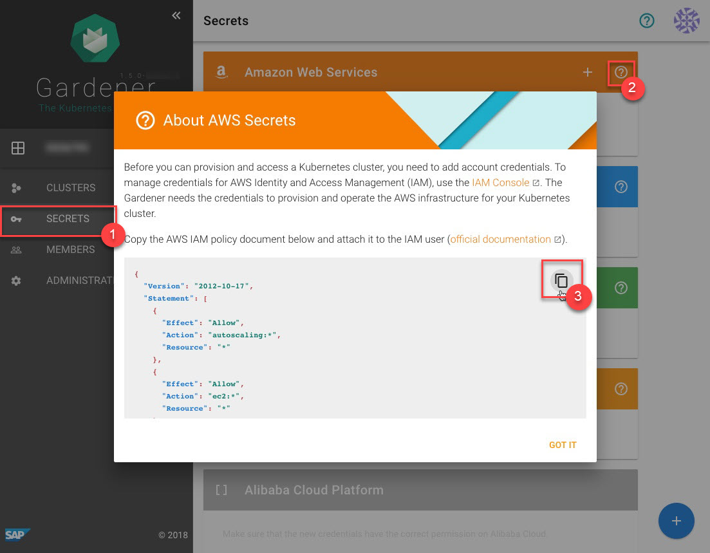

3. To [create a new policy](https://console.aws.amazon.com/iam/home?#/policies) in AWS, paste the policy that you copied from the Gardener dashboard to this custom policy.

    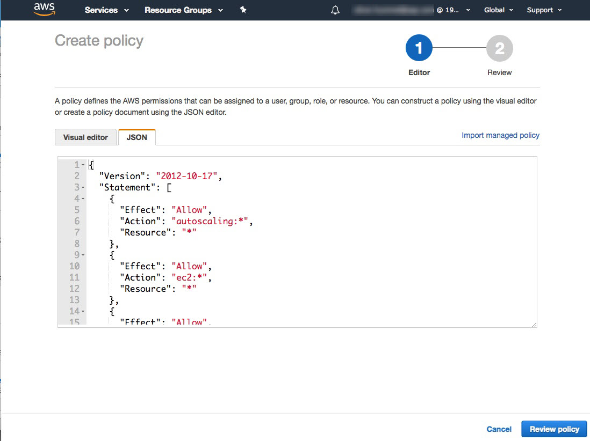

    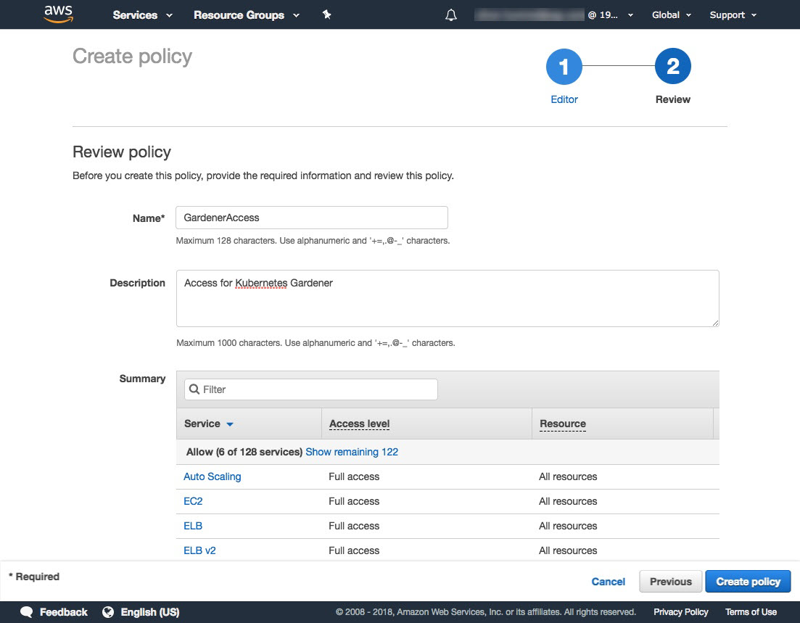

4. [Create a new technical user](https://console.aws.amazon.com/iam/home?#/users$new?step=details).

    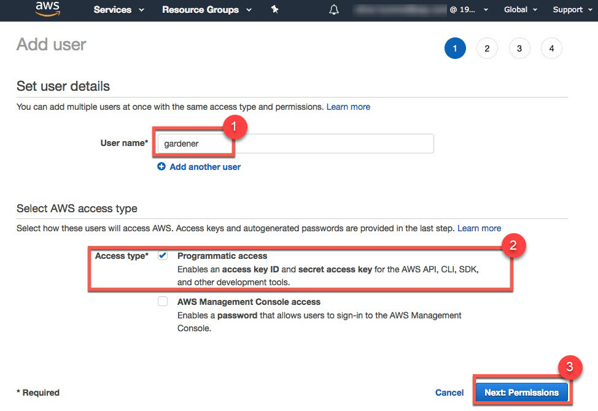

    

    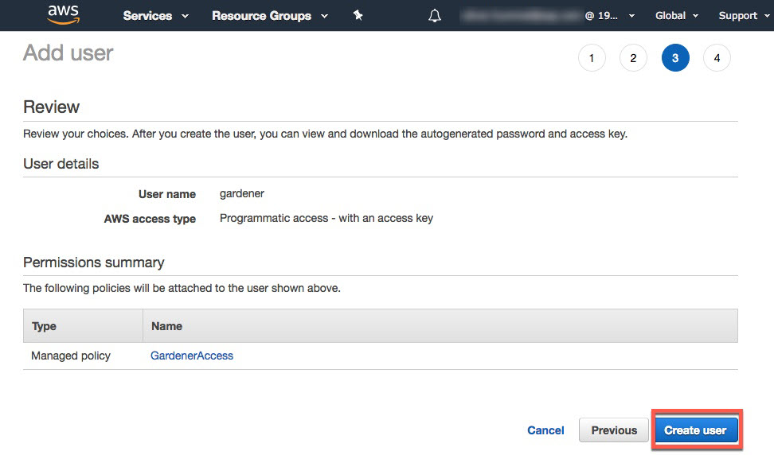

     > Note: After the user is created, `Access key ID` and `Secret access key` are generated and displayed. Remember to save them. The `Access key ID` is used later to create secrets for Gardener.

    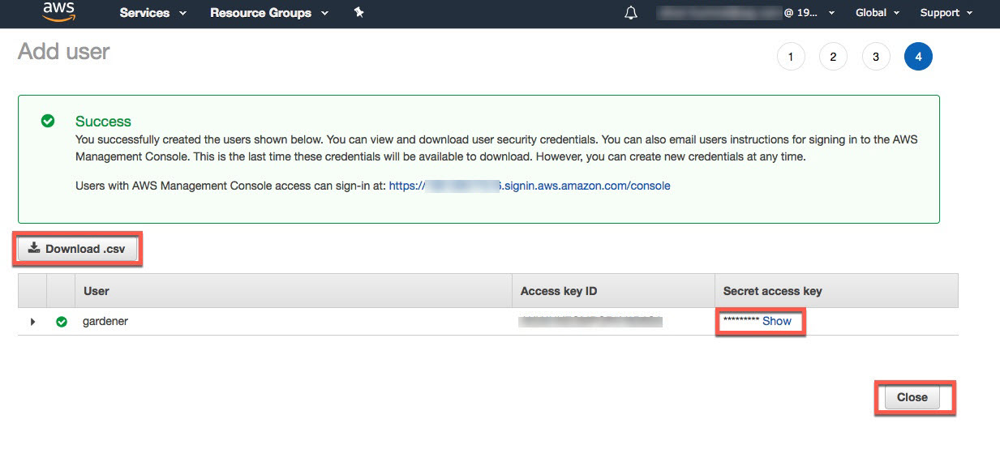

5. On the Gardener dashboard, choose *Secrets* and then the plus sign  in the AWS frame to add a new AWS secret.

6. Copy the `Access Key ID` and `Secret Access Key` you saved when you created the technical user on AWS.

    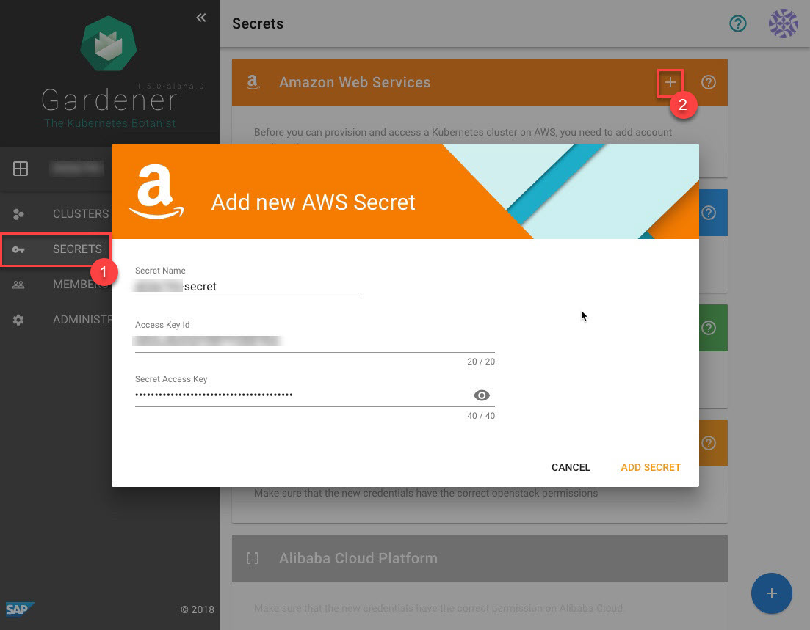

    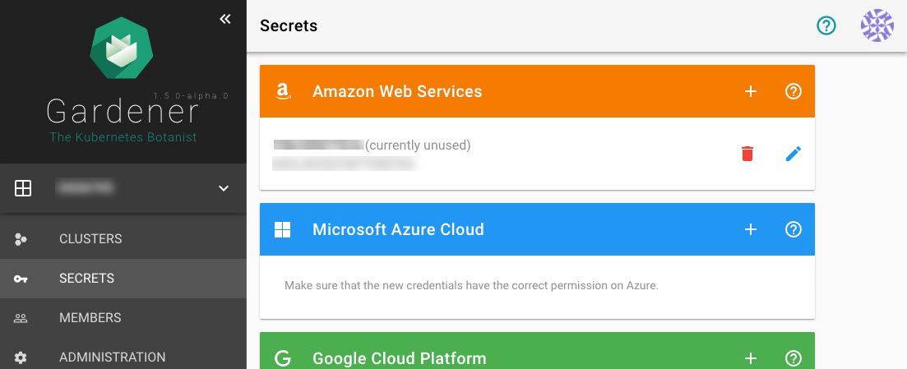

7. To create a new cluster, choose *Clusters* and then the plus sign in the lower right corner.

    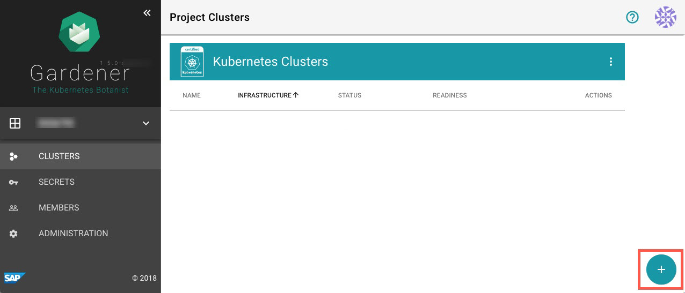

8. On tab *INFRASTRUCTURE*, choose the secret you created before. The technical user related to the chosen Secret is used to create infrastructure resources.

    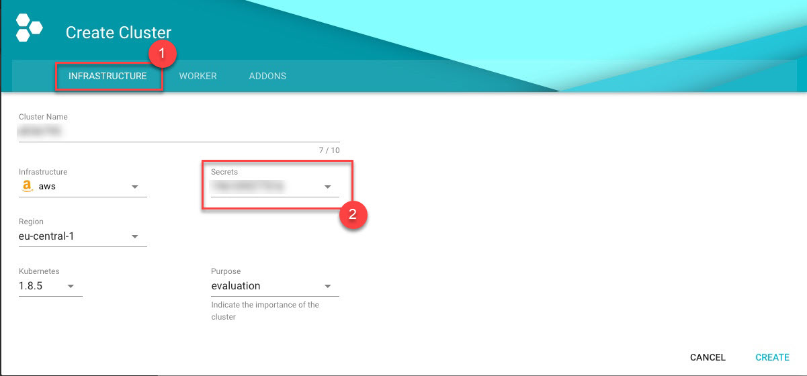

    

    

    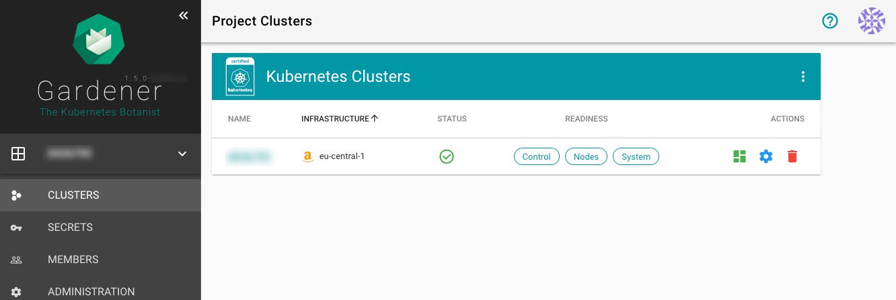

9. Copy kubeconfig.

    