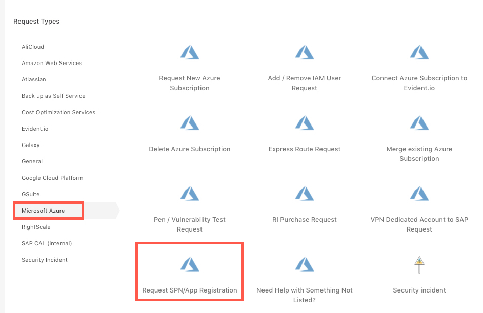
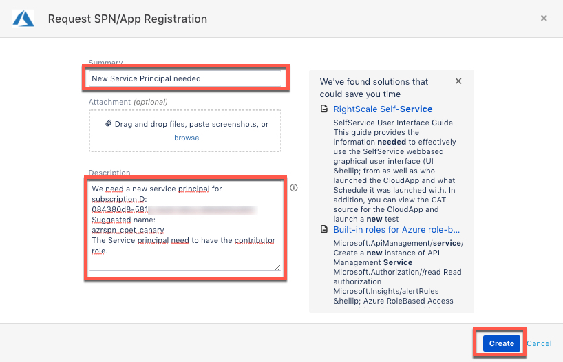
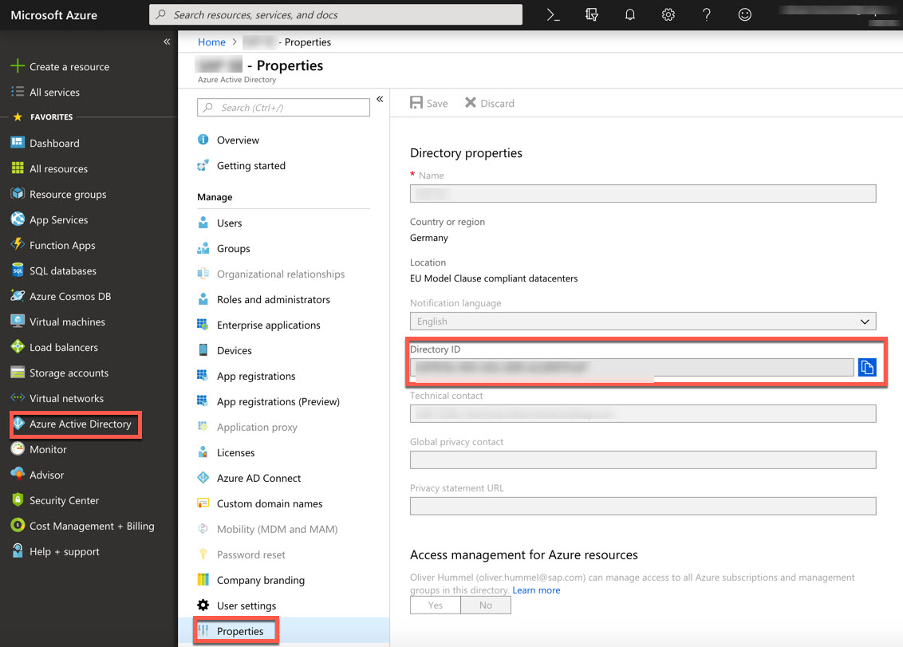
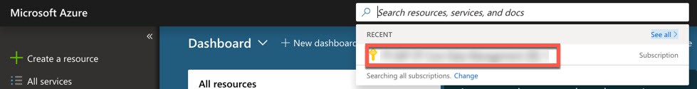
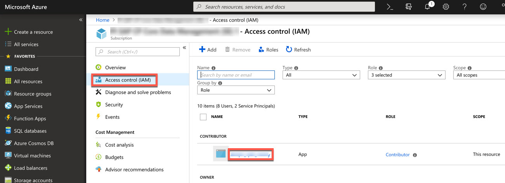
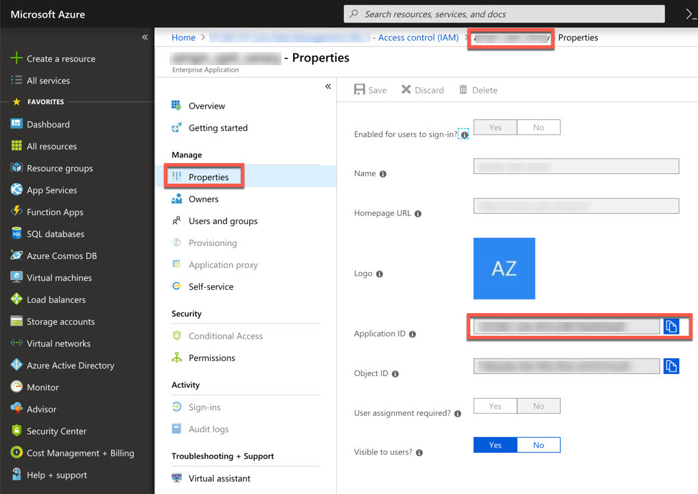
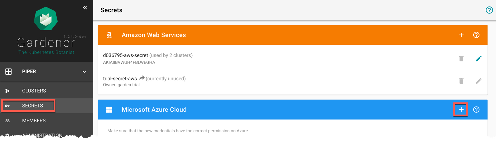
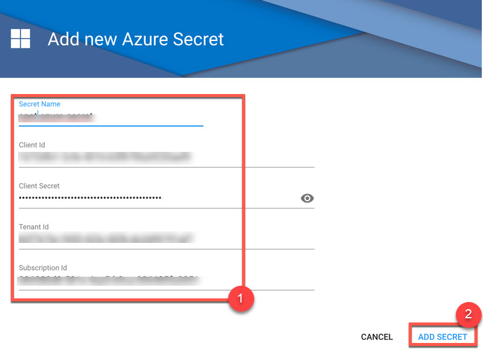

# Create shoot clusters in Azure

### Prerequisites

-   You need an Azure account.
-   You have access to the Gardener dashboard and have permissions to create projects.

Before you can provision and access a Kubernetes cluster on Azure, you need to add the account credentials in Gardener. 
Gardener needs the credentials to provision and operate the Azure infrastructure for your Kubernetes cluster.

> Ensure that the account has the **contributor** role.

1. Request a new service account on Azure. 

    You must [request a new service account](https://jira.multicloud.int.sap/plugins/servlet/desk/portal/2) first, if you don't have one.

    

    Naming Convention for the Service UserID: `azrspn_<PartOfSubName>_usecase`

    

2. Get properties of your Azure account/Service Principal.
    -  Tenant ID
    
        The TenantID is also called DirectoryID - https://portal.azure.com/#blade/Microsoft_AAD_IAM/ActiveDirectoryMenuBlade/Properties.
        

    -  ClientID
        Select the subscription.
        

    - Select the SPN.
        

    *Note:* The ClientID is also called ApplicationID.
    

    - Client Secret
        Secrets for the Azure Account/Service Principal can be genereted/rotated via the Azure Portal.
        Access the [Azure Portal](https://portal.azure.com) and navigate to the `Active Directory` service.
        Within the service navigate to `App registrations` and select your service principal. 
        In the detail view navigate to `Certificates & secrets`. In the section, you can generate a new secret for the Service Principal.

3. On the Gardener dashboard, choose *Secrets* and then the plus sign  in the Azure frame to add a new Azure secret.

    

5. Provide the details for the Azure service account.  
    After processing the ticket, you’ll receive the Service Principle credentials via email.
    Copy "Key Value" from the email into "Client Secret".

    

