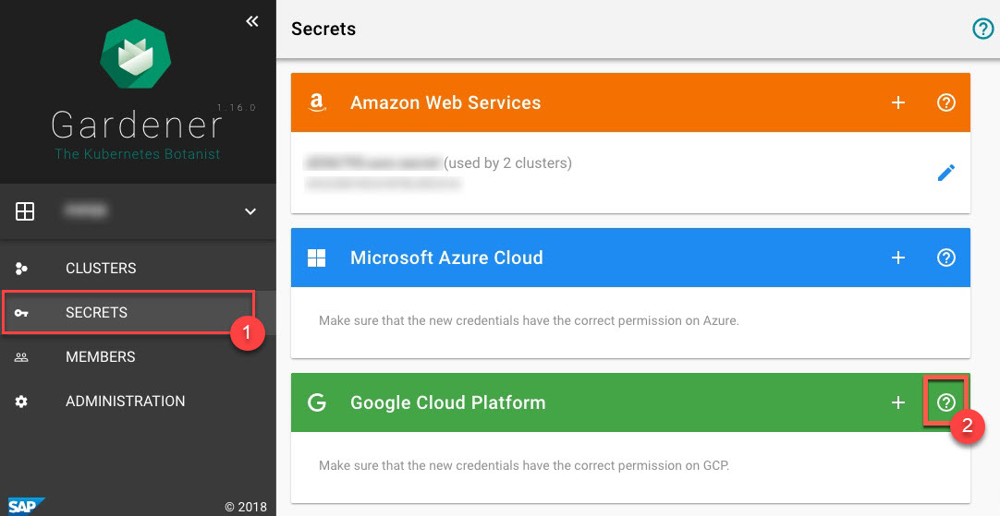
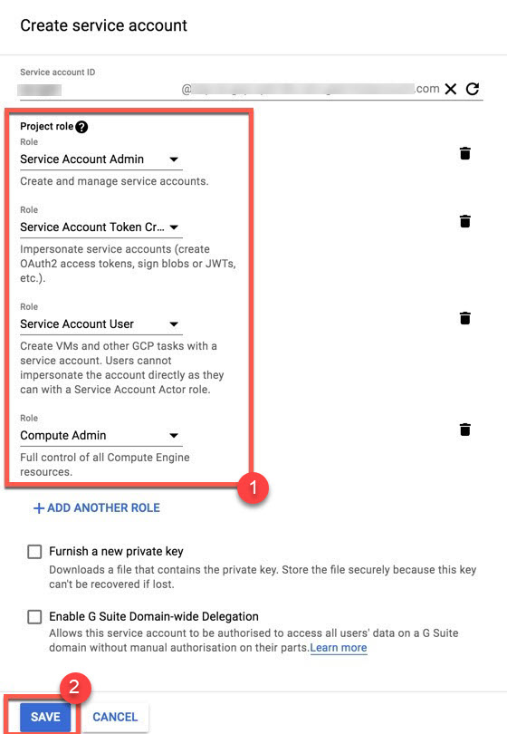
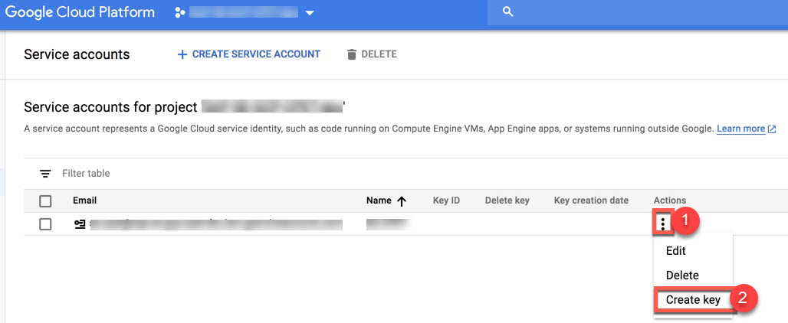
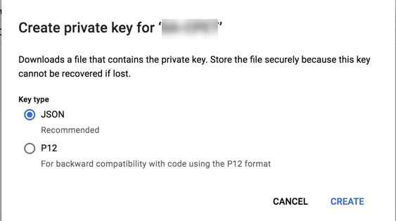
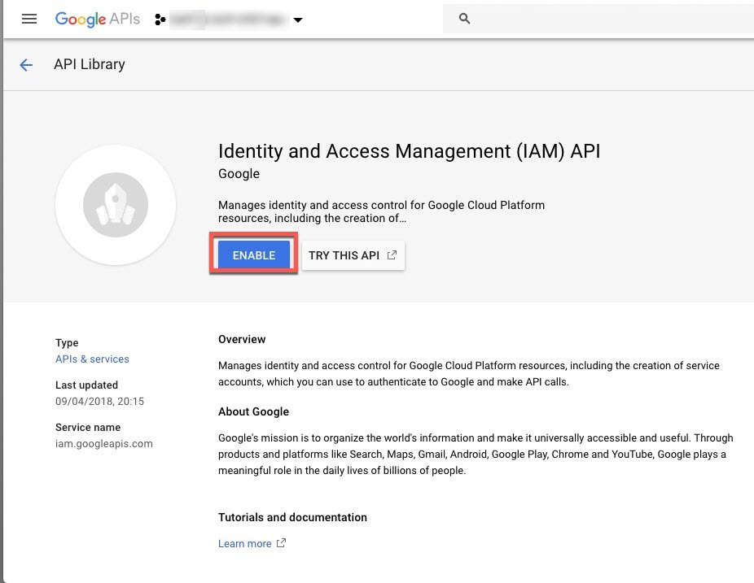
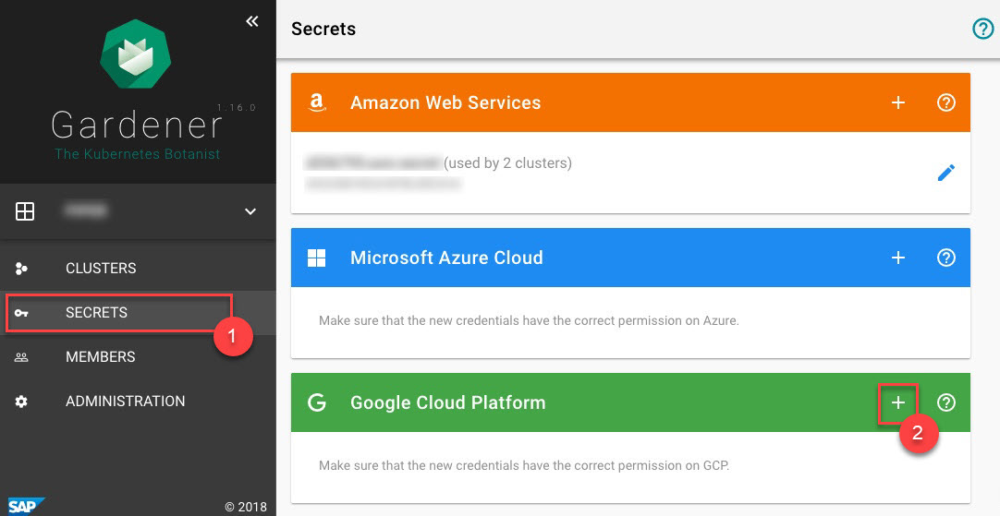
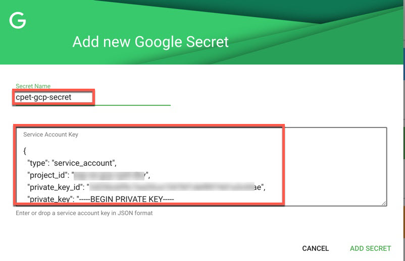
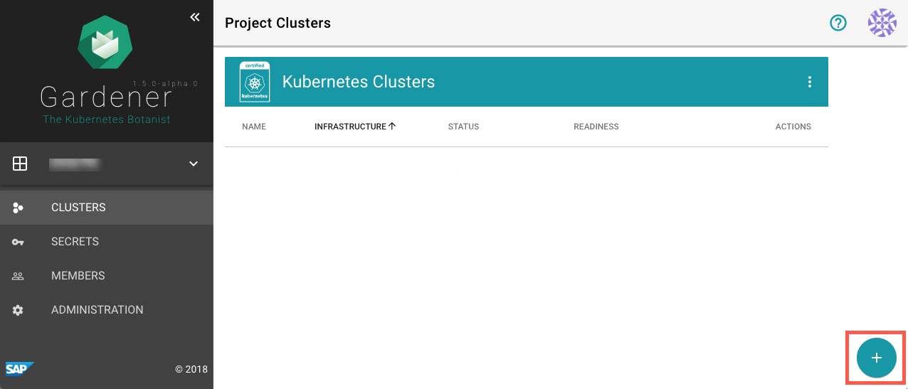
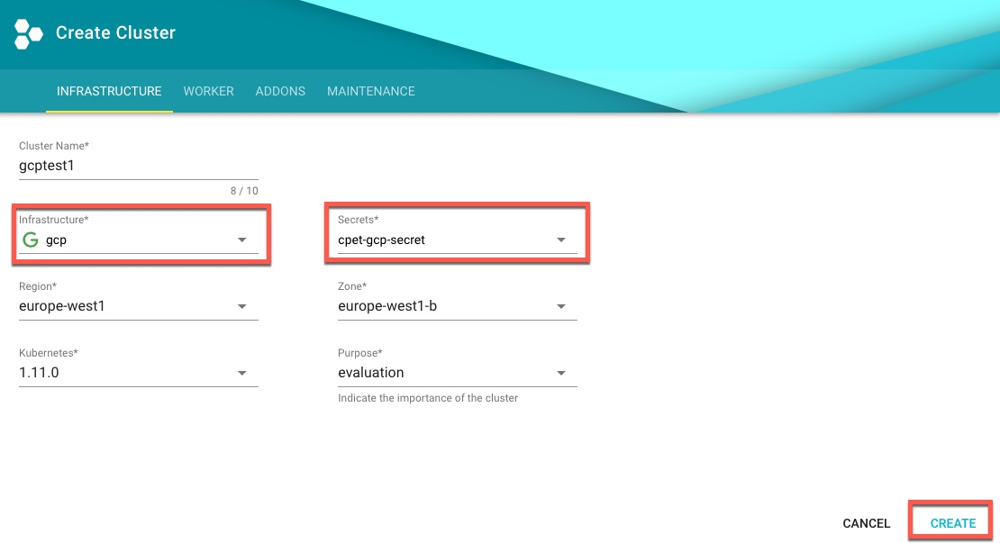
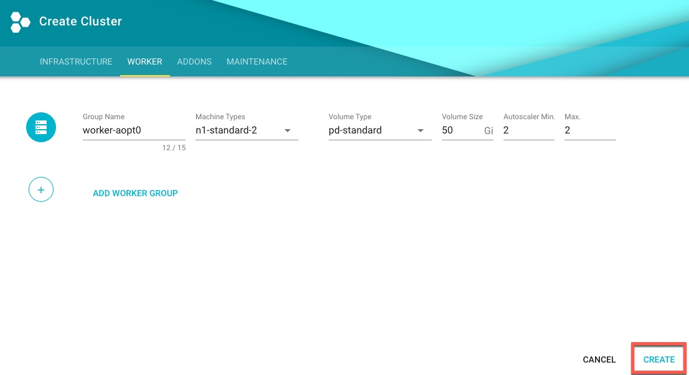

### Prerequisites

-   You need a GCP account.
-   You have access to the Gardener dashboard and have permissions to create projects.

1. Go to the Gardener dashboard and create a *Project*.

    

2. To check which roles are required by Gardener, choose *Secrets*, and click on the help button  for GCP.
    

    

3. [Create a new service account in GCP](https://console.cloud.google.com/iam-admin/serviceaccounts) and assign the roles required by Gardener.

    

    

4. To create a key for the service account, choose *Actions* and then *Create key*.

    

5. Save the private key of the service account in JSON format.
    

    > Note: Save the key of the user, it’s used later to create secrets for Gardener.

6. [Enable the Google compute API](https://console.developers.google.com/apis/library/compute.googleapis.com).

    

7. [Enable the Google IAM API](https://console.developers.google.com/apis/api/iam.googleapis.com/overview).
    

8. On the Gardener dashboard, choose *Secrets* and then the plus sign  in the GCP frame to add a new GCP secret.

    

    

9.  To create a new cluster, choose *Clusters* and then the plus sign in the lower right corner.

    

10. On tab *INFRASTRUCTURE*, choose the secret you created before. 

    

    

    

    

11. Copy kubeconfig.

    
