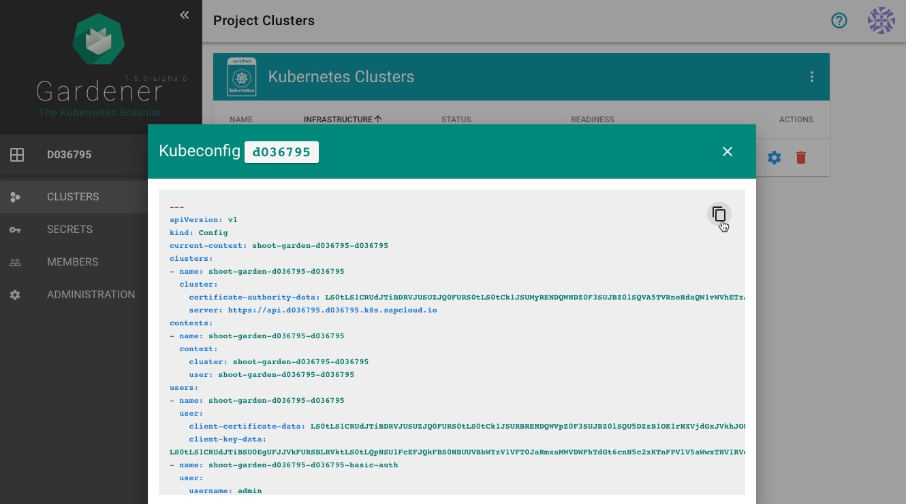

## Introduction
Creating a Kubernetes cluster in the GCP Account is easy and the Gardener UI should be self-explanatory.

# Gardener
## Create a new Project in Gardener

[Create new Project](https://dashboard.garden.canary.k8s.ondemand.com/login)

## Check which roles are required by the Gardener

# GCP

## Create a new serviceaccount and assign roles
[Create a new serviceaccount](https://console.cloud.google.com/iam-admin/serviceaccounts)

## Create key for the serviceaccount

## Download the key of the serviceaccount as json

save the keys of the user, you will need it later on

## Enable the Google compute API
[Enable the Google compute API](https://console.developers.google.com/apis/library/compute.googleapis.com)

## Enable the Google IAM API
[Enable the Google IAM API](https://console.developers.google.com/apis/api/iam.googleapis.com/overview)

# Gardener
## Add GCP Secret

## Create a new Cluster
[Create a new cluster](https://dashboard.garden.canary.k8s.ondemand.com)

## Copy kubeconfig

