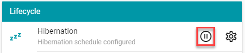
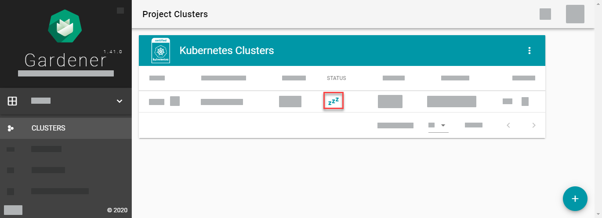
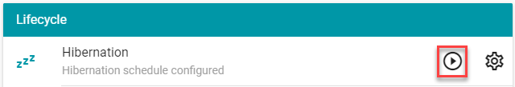
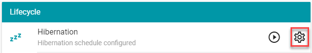

Clusters are only needed 24 hours a day if they run productive workload. So whenever you do development in a cluster, or just use it for tests or demo purposes, you can save much money if you scale-down your Kubernetes resources whenever you don't need them. However, scaling them down manually can become time-consuming the more resources you have. 

Gardener offers a clever way to automatically scale-down all resources to zero: cluster hibernation. You can either hibernate a cluster by pushing a button or by defining a hibernation schedule.

> To save costs, it's recommended to define a hibernation schedule before the creation of a cluster. You can hibernate your cluster or wake up your cluster manually even if there's a schedule for its hibernation.

- [What is hibernated?](#what-is-hibernated)
- [What isn’t affected by the hibernation?](#what-isnt-affected-by-the-hibernation)
- [Hibernate your cluster manually](#hibernate-your-cluster-manually)
- [Wake up your cluster manually](#wake-up-your-cluster-manually)
- [Create a schedule to hibernate your cluster](#create-a-schedule-to-hibernate-your-cluster)

## What is hibernated?

When a cluster is hibernated, Gardener scales down worker nodes and deletes the cluster's control plane to free resources at the IaaS provider. This affects:

* Your workload, for example, pods, deployments, custom resources.
* The virtual machines running your workload.
* The resources of the control plane of your cluster.

## What isn’t affected by the hibernation?

To scale up everything where it was before hibernation, Gardener doesn’t delete state-related information, that is, information stored in persistent volumes. The cluster state as persistent in `etcd` is also preserved.

## Hibernate your cluster manually

1. On the Gardener dashboard, choose *CLUSTERS* \> *\[YOUR-CLUSTER\]* \> *OVERVIEW* \> *Lifecycle* \> *Hibernation* \> *Hibernate Cluster*.

     

1. To confirm the hibernation, enter the name of your cluster and choose *HIBERNATE*.

> You can also hibernate your cluster by setting `spec.hibernation.enabled` to `true` in the cluster's YAML file. To change it on the dashboard, choose *CLUSTERS* \> *\[YOUR-CLUSTER\]* \> *YAML*.

As soon as the cluster was hibernated successfully, its status is shown as `ZZZ` in the list of clusters:

 

## Wake up your cluster manually

1. On the Gardener dashboard, choose *CLUSTERS* \> *\[YOUR-CLUSTER\]* \> *OVERVIEW* \> *Lifecycle* \> *Hibernation* \> *Wake up Cluster*.

    

1. To confirm waking up the cluster, choose *Wake Up*.

> You can also wake up your cluster by setting `spec.hibernation.enabled` to `false` in the cluster's YAML file. To change it on the dashboard, choose *CLUSTERS* \> *\[YOUR-CLUSTER\]* \> *YAML*.

## Create a schedule to hibernate your cluster

1. You can create a hibernation schedule for a cluster in the creation dialog of the Gardener dashboard. To create it later or to change it, choose *CLUSTERS* \> *\[YOUR-CLUSTER\]* \> *OVERVIEW* \> *Lifecycle* \> *Hibernation* \> *Configure Hibernation Schedule*.

    

1. Changes made on the Gardener dashboard for your cluster are immediately written to the cluster's YAML file on tab *CLUSTERS* \> *\[YOUR-CLUSTER\]* \> *YAML*. You can find the hibernation schedule in field `spec.hibernation.schedules`. The schedule is defined like a cron job in Linux. More information: [HibernationSchedule](https://gardener.cloud/api-reference/core/#core.gardener.cloud/v1beta1.HibernationSchedule).
