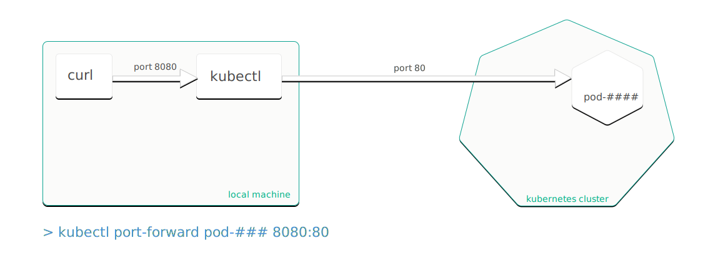

## Question
You deployed an application with a web UI or an internal endpoint in your Kubernetes (K8s) cluster.  How can I access 
this endpoint **without an external load balancer** (e.g. Ingress)?
This tutorial presents two options:

- Using Kubernetes port forward
- Using Kubernetes apiserver proxy

Please note that the options described here are mostly for quick testing or troubleshooting your application. For enabling access to your application for productive environment, please refer to [Access my service](2017-01-16-howto-service-access.md)

## Solution 1: Using Kubernetes port forward
You could use the port forwarding functionality of `kubectl` to access the pods from your 
local host __without involving a service__.

To access any pod follow these steps:

-   Run `kubectl get pods`
-   Note down the name of the pod in question as `<your-pod-name>`
-   Run `kubectl port-forward <your-pod-name> <local-port>:<your-app-port>`
-   Run a web browser or curl locally and enter the URL `http(s)://localhost:<local-port>`

In addition, `kubectl port-forward` allows to use a resource name. such as a deployment or service name, to select a matching pod to port forward.
Find more details in the [Kubernetes documentation](https://kubernetes.io/docs/tasks/access-application-cluster/port-forward-access-application-cluster/).

The main drawback of this approach is that the pod's name will change as soon as it is restarted. Moreover, you need 
to have a web browser on your client and you need to make sure that the local port is not already used by an 
application running on your system. Finally, sometimes port forwarding is canceled due to non obvious reasons. 
This leads to a kind of shaky approach. A more robust approach is to access the application using kube-proxy.

## Solution 2: Using apiserver proxy

There are several different proxies used with Kubernetes, [the official documentation](https://kubernetes.io/docs/concepts/cluster-administration/proxies/) provides a good overview.

In this tutorial we are using apiserver proxy to enable access to services running in Kubernetes without using an Ingress. __Different from the first solution, a service is required for this solution__ .

Use the following URL to access a service via apiserver proxy. For details about apiserver proxy URLs read
[Discovering builtin services](https://kubernetes.io/docs/tasks/access-application-cluster/access-cluster/#discovering-builtin-services)

`https://<cluster-master>/api/v1/namespace/<namespace>/services/<service>:<service-port>/proxy/<service-endpoint>`

**Example:**

| cluster-master  | namespace           | service  | yservice-port  | service-endpoint  | url to access service  |
| ------------------|:--------------------: | -----------:| ----------------:| ----------------:| ----------------:|
| api.testclstr.cpet.k8s.sapcloud.io     | default | nginx-svc     |  80                |   /           |  [url](http://api.testclstr.cpet.k8s.sapcloud.io/api/v1/namespaces/default/services/nginx-svc:80/proxy/)
| api.testclstr.cpet.k8s.sapcloud.io     | default | docker-nodejs-svc |  4500          |   /cpu?baseNumber=4 | [url](https://api.testclstr.cpet.k8s.sapcloud.io/api/v1/namespaces/default/services/docker-nodejs-svc:4500/proxy/cpu?baseNumber=4)

There are applications, which do __not__ yet support relative URLs like [Prometheus](https://github.com/prometheus/prometheus/issues/1583) (as of end of November, 2017).
This typically leads to missing JavaScript objects when trying to open the URL in a browser. In this case use the 
`port-forward` approach described above.
