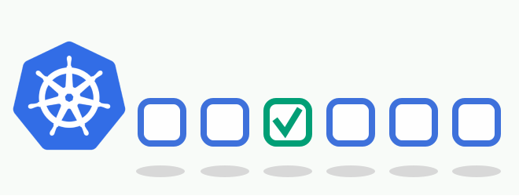
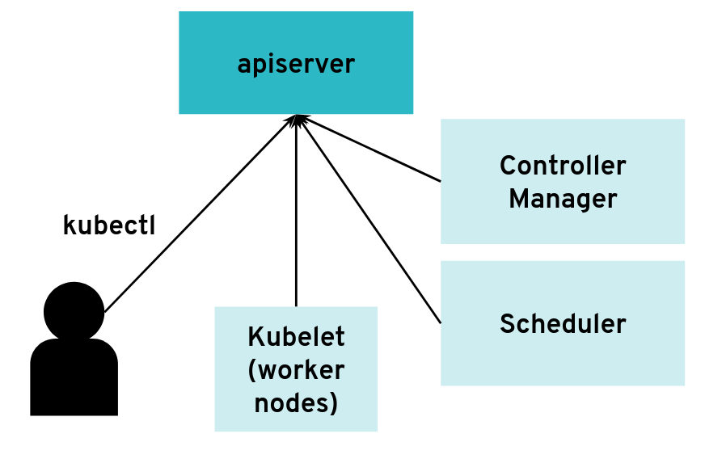
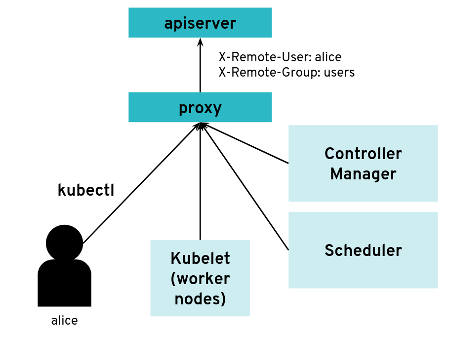
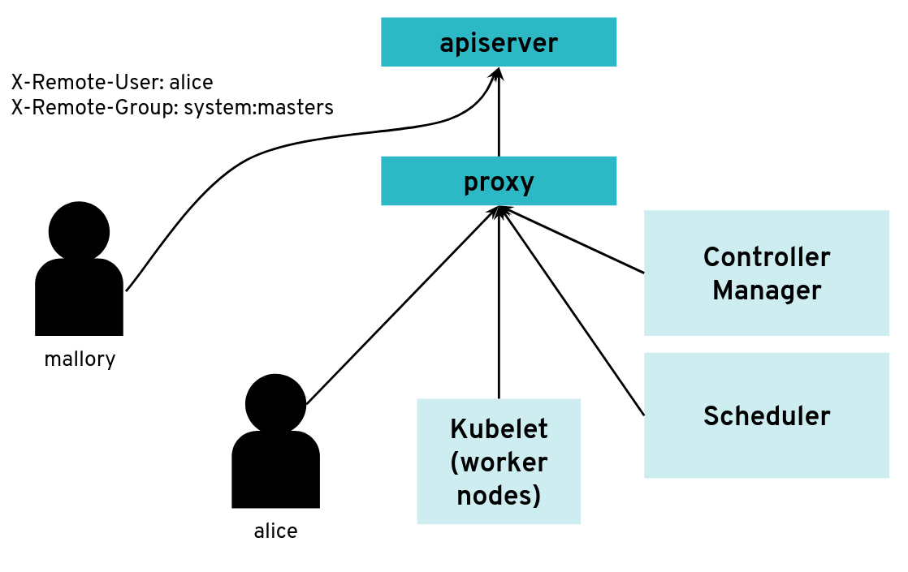
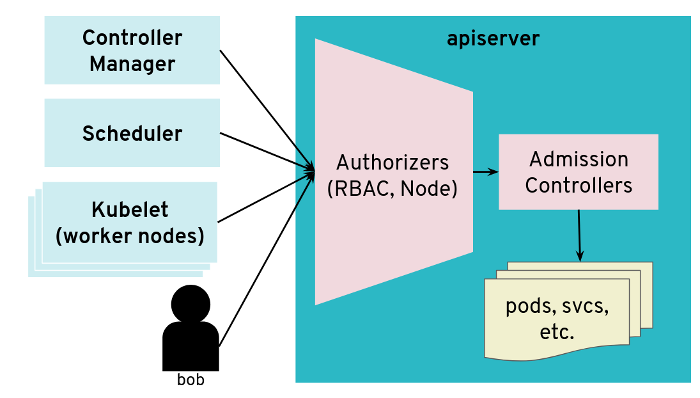
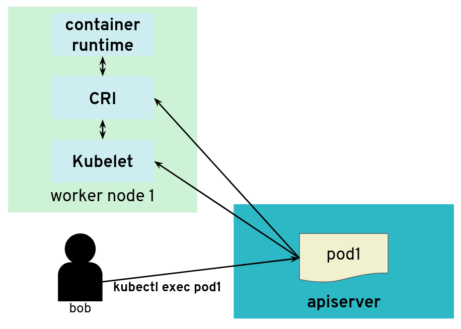
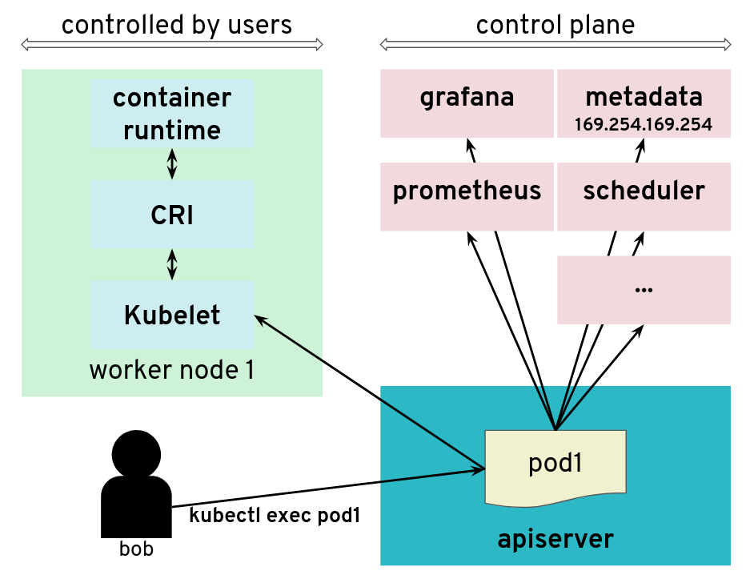
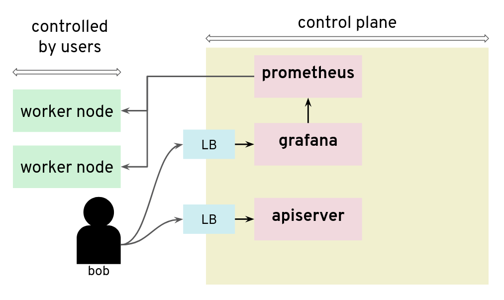
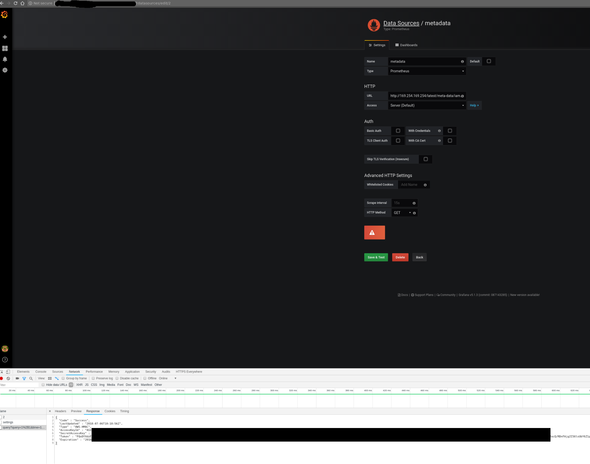
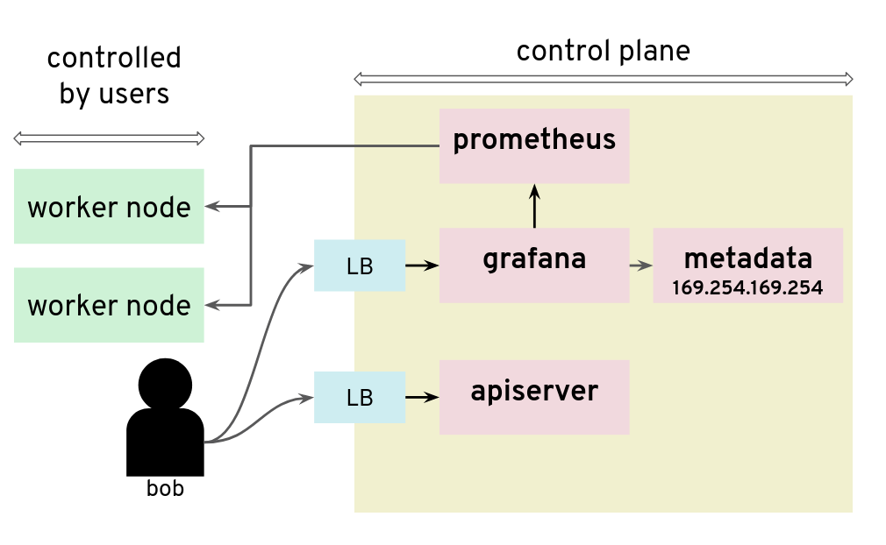

## Increasing the Security of All Gardener Stakeholders
In summer 2018, the [Gardener project team](https://github.com/gardener/gardener) asked [Kinvolk](https://kinvolk.io/) to execute several penetration tests in its role as third-party contractor. The goal of this ongoing work was to increase the security of all Gardener stakeholders in the open source community. Following the Gardener architecture, the control plane of a Gardener managed shoot cluster resides in the corresponding seed cluster. This is a [Control-Plane-as-a-Service](https://kubernetes.io/blog/2018/05/17/gardener/#kubernetes-control-plane) with a [network air gap](https://kubernetes.io/blog/2018/05/17/gardener/#network-air-gap).

Along the way we found various kinds of security issues, for example, due to misconfiguration or missing isolation, as well as two special problems with upstream Kubernetes and its Control-Plane-as-a-Service architecture.

## Major Findings
From this experience, we’d like to share a few examples of security issues that could happen on a Kubernetes installation and how to fix them.

Alban Crequy ([Kinvolk](https://kinvolk.io/)) and Dirk Marwinski ([SAP SE](https://www.sap.com)) gave a presentation entitled [Hardening Multi-Cloud Kubernetes Clusters as a Service](https://kccncchina2018english.sched.com/event/H2Hd/hardening-multi-cloud-kubernetes-clusters-as-a-service-dirk-marwinski-sap-se-alban-crequy-kinvolk-gmbh) at KubeCon 2018 in Shanghai presenting some of the findings.

Here is a summary of the findings:

-   Privilege escalation due to insecure configuration of the Kubernetes
    API server
    -   Root cause: Same certificate authority (CA) is used for both the
        API server and the proxy that allows accessing the API server.
    -   Risk: Users can get access to the API server.
    -   Recommendation: Always use different CAs.

-   Exploration of the control plane network with malicious
    HTTP-redirects

    -   Root cause: See detailed description below.
    -   Risk: Provoked error message contains full HTTP payload from an
        existing endpoint which can be exploited. The contents of the
        payload depends on your setup, but can potentially be user data,
        configuration data, and credentials.
    -   Recommendation:

        -   Use the latest version of Gardener
        -   Ensure the seed cluster's container network supports
            network policies. Clusters that have been created with
            [Kubify](https://github.com/gardener/kubify) are not
            protected as Flannel is used there which doesn't support
            network policies.

-   Reading private AWS metadata via Grafana
    -   Root cause: It is possible to configuring a new custom data
        source in Grafana, we could send HTTP requests to target the
        control
    -   Risk: Users can get the "user-data" for the seed cluster from
        the metadata service and retrieve a kubeconfig for that
        Kubernetes cluster
    -   Recommendation: Lockdown Grafana features to only what's
        necessary in this setup, block all unnecessary outgoing traffic,
        move Grafana to a different network, lockdown unauthenticated
        endpoints

## Scenario 1: Privilege Escalation with Insecure API Server
In most configurations, different components connect directly to the Kubernetes API server, often using a `kubeconfig` with a client
certificate. The API server is started with the flag:

```bash
/hyperkube apiserver --client-ca-file=/srv/kubernetes/ca/ca.crt ...
```

The API server will check whether the client certificate presented by kubectl, kubelet, scheduler or another component is really signed by the configured certificate authority for clients.

*The API server can have many clients of various kinds*<br/><br/><br/>

However, it is possible to configure the API server differently for use with an intermediate authenticating proxy. The proxy will authenticate the client with its own custom method and then issue HTTP requests to the API server with additional HTTP headers specifying the user name and group name. The API server should only accept HTTP requests with HTTP headers from a legitimate proxy. To allow the API server to check incoming requests, you need pass on a list of certificate authorities (CAs) to it. Requests coming from a proxy are only accepted if they use a client certificate that is signed by one of the CAs of that list.


```bash
--requestheader-client-ca-file=/srv/kubernetes/ca/ca-proxy.crt
--requestheader-username-headers=X-Remote-User
--requestheader-group-headers=X-Remote-Group
```

*API server clients can reach the API server through an authenticating proxy*<br/><br/><br/>

So far, so good. But what happens if the malicious user “Mallory” tries to connect directly to the API server and reuses
the HTTP headers to pretend to be someone else?

*What happens when a client bypasses the proxy, connecting directly to the API server?*<br/><br/><br/>


With a correct configuration, Mallory’s kubeconfig will have a certificate signed by the API server certificate authority
but not signed by the proxy certificate authority. So the API server will not accept the extra HTTP header “X-Remote-Group: system:masters”.


You only run into an issue when the same certificate authority is used for both the API server and the proxy. Then, any Kubernetes
client certificate can be used to take the role of different user or group as the API server will accept the user header and
group header.


The `kubectl` tool does not normally add those HTTP headers but it’s pretty easy to generate the corresponding HTTP
requests manually.


We worked on [improving the Kubernetes documentation](https://github.com/kubernetes/website/pull/10093) to make clearer
that this configuration should be avoided.


## Scenario 2: Exploration of the Control Plane Network with Malicious HTTP-Redirects
The API server is a central component of Kubernetes and many components initiate connections to it, including the kubelet
running on worker nodes. Most of the requests from those clients will end up updating Kubernetes objects (pods, services,
deployments, and so on) in the etcd database but the API server usually does not need to initiate TCP connections itself.

*The API server is mostly a component that receives requests*<br/><br/><br/>


However, there are exceptions. Some `kubectl` commands will trigger the API server to open a new
connection to the kubelet. `kubectl exec` is one of those commands. In order to get the standard I/Os from the pod,
the API server will start an HTTP connection to the kubelet on the worker node where the pod is running. Depending on
the container runtime used, it can be done in different ways, but one way to do it is for the kubelet to reply with a
HTTP-302 redirection to the [Container Runtime Interface (CRI)](https://github.com/kubernetes/community/blob/master/contributors/devel/sig-node/container-runtime-interface.md).
Basically, the kubelet is telling the API server to get the streams from CRI itself directly instead of forwarding. The
redirection from the kubelet will only change the port and path from the URL; the IP address will not be changed because
the kubelet and the CRI component run on the same worker node.

*But the API server also initiates some connections, for example, to worker nodes*<br/><br/><br/>

It’s often quite easy for users of a Kubernetes cluster to get access to worker nodes and tamper with the kubelet. They
could be given explicit SSH access or they could be given a kubeconfig with enough privileges to create privileged pods
or even just pods with “host” volumes.


In contrast, users (even those with “system:masters” permissions or “root” rights) are often not given access to the control plane.
On setups like, for example, GKE or Gardener, the control plane is running on separate nodes, with a different administrative
access. It could be hosted on a different cloud provider account. So users are not free to explore the internal network
in the control plane.


What would happen if a user was tampering with the kubelet to make it maliciously redirect `kubectl exec` requests to
a different random endpoint? Most likely the given endpoint would not speak to the streaming server protocol, so there would
be an error. However, the full HTTP payload from the endpoint is included in the error message printed by kubectl exec.

*The API server is tricked to connect to other components*<br/><br/><br/>

The impact of this issue depends on the specific setup. But in many configurations, we could find a metadata service
(such as the [AWS metadata service](https://docs.aws.amazon.com/AWSEC2/latest/UserGuide/ec2-instance-metadata.html))
containing user data, configurations and credentials. The setup we explored had a different AWS account and a different
[EC2 instance profile](https://docs.aws.amazon.com/IAM/latest/UserGuide/id_roles_use_switch-role-ec2_instance-profiles.html)
for the worker nodes and the control plane. This issue allowed users to get access to the AWS metadata service in the
context of the control plane, which they should not have access to.


We have reported this issue to the [Kubernetes Security mailing list](https://kubernetes.io/docs/reference/issues-security/security/)
and the public pull request that addresses the issue has been merged [PR#66516](https://github.com/kubernetes/kubernetes/pull/66516).
It provides a way to enforce HTTP redirect validation (disabled by default).


But there are several other ways that users could trigger the API server to generate HTTP requests and get the reply
payload back, so it is advised to isolate the API server and other components from the network as additional precautious measures.
Depending on where the API server runs, it could be with [Kubernetes Network Policies](https://kubernetes.io/docs/concepts/services-networking/network-policies/), [EC2 Security Groups](https://docs.aws.amazon.com/AWSEC2/latest/UserGuide/using-network-security.html) or just iptables directly. Following the [defense in depth principle](https://en.wikipedia.org/wiki/Defense_in_depth_(computing)),
it is a good idea to apply the API server HTTP redirect validation when it is available as well as firewall rules.


In Gardener, this has been fixed with Kubernetes network policies along with changes to ensure the API server does
not need to contact the metadata service. You can see more details in the [announcements on the Gardener mailing list](https://groups.google.com/forum/#!forum/gardener).
This is tracked in [CVE-2018-2475](https://cve.mitre.org/cgi-bin/cvename.cgi?name=CVE-2018-2475).


*To be protected from this issue, stakeholders should:*

* *Use the latest version of Gardener*
* *Ensure the seed cluster’s container network supports network policies. Clusters that have been created with
[Kubify](https://github.com/gardener/kubify) are not protected as Flannel is used there which doesn’t support network
policies.*


## Scenario 3: Reading Private AWS Metadata via Grafana
For our tests, we had access to a Kubernetes setup where users are not only given access to the API server in the control
plane, but also to a Grafana instance that is used to gather data from their Kubernetes clusters via Prometheus. The control
plane is managed and users don’t have access to the nodes that it runs. They can only access the API server and Grafana
via a load balancer. The internal network of the control plane is therefore hidden to users.

*Prometheus and Grafana can be used to monitor worker nodes*<br/><br/><br/>


Unfortunately, that setup was not protecting the control plane network from nosy users. By configuring a new custom
data source in Grafana, we could send HTTP requests to target the control plane network, for example the AWS metadata
service. The reply payload is not displayed on the Grafana Web UI but it is possible to access it from the debugging
console of the Chrome browser.

*Credentials can be retrieved from the debugging console of Chrome*<br/><br/><br/>

*Adding a Grafana data source is a way to issue HTTP requests to arbitrary targets*<br/><br/><br/>

In that installation, users could get the “user-data” for the seed cluster from the metadata service and retrieve a
kubeconfig for that Kubernetes cluster.


There are many possible measures to avoid this situation: lockdown Grafana features to only what’s necessary in this setup, block all
unnecessary outgoing traffic, move Grafana to a different network, or lockdown unauthenticated endpoints, among others.

## Conclusion
The three scenarios above show pitfalls with a Kubernetes setup. A lot of them were specific to the Kubernetes
installation: different cloud providers or different configurations will show different weaknesses. Users should no longer be given access to Grafana.