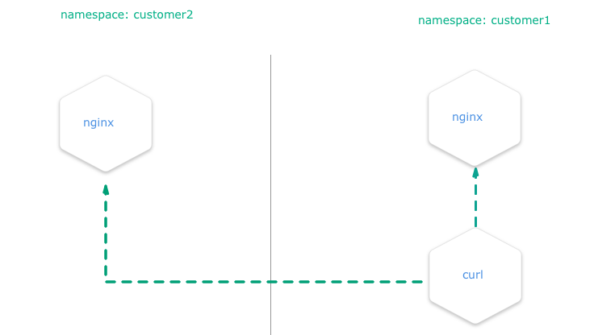
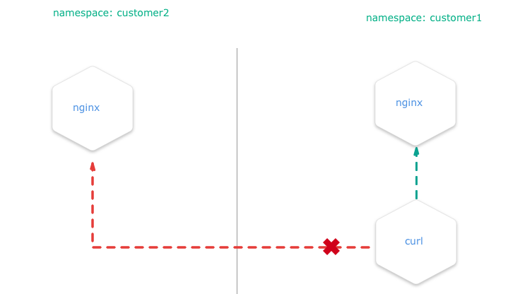

## Overview

You can configure a **NetworkPolicy** to deny all the traffic from other namespaces while allowing all the traffic 
coming from the same namespace the pod was deployed into.                                           


**There are many reasons why you may chose to employ Kubernetes network policies:**
 - Isolate multi-tenant deployments
 - Regulatory compliance
 - Ensure containers assigned to different environments (e.g. dev/staging/prod) cannot interfere with each other      
 
 
Kubernetes **network policies** are application centric compared to infrastructure/network centric standard firewalls. 
**There are no explicit CIDRs or IP addresses used** for matching source or destination IP’s. 
**Network policies build up on labels and selectors** which are key concepts of Kubernetes that are used to organize 
(for e.g all DB tier pods of an app) and select subsets of objects.

## Example
We create two nginx HTTP-Servers in two namespaces and block all traffic between the two namespaces. E.g. you are
unable to get content from *namespace1* if you are sitting in *namespace2*.

## Setup the Namespaces

```bash
# create two namespaces for test purpose
kubectl create ns customer1
kubectl create ns customer2

# create a standard HTTP web server
kubectl run nginx --image=nginx --replicas=1 --port=80 -n=customer1
kubectl run nginx --image=nginx --replicas=1 --port=80 -n=customer2

# expose the port 80 for external access
kubectl expose deployment nginx --port=80 --type=NodePort -n=customer1
kubectl expose deployment nginx --port=80 --type=NodePort -n=customer2

```

--- 

## Test Without NP


Create a pod with *curl* preinstalled inside the namespace *customer1*:
```bash
# create a "bash" pod in one namespace
kubectl run -i --tty client --image=tutum/curl -n=customer1
```

Try to *curl* the exposed nginx server to get the default index.html page. **Execute this in the bash prompt of the pod created above.**

```bash
# get the index.html from the nginx of the namespace "customer1" => success
curl http://nginx.customer1
# get the index.html from the nginx of the namespace "customer2" => success
curl http://nginx.customer2
```

Both calls are done in a pod within the namespace *customer1* and both nginx servers are always reachable, no matter in what namespace.

---
## Test with NP


Install the **NetworkPolicy** from your shell:

```yaml
apiVersion: networking.k8s.io/v1
kind: NetworkPolicy
metadata:
  name: deny-from-other-namespaces
spec:
  podSelector:
    matchLabels:
  ingress:
  - from:
    - podSelector: {}
```
* it applies the policy to ALL pods in the named namespace as the `spec.podSelector.matchLabels` is empty and therefore selects all pods.
* it allows traffic from ALL pods in the named namespace, as `spec.ingress.from.podSelector` is empty and therefore selects all pods.


``` 
kubectl apply -f ./network-policy.yaml -n=customer1
kubectl apply -f ./network-policy.yaml -n=customer2
```

After this, `curl http://nginx.customer2` shouldn't work anymore if you are a service inside the namespace *customer1* and 
vice versa
{}
This policy, once applied, will also disable all external traffic to these pods. For example, you can create a service of type `LoadBalancer` in namespace `customer1` that match the nginx pod. When you request the service by its `<EXTERNAL_IP>:<PORT>`, then the network policy that will deny the ingress traffic from the service and the request will time out.
{}

## Related Links
You can get more information on how to configure the **NetworkPolicies** at:

 - [Calico WebSite](https://docs.projectcalico.org/v3.0/getting-started/kubernetes/tutorials/advanced-policy)
 - [Kubernetes NP Recipes](https://github.com/ahmetb/kubernetes-network-policy-recipes)