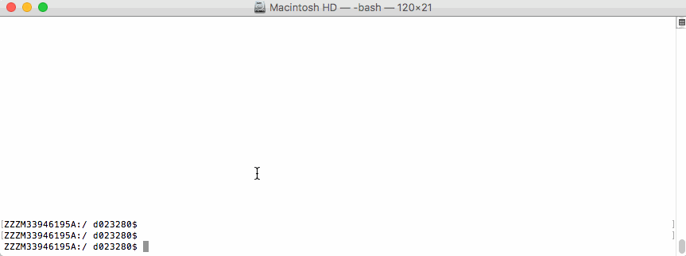
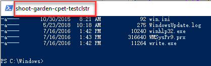

## Overview

Use the Kubernetes command-line tool, **kubectl**, to deploy and manage applications on Kubernetes. 
Using kubectl, you can inspect cluster resources, as well as create, delete, and update components.




By default, the kubectl configuration is located at `~/.kube/config`.

Let us suppose that you have two clusters, one for development work and one for scratch work.

How to handle this easily without copying the used configuration always to the right place? 

## Export the KUBECONFIG Enviroment Variable
```sh 
bash$ export KUBECONFIG=<PATH-TO-M>-CONFIG>/kubeconfig-dev.yaml
```

How to determine which cluster is used by the kubectl command?

## Determine Active Cluster
```sh 
bash$ kubectl cluster-info
Kubernetes master is running at https://api.dev.garden.shoot.canary.k8s-hana.ondemand.com
KubeDNS is running at https://api.dev.garden.shoot.canary.k8s-hana.ondemand.com/api/v1/proxy/namespaces/kube-system/services/kube-dns

To further debug and diagnose cluster problems, use 'kubectl cluster-info dump'.
bash$ 
```

## Display Cluster in the bash - Linux and Alike
I found this tip on Stackoverflow and find it worth to be added here.
Edit your `~/.bash_profile` and add the following code snippet to show the current K8s 
context in the shell's prompt:

```sh
prompt_k8s(){
  k8s_current_context=$(kubectl config current-context 2> /dev/null)
  if [[ $? -eq 0 ]] ; then echo -e "(${k8s_current_context}) "; fi
}
 
 
PS1+='$(prompt_k8s)'

```

After this, your bash command prompt contains the active KUBECONFIG context and you always know
which cluster is active - *develop* or *production*. 

e.g.

```sh 
bash$ export KUBECONFIG=/Users/d023280/Documents/workspace/gardener-ui/kubeconfig_gardendev.yaml 
bash (garden_dev)$ 
```

Note the **(garden_dev)** prefix in the bash command prompt.

**This helps immensely to avoid thoughtless mistakes.**

## Display Cluster in the PowerShell - Windows
Display current K8s cluster in the title of PowerShell window.

Create a [profile](https://superuser.com/a/1045659) file for your shell under `%UserProfile%\Documents\Windows­PowerShell\Microsoft.PowerShell_profile.ps1`

Copy following code to `Microsoft.PowerShell_profile.ps1`
```sh
 function prompt_k8s {
     $k8s_current_context = (kubectl config current-context) | Out-String
     if($?) {
         return $k8s_current_context
     }else {
         return "No K8S contenxt found"
     }
 }

 $host.ui.rawui.WindowTitle = prompt_k8s
```



If you want to switch to different cluster, you can set `KUBECONFIG` to new value, and re-run the file `Microsoft.PowerShell_profile.ps1`