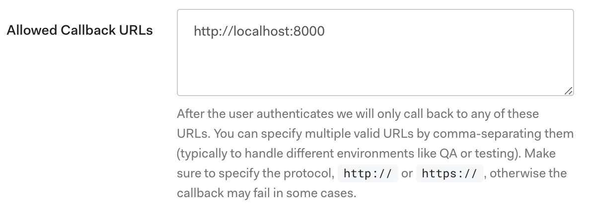
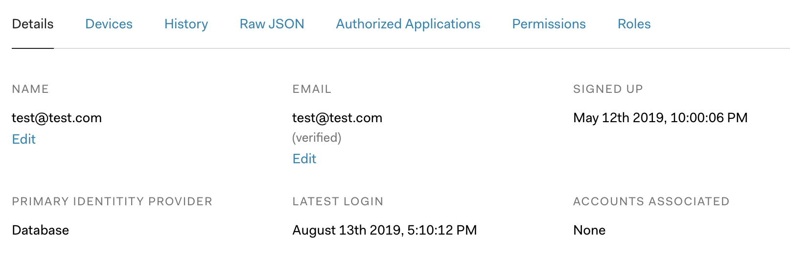
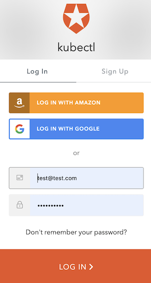

# Authenticating

In this blog you will learn how to:

1. Configure an Identity Provider using OpenID Connect.
2. Configure a local kubectl plugin to enable [oidc-login](https://github.com/int128/kubelogin) .
3. Configure the K8s API Server of Gardener managed Kubernetes cluster.
4. Create an RBAC rule to authorize an authenticated user.

## Motivation

As a project owner of Gardener, I want my Kubernetes level user to be authenticated by an identity provider.


## Prerequisite Knowledge

Please read the following background material on [Authenticating](https://kubernetes.io/docs/reference/access-authn-authz/authentication/#openid-connect-tokens)


## Insights About Gardener

The Gardener allows the administrator to modify every aspect of the control plane setup, e.g. all feature gateways and even configurations are programmatically accessible. In this way, every administrative user of the Gardener has full control of how the control plane should be parameterized. But with this power, the user can easily configure a control plane that is beyond any SLA that the Gardener team can arguably support. Therefore, use this power wisely! A configuration that enables experimental features for production becomes an operational responsibility of the cluster owner's team.

But Gardener does not stop you from experimenting!

There are currently no default IdP parameters.

## Configure an Identity Provider

Create a tenant in an OpenID-Connect compatible Identity Provider. For sake of simplicity, we shall use [Auth0](https://auth0.com/), which has a free plan for experimentations.

In your tenant, setup a native client/application that will use the authentication:

Configure the client to have a callback url of `http://localhost:8000`. This callback will connect to your local `kubectl oidc-login` plugin:


Note down the following parameters:

* Domain or Issuer url. It [must](https://openid.net/specs/openid-connect-core-1_0.html#Terminology) be an `https`-secured endpoint (In case of Auth0, notice the trailing `/` at the end).
* Client ID
* Client Secret

Verify that `https://<Issuer>/.well-known/openid-configuration` is reachable.

Now create some users (or connect to a user store):

Notice that the users must have a *verified* email address. In doubt, just override that setting manually.

## Configure kubectl oidc-login

Please install the kubectl plugin [oidc-login](https://github.com/int128/kubelogin). We highly recommend the [krew](https://github.com/kubernetes-sigs/krew) install tool, which also makes other plugins easily available.
```
$ kubectl krew install oidc-login
Updated the local copy of plugin index.
Installing plugin: oidc-login
CAVEATS:
\
 |  You need to setup the OIDC provider, Kubernetes API server, role binding and kubeconfig.
 |  See https://github.com/int128/kubelogin for more.
/
Installed plugin: oidc-login
```

Prepare a `kubeconfig` for later use:
```
$ cp ~/.kube/config ~/.kube/config-oidc
``` 

Modify the configurations as follows:
```yaml
apiVersion: v1
kind: Config

...

contexts:
- context:
    cluster: shoot--project--mycluster
    user: my-oidc
  name: shoot--project--mycluster

...

users:
- name: my-oidc
  user:
    auth-provider:
      config:
        client-id: <Client ID>
        client-secret: <Client Secret>
        idp-issuer-url: "https://<Issuer>/"
        extra-scopes: email,offline_access,profile
      name: oidc
``` 
Ensure that the modified context is the active context `current-context: shoot--project--mycluster`.

## Configure the Gardener Shoot Spec

Modify the Gardener shoot/cluster manifest as follows:
```yaml
apiVersion: core.gardener.cloud/v1beta1
kind: Shoot
metadata:
  name: mycluster
  namespace: garden-project
...
spec:
  kubernetes:
    kubeAPIServer:
      oidcConfig:
        clientID: <Client ID>
        issuerURL: "https://<Issuer>/"
        usernameClaim: email
```
This change of the shoot manifest triggers a reconciliation. Once the reconciliation is finished, your oidc configuration is applied. It does *not* invalidate other certificate based authentication methods. Wait for Gardener to reconcile the change. It can take upto 5min.


## Authorize an authenticated user

For simplicity, we will just authorize a single user with the all encompassing cluster role `cluster-admin`:
```yaml
apiVersion: rbac.authorization.k8s.io/v1
kind: ClusterRoleBinding
metadata:
  name: cluster-admin-test
roleRef:
  apiGroup: rbac.authorization.k8s.io
  kind: ClusterRole
  name: cluster-admin
subjects:
- apiGroup: rbac.authorization.k8s.io
  kind: User
  name: test@test.com
```
As administrator, activate/apply the above cluster role binding for `test@test.com`.

## Verify the Result

Now activate the prepared `kubeconfig-oidc` and perform a login:
```
$ export KUBECONFIG=~/.kube/config-oidc
$ kubectl oidc-login
Open http://localhost:8000 for authentication
```
The plugin opens a browser for an interctive authentication session, and in parallel serves a local webserver for the configured callback.



If you successfully verified your user, then the console will display the validity of your returned token:
```
You got a valid token until 2019-08-14 06:26:49 +0200 CEST
```

Inspect the `kubeconfig-oidc`. You will find two additional parameters:
```yaml
...
users:
- name: my-oidc
  user:
    auth-provider:
      config:
        client-id: <Client ID>
        client-secret: <Client Secret>
        idp-issuer-url: "https://<Issuer>/"
        extra-scopes: email,offline_access,profile
        id-token: eyJ0eX ... 4In0.QQKS ... TTTw
        refresh-token: LFt ... 0Skj
      name: oidc
```
The plugin persisted the `id-token` and `refresh-token` in your configuration file. 

Verify that your user actually has the `cluster-admin` role:
```
$ kubectl get po --all-namespaces
NAMESPACE     NAME                                       READY   STATUS    RESTARTS   AGE
kube-system   blackbox-exporter-954dd954b-tk9vl          1/1     Running   0          7d5h
kube-system   calico-kube-controllers-5f4b46ffb5-ggb7z   1/1     Running   0          7d5h
...

$ kubectl who-can create clusterrolebinding
No subjects found with permissions to create clusterrolebinding assigned through RoleBindings

CLUSTERROLEBINDING                                    SUBJECT                             TYPE            SA-NAMESPACE
cluster-admin                                         system:masters                      Group
cluster-admin-test                                    test@test.com                       User
...
```

Congratulations, you have just configured your cluster to authenticate against an Identity Provider using OpenID Connect!
