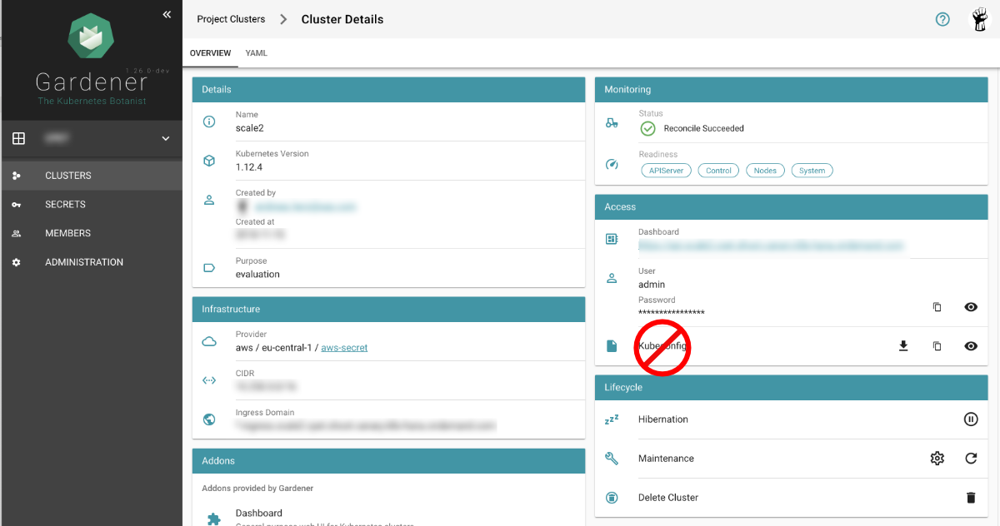

# Organizing Access Using kubeconfig Files
The kubectl command-line tool uses `kubeconfig` files to find the information it needs to choose a cluster and 
communicate with the API server of a cluster.

## Problem
If you've become aware of a security breach that affects you, you may want to revoke or cycle credentials 
in case anything was leaked. However, this is not possible with the initial or master `kubeconfig` from your 
cluster.


## Pitfall

Never distribute the `kubeconfig`, which you can download directly within the Gardener dashboard, for a productive cluster.




## Create custom kubeconfig file for each user

Create a separate `kubeconfig` for each user. One of the big advantages is, that you can revoke them and control 
the permissions better. A limitation to single namespaces is also possible here.

The script creates a new `ServiceAccount` with read privileges in the whole cluster (Secretes are excluded).
To run the script [jq](https://stedolan.github.io/jq/), a lightweight and flexible command-line JSON processor, must 
be installed.


```bash
#!/bin/bash

if [[ -z "$1" ]] ;then
  echo "usage: $0 <username>"
  exit 1
fi

user=$1
kubectl create sa ${user}
secret=$(kubectl get sa ${user} -o json | jq -r .secrets[].name)
kubectl get secret ${secret} -o json | jq -r '.data["ca.crt"]' | base64 -D > ca.crt

user_token=$(kubectl get secret ${secret} -o json | jq -r '.data["token"]' | base64 -D)
c=`kubectl config current-context`
cluster_name=`kubectl config get-contexts $c | awk '{print $3}' | tail -n 1`
endpoint=`kubectl config view -o jsonpath="{.clusters[?(@.name == \"${cluster_name}\")].cluster.server}"`

# Set up the config
KUBECONFIG=k8s-${user}-conf kubectl config set-cluster ${cluster_name} \
    --embed-certs=true \
    --server=${endpoint} \
    --certificate-authority=./ca.crt

KUBECONFIG=k8s-${user}-conf kubectl config set-credentials ${user}-${cluster_name#cluster-} --token=${user_token}
KUBECONFIG=k8s-${user}-conf kubectl config set-context ${user}-${cluster_name#cluster-} \
    --cluster=${cluster_name} \
    --user=${user}-${cluster_name#cluster-}
KUBECONFIG=k8s-${user}-conf kubectl config use-context ${user}-${cluster_name#cluster-}

cat <<EOF | kubectl create -f -
apiVersion: rbac.authorization.k8s.io/v1
kind: ClusterRoleBinding
metadata:
  name: view-${user}-global
subjects:
- kind: ServiceAccount
  name: ${user}
  namespace: default
roleRef:
  kind: ClusterRole
  name: view
  apiGroup: rbac.authorization.k8s.io

EOF


echo "done! Test with: "
echo "export KUBECONFIG=k8s-${user}-conf"
echo "kubectl get pods"
```

If **edit** or **admin** rights are to be assigned, the `ClusterRoleBinding` must be adapted in the `roleRef` section 
with the roles listed below.

Furthermore, you can restrict this to a single namespace by not creating a `ClusterRoleBinding` but only a `RoleBinding`
within the desired namespace.

Default ClusterRole |	Default ClusterRoleBinding	| Description
------------------- | ----------------------------- | ---------------
cluster-admin	    | system:masters group	        | Allows super-user access to perform any action on any resource. When used in a ClusterRoleBinding, it gives full control over every resource in the cluster and in all namespaces. When used in a RoleBinding, it gives full control over every resource in the rolebinding's namespace, including the namespace itself.
admin	            | None                          | Allows admin access, intended to be granted within a namespace using a RoleBinding. If used in a RoleBinding, allows read/write access to most resources in a namespace, including the ability to create roles and rolebindings within the namespace. It does not allow write access to resource quota or to the namespace itself.
edit	            | None	                        | Allows read/write access to most objects in a namespace. It does not allow viewing or modifying roles or rolebindings.
view	            | None                          | Allows read-only access to see most objects in a namespace. It does not allow viewing roles or rolebindings. It does not allow viewing secrets, since those are escalating.


