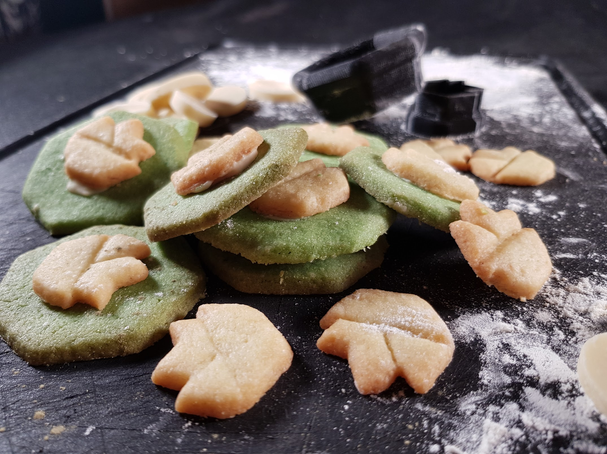
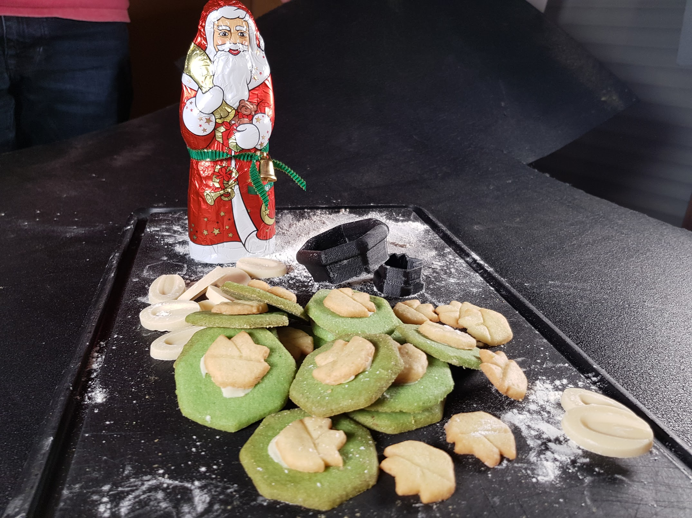
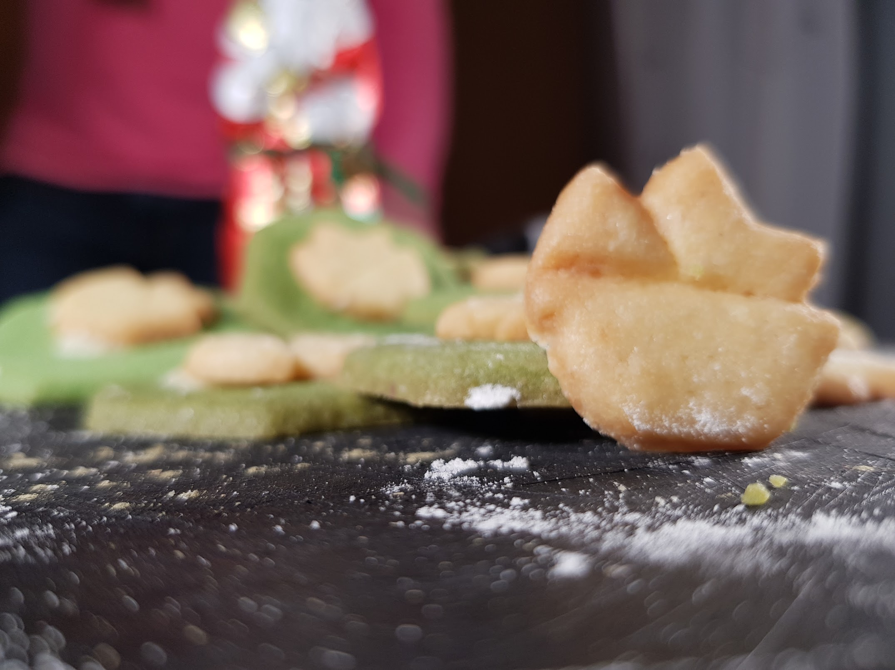

# Green Tea Matcha Cookies

For a team event during the Christmas season we decided to completely reinterpret the topic `cookies`. :-)

Matcha cookies have the delicate flavor and color of green tea. These soft, pillowy and chewy green tea cookies 
are perfect with tea. And of course they fit perfectly to our logo

## Ingredients

- 1 stick butter, softened
- ⅞ cup of granulated sugar
- 1 cup + 2 tablespoons all-purpose flour
- 2 eggs
- 1¼ tablespoons culinary grade matcha powder
- 1 teaspoon baking powder
- Pinch of salt

## Instructions
1. Cream together the butter and sugar in a large mixing bowl - it should be creamy colored and airy. A hand blender or stand mixer works well for this. This helps the cookie become fluffy and chewy.
1. Gently incorporate the eggs to the butter mixture one at a time.
1. In a separate bowl, sift together all the dry ingredients.
1. Add the dry ingredients to the wet by adding a little at a time and folding or gently mixing the batter together. Keep going until you've incorporated all the remaining flour mixture. The dough should be a beautiful green color.
1. Chill the dough for at least an hour - up to overnight. The longer the better!
1. Preheat your oven to 325 F.
1. Roll the dough into balls the size of ping pong balls and place them on a non-stick cookie sheet.
1. Bake them for 12-15 minutes until the bottoms just start to become golden brown and the cookie no longer looks wet in the middle. Note: you can always bake them at 350 F for a less moist, fluffy cookie. It will bake faster by about 2-4 minutes 350 F so watch them closely.
1. Remove and let cool on a rack and enjoy!

## Note
Make sure you get culinary grade matcha powder. You should be able to find this in Asian or natural grocers

