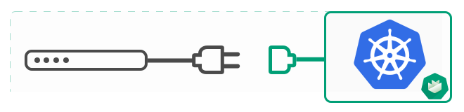

# Manually adding a node to an existing cluster
Gardener has an excellent ability to [automatically scale machines](/components/mcm/) for the cluster. From the point of view 
of scalability, there is no need for manual intervention. 

This tutorial is useful for those end-users who need specifically configured nodes, which are not yet supported 
by Gardener. For example: an end-user who wants some workload that requires `runnc` instead of `runc` as container 
runtime.



## Disclaimer

> Here we will look at the steps on how to add a node to an existing cluster without the support of Gardener. 
Such a node will not be managed by Gardener, and if it goes down for any reason, Gardener will not be 
responsible to replace it.


## How
1. Create a new instance in the same VPC/network as other machines in the cluster. You should be able to ssh into the machine. So save its private key, and assign a public IP to it. If adding a public IP is not preferred, then ssh into any other machine in the cluster, and then ssh from there into the new machine using its private key.

   To ssh into a machine which is already in the cluster, use the steps defined [here](https://github.com/gardener/documentation/blob/master/website/documentation/guides/monitoring_and_troubleshooting/shell-to-node/_index.md "ssh-into-node").

   Attach the same IAM role to the new machine which is attached to the existing machines in the cluster. This is required by kubelet in the new machine so that it can contact the cloud provider to query the node's name.

2. On the new machine, create file `/var/lib/kubelet/kubeconfig-bootstrap` with the following content:

```yaml
apiVersion: v1
kind: Config
current-context: kubelet-bootstrap@default
clusters:
- cluster:
    certificate-authority-data: <CA Certificate>
    server: <Server>
  name: default
contexts:
- context:
    cluster: default
    user: kubelet-bootstrap
  name: kubelet-bootstrap@default
users:
- name: kubelet-bootstrap
  user:
    as-user-extra: {}
    token: <Token>
```

3. ssh into an existing node, and run these commands to get the values of <CA Certificate> and <Server> to be replaced in above file:
- \<Servr>
```bash
 /opt/bin/hyperkube kubectl \
   --kubeconfig /var/lib/kubelet/kubeconfig-real \
   config view \
   -o go-template='{{index .clusters 0 "cluster" "server"}}' \
   --raw
 ```
- \<CA Certificate>
```bash
/opt/bin/hyperkube kubectl \
   --kubeconfig /var/lib/kubelet/kubeconfig-real \
   config view \
   -o go-template='{{index .clusters 0 "cluster" "certificate-authority-data"}}' \
   --raw
```

4. \<Token>\
  The kubelet on the new machine needs a bootstrap token to authenticate with the kube-apiserver when adding itself to the cluster. Kube-apiserver uses a secret in the `kube-system` namespace to authenticate this token. This token is valid for 90 minutes from the time of creation, and the corresponding secret captures this detail in its `.data.expiration` field. The name of this secret is of the format `bootstrap-token-*`. Gardener takes care of creating new bootstrap tokens, and the corresponding secrets.
  To get an unexpired token, find the secrets with the name format `bootstrap-token-*` in the `kube-system` namespace in the cluster, and pick the one with minimum age. Eg. `bootstrap-token-abcdef`.\
  Run these commands to get the token:
   ```bash
    tokenid=$(kubectl get secret bootstrap-token-abcdef -n kube-system -o go-template='{{index .data "token-id"}}' | base64 --decode)

    tokensecret=$(kubectl get secret bootstrap-token-abcdef -n kube-system -o go-template='{{index .data "token-secret"}}' | base64 --decode)

    echo $tokenid.$tokensecret
   ```
   The value of $TOKEN will be `tokenid.tokensecret`. Replace $TOKEN in above file with this value

5. Copy contents of the files - `/var/lib/kubelet/config/kubelet`, `/var/lib/kubelet/ca.crt` and `/etc/systemd/system/kubelet.service` - from an existing node to the new node

6. Run the following command in the new node to start the kubelet:
```bash
systemctl enable kubelet && systemctl start kubelet
```

The new node should be added to the existing cluster within a couple of minutes.
