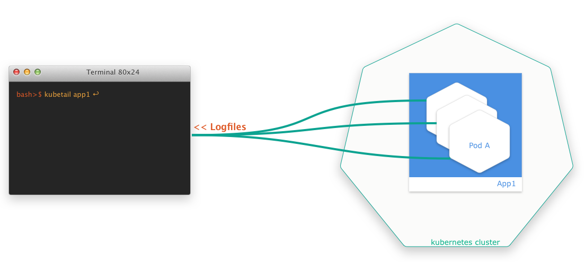

## Problem

One thing that always bothered me was that I couldn't get logs of several pods at once with `kubectl`. A simple `tail -f <path-to-logfile>` isn't possible at all. Certainly, you can use `kubectl logs -f <pod-id>`, but it doesn't help if you want to monitor more than one pod at a time.

This is something you really need a lot, at least if you run several instances of a pod behind a `deployment`. This is even more so if you don't have a Kibana or a similar setup.

## Solution

Luckily, there are smart developers out there who always come up with solutions. The **finding of the week** is a small bash script that allows you to aggregate log files of several pods at the same time in a simple way. The script is called `kubetail` and is available at [GitHub](https://github.com/johanhaleby/kubetail).
