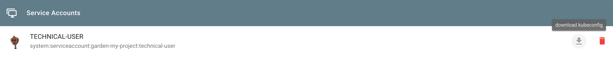

## Overview
This guide walks you through the installation of the latest version of Knative
using pre-built images on a [Gardener](https://gardener.cloud) created cluster
environment. To set up your own Gardener, see the
[documentation](https://github.com/gardener/gardener/blob/master/docs/README.md)
or have a look at the
[landscape-setup-template](https://github.com/gardener/landscape-setup-template)
project. To learn more about this open source project, read the
[blog on kubernetes.io](https://kubernetes.io/blog/2018/05/17/gardener/).

## Prerequsites

Knative requires a Kubernetes cluster v1.15 or newer.

## Steps

### Install and Configure kubectl

1.  If you already have `kubectl` CLI, run `kubectl version --short` to check
    the version. You need v1.10 or newer. If your `kubectl` is older, follow the
    next step to install a newer version.

2.  [Install the kubectl CLI](https://kubernetes.io/docs/tasks/tools/install-kubectl/#install-kubectl).

### Access Gardener

1.  Create a project in the Gardener dashboard. This will essentially create a
    Kubernetes namespace with the name `garden-<my-project>`.

2.  [Configure access to your Gardener project](https://kubernetes.io/docs/tasks/tools/install-kubectl/#configure-kubectl)
    using a kubeconfig. 
    
    If you are not the Gardener Administrator already, you
    can create a technical user in the Gardener dashboard. 
    Go to the "Members" section and add a service account. 
    You can then download the kubeconfig for your project. 
    You can skip this step if you create your cluster using the
    user interface; it is only needed for programmatic access, make sure you set
    `export KUBECONFIG=garden-my-project.yaml` in your shell.
    

### Creating a Kubernetes Cluster

You can create your cluster using `kubectl` CLI by providing a cluster
specification yaml file. You can find an example for GCP in the 
[gardener/gardener repository](https://github.com/gardener/gardener/blob/master/example/90-shoot.yaml).
Make sure the namespace matches that of your project. Then just apply the
prepared so-called "shoot" cluster CRD with kubectl:

```
kubectl apply --filename my-cluster.yaml
```

The easier alternative is to create the cluster following the cluster creation
wizard in the Gardener dashboard:


### Configure kubectl for Your Cluster

You can now download the kubeconfig for your freshly created cluster in the
Gardener dashboard or via the CLI as follows:

```
kubectl --namespace shoot--my-project--my-cluster get secret kubecfg --output jsonpath={.data.kubeconfig} | base64 --decode > my-cluster.yaml
```

This kubeconfig file has full administrators access to you cluster. For the rest
of this guide, be sure you have `export KUBECONFIG=my-cluster.yaml` set.

## Installing Istio

Knative depends on Istio. If your cloud platform offers a managed Istio
installation, we recommend installing Istio that way, unless you need the
ability to customize your installation.

Otherwise, see the [Installing Istio for Knative guide](https://knative.dev/docs/install/installing-istio/)
to install Istio.

You must install Istio on your Kubernetes cluster before continuing with these
instructions to install Knative.

## Installing `cluster-local-gateway` for Serving Cluster-Internal Traffic

If you installed Istio, you can install a `cluster-local-gateway` within your Knative cluster so that you can serve cluster-internal traffic. If you want to configure your revisions to use routes that are visible only within your cluster, [install and use the `cluster-local-gateway`](https://knative.dev/docs/admin/install/knative-offerings/).

## Installing Knative

The following commands install all available Knative components as well as the
standard set of observability plugins. Knative's installation guide - [Installing Knative](https://knative.dev/docs/admin/install/).

1. If you are upgrading from Knative 0.3.x: Update your domain and static IP
   address to be associated with the LoadBalancer `istio-ingressgateway` instead
   of `knative-ingressgateway`. Then run the following to clean up leftover
   resources:

   ```
   kubectl delete svc knative-ingressgateway -n istio-system
   kubectl delete deploy knative-ingressgateway -n istio-system
   ```

   If you have the Knative Eventing Sources component installed, you will also
   need to delete the following resource before upgrading:

   ```
   kubectl delete statefulset/controller-manager -n knative-sources
   ```

   While the deletion of this resource during the upgrade process will not
   prevent modifications to Eventing Source resources, those changes will not be
   completed until the upgrade process finishes.

1. To install Knative, first install the CRDs by running the `kubectl apply`
   command once with the `-l knative.dev/crd-install=true` flag. This prevents
   race conditions during the install, which cause intermittent errors:

   ```bash
   kubectl apply --selector knative.dev/crd-install=true \
   --filename https://github.com/knative/serving/releases/download/v0.12.1/serving.yaml \
   --filename https://github.com/knative/eventing/releases/download/v0.12.1/eventing.yaml \
   --filename https://github.com/knative/serving/releases/download/v0.12.1/monitoring.yaml
   ```

1. To complete the installation of Knative and its dependencies, run the
   `kubectl apply` command again, this time without the `--selector` flag:

   ```bash
   kubectl apply --filename https://github.com/knative/serving/releases/download/v0.12.1/serving.yaml \
   --filename https://github.com/knative/eventing/releases/download/v0.12.1/eventing.yaml \
   --filename https://github.com/knative/serving/releases/download/v0.12.1/monitoring.yaml
   ```

2. Monitor the Knative components until all of the components show a `STATUS` of
   `Running`:
   ```bash
   kubectl get pods --namespace knative-serving
   kubectl get pods --namespace knative-eventing
   kubectl get pods --namespace knative-monitoring
   ```

## Set Your Custom Domain

1.  Fetch the external IP or CNAME of the knative-ingressgateway:

```
kubectl --namespace istio-system get service knative-ingressgateway
NAME                     TYPE           CLUSTER-IP      EXTERNAL-IP     PORT(S)                                      AGE
knative-ingressgateway   LoadBalancer   100.70.219.81   35.233.41.212   80:32380/TCP,443:32390/TCP,32400:32400/TCP   4d
```

2.  Create a wildcard DNS entry in your custom domain to point to the above IP or
    CNAME:

```
*.knative.<my domain> == A 35.233.41.212
# or CNAME if you are on AWS
*.knative.<my domain> == CNAME a317a278525d111e89f272a164fd35fb-1510370581.eu-central-1.elb.amazonaws.com
```

3.  Adapt your Knative config-domain (set your domain in the data field):

```
kubectl --namespace knative-serving get configmaps config-domain --output yaml
apiVersion: v1
data:
  knative.<my domain>: ""
kind: ConfigMap
  name: config-domain
  namespace: knative-serving
```

## What's Next

Now that your cluster has Knative installed, you can see what Knative has to
offer.

Deploy your first app with the
[Getting Started with Knative App Deployment](https://knative.dev/docs/serving/getting-started-knative-app/)
guide.

Get started with Knative Eventing by walking through one of the
[Eventing Samples](https://knative.dev/docs/eventing/samples/).

[Install Cert-Manager](https://knative.dev/docs/serving/installing-cert-manager/) if you want to use the
[automatic TLS cert provisioning feature](https://knative.dev/docs/serving/using-auto-tls/).

## Cleaning Up

Use the Gardener dashboard to delete your cluster, or execute the following with
kubectl pointing to your `garden-my-project.yaml` kubeconfig:

```
kubectl --kubeconfig garden-my-project.yaml --namespace garden--my-project annotate shoot my-cluster confirmation.gardener.cloud/deletion=true

kubectl --kubeconfig garden-my-project.yaml --namespace garden--my-project delete shoot my-cluster
```