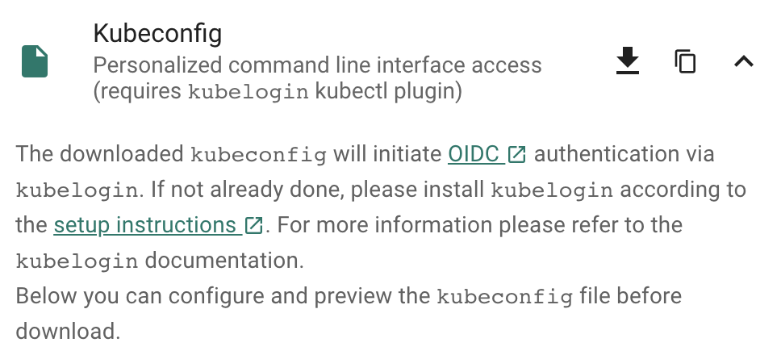

As we ramp up more and more friends of Gardener, I thought it worthwile to explore and write a tutorial about how to simply
* create a Gardener managed Kubernetes Cluster (Shoot) via kubectl,
* install Istio as a preferred, production ready Ingress/Service Mesh (instead of the Nginx Ingress addon),
* attach your own custom domain to be managed by Gardener,
* combine everything with certificates from Let's Encrypt.


Here are some pre-pointers that you will need to go deeper:
* [CRUD Gardener Shoot](https://gardener.cloud/documentation/guides/administer_shoots/create-delete-shoot/)
* [DNS Management](https://gardener.cloud/documentation/guides/install_gardener/gardener_dns_management/)
* [Certificate Management](https://gardener.cloud/documentation/guides/install_gardener/gardener_certificate_management/)
* [Tutorial Domain Names](https://gardener.cloud/documentation/guides/administer_shoots/dns_names/)
* [Tutorial Certificates](https://gardener.cloud/documentation/guides/administer_shoots/x509_certificates/)

{}
<p>If you try my instructions and fail, then read the alternative title of this tutorial as "Shoot yourself in foot with Gardener, custom Domains, Istio and Certificates".</p>
{}

## First Things First

Login to your Gardener landscape, setup a project with adequate infrastructure credentials and then navigate to your account. Note down the name of your secret. I chose the GCP infrastructure from the vast possible options that my Gardener provides me with, so i had named the secret as `shoot-operator-gcp`. 

From the Access widget (leave the default settings) download your personalized `kubeconfig` into `~/.kube/kubeconfig-garden-myproject`. Follow the instructions to setup `kubelogin`:



For convinience, let us set an alias command with 
```bash
alias kgarden="kubectl --kubeconfig ~/.kube/kubeconfig-garden-myproject.yaml"
``` 
`kgarden` now gives you all botanical powers and connects you directly with your Gardener.

You should now be able to run `kgarden get shoots`, automatically get an oidc token, and list already running clusters/shoots.

## Prepare your Custom Domain
I am going to use [Cloud Flare](https://www.cloudflare.com/) as programmatic DNS of my custom domain `mydomain.io`. Please follow detailed instructions from Cloud Flare on how to delegate your domain (the free account does not support delegating subdomains). Alternatively, AWS Route53 (and most others) support [delegating subdomains](https://docs.aws.amazon.com/Route53/latest/DeveloperGuide/CreatingNewSubdomain.html).

I needed to follow these [instructions](https://github.com/gardener/external-dns-management/blob/master/docs/cloudflare/README.md) and created the following secret:
```yaml
apiVersion: v1
kind: Secret
metadata:
  name: cloudflare-mydomain-io
type: Opaque
data:
  CLOUDFLARE_API_TOKEN: useYOURownDAMITzNDU2Nzg5MDEyMzQ1Njc4OQ==
```
Apply this secret into your project with `kgarden create -f cloudflare-mydomain-io.yaml`.

Our [External DNS Manager](https://github.com/gardener/external-dns-management/) also supports Amazon Route53, Google CloudDNS, AliCloud DNS, Azure DNS, or OpenStack Designate. Check it out.

## Prepare Gardener Extensions
I now need to prepare the Gardener extensions `shoot-dns-service` and `shoot-cert-service` and set the parameters accordingly.

{}
<p>Please note, that the availability of Gardener Extensions depends on how your administrator has configured the Gardener landscape. Please contact your Gardener administrator in case you experience any issues during activation.</p>
{}

The following snipplet allows Gardener to manage my entire custom domain, whereas with the `include:` attribute I restrict all dynamic entries under the subdomain `gsicdc.mydomain.io`:

```yaml
  dns:
    providers:
      - domains:
          include:
            - gsicdc.mydomain.io
        primary: false
        secretName: cloudflare-mydomain-io
        type: cloudflare-dns
  extensions:
    - type: shoot-dns-service
```

The next snipplet allows Gardener to manage certificates automatically from *[Let's Encrypt](https://letsencrypt.org/)* on `mydomain.io` for me:
```yaml
  extensions:
    - type: shoot-cert-service
      providerConfig:
        apiVersion: service.cert.extensions.gardener.cloud/v1alpha1
        issuers:
          - email: me@mail.com
            name: mydomain
            server: 'https://acme-v02.api.letsencrypt.org/directory'
          - email: me@mail.com
            name: mydomain-staging
            server: 'https://acme-staging-v02.api.letsencrypt.org/directory'
```

{}
<p>Adjust the snipplets with your parameters (don't forget your email). And please use the mydomain-staging issuer while you are testing and learning. Otherwise, Let's Encrypt will rate limit your frequent requests and you can wait a week until you can continue.</p>
{}

References for [Let's Encrypt](https://letsencrypt.org):
* [Rate limit](https://letsencrypt.org/docs/rate-limits/)
* [Staging environment](https://letsencrypt.org/docs/staging-environment/)
* [Challenge Types](https://letsencrypt.org/docs/challenge-types/)
* [Wildcard Certificates](https://community.letsencrypt.org/t/acme-v2-production-environment-wildcards/55578)

## Create the Gardener Shoot Cluster

Remember I chose to create the Shoot on GCP, so below is the simplest declarative shoot or cluster order document. Notice that I am referring to the infrastructure credentials with `shoot-operator-gcp` and I combined the above snipplets into the yaml file:

```yaml
apiVersion: core.gardener.cloud/v1beta1
kind: Shoot
metadata:
  name: gsicdc
spec:
  dns:
    providers:
    - domains:
        include:
          - gsicdc.mydomain.io
      primary: false
      secretName: cloudflare-mydomain-io
      type: cloudflare-dns
  extensions:
  - type: shoot-dns-service
  - type: shoot-cert-service
    providerConfig:
      apiVersion: service.cert.extensions.gardener.cloud/v1alpha1
      issuers:
        - email: me@mail.com
          name: mydomain
          server: 'https://acme-v02.api.letsencrypt.org/directory'
        - email: me@mail.com
          name: mydomain-staging
          server: 'https://acme-staging-v02.api.letsencrypt.org/directory'
  cloudProfileName: gcp
  kubernetes:
    allowPrivilegedContainers: true
    version: 1.18.2
  maintenance:
    autoUpdate:
      kubernetesVersion: true
      machineImageVersion: true
  networking:
    nodes: 10.250.0.0/16
    pods: 100.96.0.0/11
    services: 100.64.0.0/13
    type: calico
  provider:
    controlPlaneConfig:
      apiVersion: gcp.provider.extensions.gardener.cloud/v1alpha1
      kind: ControlPlaneConfig
      zone: europe-west1-d
    infrastructureConfig:
      apiVersion: gcp.provider.extensions.gardener.cloud/v1alpha1
      kind: InfrastructureConfig
      networks:
        workers: 10.250.0.0/16
    type: gcp
    workers:
    - machine:
        image:
          name: gardenlinux
          version: 11.29.2
        type: n1-standard-2
      maxSurge: 1
      maxUnavailable: 0
      maximum: 2
      minimum: 1
      name: my-workerpool
      volume:
        size: 50Gi
        type: pd-standard
      zones:
      - europe-west1-d
  purpose: testing
  region: europe-west1
  secretBindingName: shoot-operator-gcp
```

Create your cluster and wait for it to be ready (about 5 to 7min).

```bash
$ kgarden create -f gsicdc.yaml
shoot.core.gardener.cloud/gsicdc created

$ kgarden get shoot gsicdc --watch
NAME     CLOUDPROFILE   VERSION   SEED   DOMAIN                                        HIBERNATION   OPERATION    PROGRESS   APISERVER     CONTROL       NODES     SYSTEM    AGE
gsicdc   gcp            1.18.2    gcp    gsicdc.myproject.shoot.devgarden.cloud   Awake         Processing   38         Progressing   Progressing   Unknown   Unknown   83s
...
gsicdc   gcp            1.18.2    gcp    gsicdc.myproject.shoot.devgarden.cloud   Awake         Succeeded    100        True          True          True          False         6m7s
```

Get access to your freshly baked cluster and set your `KUBECONFIG`:

```bash
$ kgarden get secrets gsicdc.kubeconfig -o jsonpath={.data.kubeconfig} | base64 -d >kubeconfig-gsicdc.yaml

$ export KUBECONFIG=$(pwd)/kubeconfig-gsicdc.yaml
$ kubectl get all
NAME                 TYPE        CLUSTER-IP   EXTERNAL-IP   PORT(S)   AGE
service/kubernetes   ClusterIP   100.64.0.1   <none>        443/TCP   89m
```

## Install Istio

Please follow the Istio installation [instructions](https://istio.io/docs/setup/getting-started/) and download `istioctl`. If you are on a Mac, I recommend 
```bash
$ brew install istioctl
```

I want to install Istio with a default profile and SDS enabled. Furthermore I pass the following annotations to the service object `istio-ingressgateway` in the `istio-system` namespace.
```yaml
  annotations:
    cert.gardener.cloud/issuer: mydomain-staging
    cert.gardener.cloud/secretname: wildcard-tls
    dns.gardener.cloud/class: garden
    dns.gardener.cloud/dnsnames: "*.gsicdc.mydomain.io"
    dns.gardener.cloud/ttl: "120"
```
With these annotations three things now happen automagically:
1. The [External DNS Manager](https://gardener.cloud/documentation/guides/install_gardener/gardener_dns_management/), provided to you as a service (`dns.gardener.cloud/class: garden`), picks up the request and creates the wildcard DNS entry `*.gsicdc.mydomain.io` with a time to live of 120sec at your DNS provider. My provider Cloud Flare is very very quick (as opposed to some other services). You should be able to verify the entry with `dig lovemygardener.gsicdc.mydomain.io` within seconds.
2. The [Certificate Mangement](https://gardener.cloud/documentation/guides/install_gardener/gardener_certificate_management/) picks up the request as well and initates a DNS01 protocol exchange with Let's Encrypt; using the staging environment referred to with the issuer behind `mydomain-staging`.
3. After aproximately 70sec (give and take) you will receive the wildcard certificate in the `wildcard-tls` secret in the namespace `istio-system`. 

{}
<p>Notice, that the namespace for the certificate secret is often the cause of many troubeshooting sessions: the secret must reside in the same namespace of the gateway.</p>
{}

Here is the istio-install script:
```bash
$ export domainname="*.gsicdc.mydomain.io"
$ export issuer="mydomain-staging"

$ cat <<EOF | istioctl install -y -f -
apiVersion: install.istio.io/v1alpha1
kind: IstioOperator
spec:
  profile: default
  components:
    ingressGateways:
    - name: istio-ingressgateway
      enabled: true
      k8s:
        serviceAnnotations:
          cert.gardener.cloud/issuer: "${issuer}"
          cert.gardener.cloud/secretname: wildcard-tls
          dns.gardener.cloud/class: garden
          dns.gardener.cloud/dnsnames: "${domainname}"
          dns.gardener.cloud/ttl: "120" 
EOF
```

Verify that setup is working and that DNS and certificates have been created/delivered:
```bash
$ kubectl -n istio-system describe service istio-ingressgateway
<snip>
Events:
  Type    Reason                Age                From                     Message
  ----    ------                ----               ----                     -------
  Normal  EnsuringLoadBalancer  58s                service-controller       Ensuring load balancer
  Normal  reconcile             58s                cert-controller-manager  created certificate object istio-system/istio-ingressgateway-service-pwqdm
  Normal  cert-annotation       58s                cert-controller-manager  wildcard-tls: cert request is pending
  Normal  cert-annotation       54s                cert-controller-manager  wildcard-tls: certificate pending: certificate requested, preparing/waiting for successful DNS01 challenge
  Normal  cert-annotation       28s                cert-controller-manager  wildcard-tls: certificate ready
  Normal  EnsuredLoadBalancer   26s                service-controller       Ensured load balancer
  Normal  reconcile             26s                dns-controller-manager   created dns entry object shoot--core--gsicdc/istio-ingressgateway-service-p9qqb
  Normal  dns-annotation        26s                dns-controller-manager   *.gsicdc.mydomain.io: dns entry is pending
  Normal  dns-annotation        21s (x3 over 21s)  dns-controller-manager   *.gsicdc.mydomain.io: dns entry active

$ dig lovemygardener.gsicdc.mydomain.io

; <<>> DiG 9.10.6 <<>> lovemygardener.gsicdc.mydomain.io
<snip>
;; ANSWER SECTION:
lovemygardener.gsicdc.mydomain.io. 120 IN A	35.195.120.62
<snip>
```
There you have it, the wildcard-tls certificate is ready and the *.gsicdc.mydomain.io dns entry is active. Traffic will be going your way.  

## Handy tools to install

Another set of fine tools to use are [kapp](https://get-kapp.io/) (formerly known as k14s), [k9s](https://k9scli.io/) and [HTTPie](https://httpie.org/). While we are at it, let's install them all. If you are on a Mac, I recommend:

```bash
brew tap vmware-tanzu/carvel
brew install ytt kbld kapp kwt imgpkg vendir
brew install derailed/k9s/k9s
brew install httpie
```

## Ingress to your service

{}
<p>Networking is a central part of Kubernetes, but it can be challenging to understand exactly how it is expected to work. You should learn about Kubernetes networking, and first try to debug problems yourself. With a solid managed cluster from Gardener, it is always PEBCAK!</p>
{}

Kubernetes Ingress is a subject that is evolving to much broader standard. Please watch [Evolving the Kubernetes Ingress APIs to GA and Beyond](https://www.youtube.com/watch?v=cduG0FrjdJA) for a good introduction. In this example, I did not want to use the Kubernetes `Ingress` compatibility option of Istio. Instead, I used `VirtualService` and `Gateway` from the Istio's API group `networking.istio.io/v1beta1` directly, and enabled istio-injection generically for the namespace.

I use [httpbin](https://httpbin.org/) as service that I want to expose to the internet, or where my ingress should be routed to (depends on your point of view, I guess).

```yaml
apiVersion: v1
kind: Namespace
metadata:
  name: production
  labels:
    istio-injection: enabled
---
apiVersion: v1
kind: Service
metadata:
  name: httpbin
  namespace: production
  labels:
    app: httpbin
spec:
  ports:
  - name: http
    port: 8000
    targetPort: 80
  selector:
    app: httpbin
---
apiVersion: apps/v1
kind: Deployment
metadata:
  name: httpbin
  namespace: production
spec:
  replicas: 1
  selector:
    matchLabels:
      app: httpbin
  template:
    metadata:
      labels:
        app: httpbin
    spec:
      containers:
      - image: docker.io/kennethreitz/httpbin
        imagePullPolicy: IfNotPresent
        name: httpbin
        ports:
        - containerPort: 80
---
apiVersion: networking.istio.io/v1beta1
kind: Gateway
metadata:
  name: httpbin-gw
  namespace: production
spec:
  selector:
    istio: ingressgateway #! use istio default ingress gateway
  servers:
  - port:
      number: 80
      name: http
      protocol: HTTP
    tls:
      httpsRedirect: true
    hosts:
    - "httpbin.gsicdc.mydomain.io"
  - port:
      number: 443
      name: https
      protocol: HTTPS
    tls:
      mode: SIMPLE
      credentialName: wildcard-tls
    hosts:
    - "httpbin.gsicdc.mydomain.io"
---
apiVersion: networking.istio.io/v1beta1
kind: VirtualService
metadata:
  name: httpbin-vs
  namespace: production
spec:
  hosts:
  - "httpbin.gsicdc.mydomain.io"
  gateways:
  - httpbin-gw
  http:
  - match:
    - uri:
        regex: /.*
    route:
    - destination:
        port:
          number: 8000
        host: httpbin
---
```

Let us now deploy the whole package of Kubernetes primitives using `kapp`:
```bash
$ kapp deploy -a httpbin -f httpbin-kapp.yaml
Target cluster 'https://api.gsicdc.myproject.shoot.devgarden.cloud' (nodes: shoot--myproject--gsicdc-my-workerpool-z1-6586c8f6cb-x24kh)

Changes

Namespace   Name        Kind            Conds.  Age  Op      Wait to    Rs  Ri
(cluster)   production  Namespace       -       -    create  reconcile  -   -
production  httpbin     Deployment      -       -    create  reconcile  -   -
^           httpbin     Service         -       -    create  reconcile  -   -
^           httpbin-gw  Gateway         -       -    create  reconcile  -   -
^           httpbin-vs  VirtualService  -       -    create  reconcile  -   -

Op:      5 create, 0 delete, 0 update, 0 noop
Wait to: 5 reconcile, 0 delete, 0 noop

Continue? [yN]: y

5:36:31PM: ---- applying 1 changes [0/5 done] ----
<snip>
5:37:00PM: ok: reconcile deployment/httpbin (apps/v1) namespace: production
5:37:00PM: ---- applying complete [5/5 done] ----
5:37:00PM: ---- waiting complete [5/5 done] ----

Succeeded
```

Let's finaly test the service (Of course you can use the browser as well):
```bash
$ http httpbin.gsicdc.mydomain.io
HTTP/1.1 301 Moved Permanently
content-length: 0
date: Wed, 13 May 2020 21:29:13 GMT
location: https://httpbin.gsicdc.mydomain.io/
server: istio-envoy

$ curl -k https://httpbin.gsicdc.mydomain.io/ip
{
    "origin": "10.250.0.2"
}
```
Quod erat demonstrandum.
The proof of exchanging the issuer is now left to the reader. 

{}
<p>Remember that the certificate is actually not valid because it is issued from the Let's encrypt staging environment. Thus, we needed "curl -k" or "http --verify no".</p>
{}

Hint: use the interactive k9s tool.


## Cleanup

Remove the cloud native application:
```bash
$ kapp ls
Apps in namespace 'default'

Name     Namespaces            Lcs   Lca
httpbin  (cluster),production  true  17m

$ kapp delete -a httpbin
...
Continue? [yN]: y
...
11:47:47PM: ---- waiting complete [8/8 done] ----

Succeeded
```

Remove Istio:
```bash
$ istioctl x uninstall --purge
clusterrole.rbac.authorization.k8s.io "prometheus-istio-system" deleted
clusterrolebinding.rbac.authorization.k8s.io "prometheus-istio-system" deleted
...
```

Delete your Shoot:
```bash
kgarden annotate shoot gsicdc confirmation.gardener.cloud/deletion=true --overwrite
kgarden delete shoot gsicdc --wait=false
```

